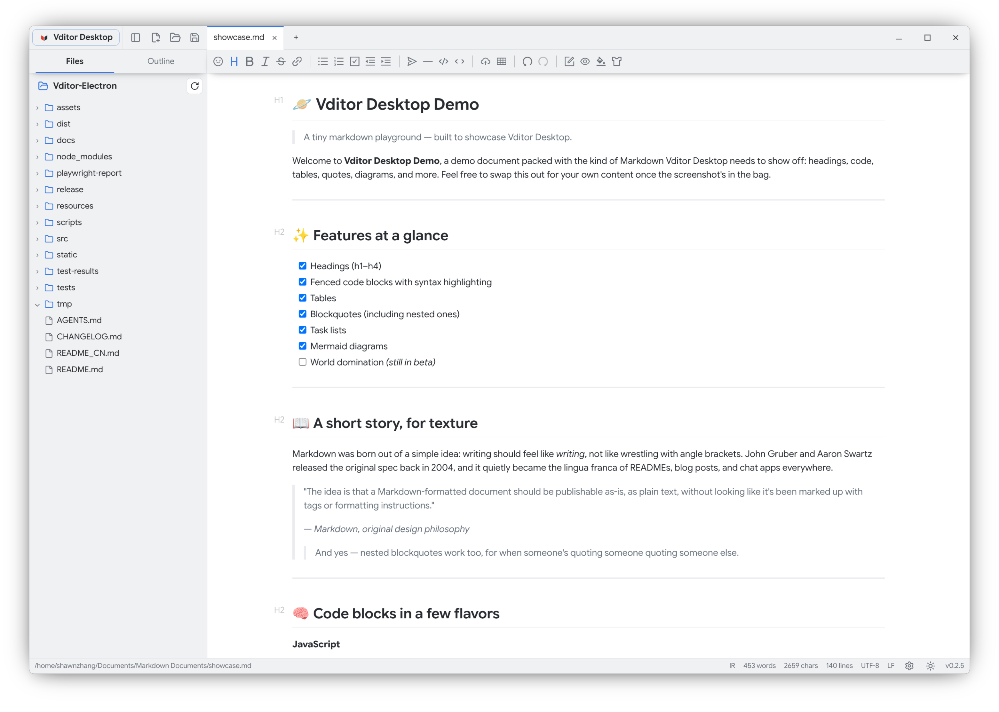
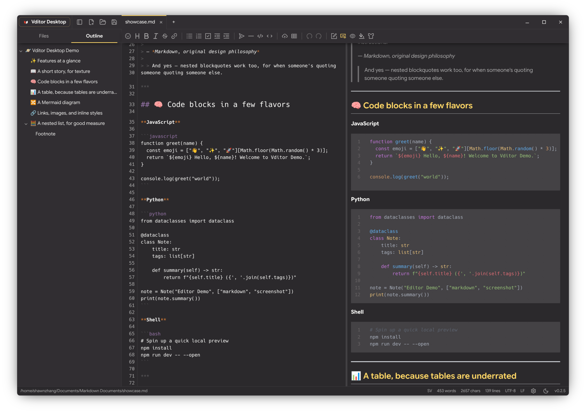

# Vditor Desktop

[简体中文](README_CN.md) · English

<p align="center">
  
</p>

<p align="center">
  Your Markdown files, on your own machine, in a desktop editor built for focus — not a browser tab, not another cloud account, just Vditor's full editing power in a calm workspace.
</p>

<p align="center">
  <a href="https://github.com/Studio-200A/Vditor-Electron/releases"></a>
  <a href="https://github.com/Studio-200A/Vditor-Electron/blob/main/LICENSE"></a>
  <a href="https://github.com/Studio-200A/Vditor-Electron"></a>
  <a href="https://github.com/prettier/prettier"></a>

</p>

Vditor Desktop takes the writing experience of [Vditor](https://github.com/Vanessa219/vditor) — **one of the most capable Markdown editors around** — and gives it the desktop app it deserves. There's no proprietary format and no lock-in: what you write is exactly what sits on disk, an ordinary `.md` file, at all times. Around that, the app fills in everything a real desktop tool needs but a browser-based editor can't offer on its own: tabs, workspaces, a file explorer, Vditor's built-in outline, themes, session recovery, and native file associations.





## Contents

- [Why Vditor Desktop](#why-vditor-desktop)
- [Editing modes](#editing-modes)
- [A workspace that stays out of the way](#a-workspace-that-stays-out-of-the-way)
- [Protecting You and Your Content, Thoughtfully](#protecting-you-and-your-content-thoughtfully)
- [Themes and languages](#themes-and-languages)
- [Install and run](#install-and-run)
- [Everyday shortcuts](#everyday-shortcuts)
- [Configuration and data](#configuration-and-data)
- [Build and test](#build-and-test)
- [Contributing](#contributing)
- [Open-source software](#open-source-software)
- [Disclaimer](#disclaimer)
- [License](#license)

## Why Vditor Desktop

- **Your files stay yours.** No account, no cloud sync, no proprietary format. What you write is a plain `.md` file on your disk, readable and portable with any other editor, forever.
- **Write however your brain works that day.** WYSIWYG when you want to see the finished page, instant rendering when you want syntax and style at once, split preview when you want source and output side by side — switch anytime, mid-document.
- **A real desktop citizen, not a wrapped webpage.** Open files straight from the terminal or your file manager, treat any folder as a project, and pick up right where you left off — tabs, layout, and all — the next time you launch it.
- **The file tree is part of the editor, not an afterthought.** Create, rename, and organize files without leaving your document; open new workspaces or send files to the trash straight from the explorer's right-click menu.
- **Small conveniences that add up.** Right-click for clipboard and selection actions wherever you're writing, get row/column controls on rendered tables, and never fight a stray menu that forgot to close itself when you opened another one.
- **An interface that gets out of the way.** A single, compact bar holds your menus, file actions, tabs, and window controls; the editing toolbar only shows up when you actually need it.
- **All the Markdown power you'd expect from Vditor.** Math, diagrams, charts, footnotes, syntax highlighting, a table of contents, and inline media preview — kept faithful to upstream and presented in full.
- **Local-first.** Configuration and app data live in the standard local directory for your platform. There's nothing to upload, because there's nowhere for it to go.

## Editing modes

| Mode                  | Best for                                                                                |
| --------------------- | --------------------------------------------------------------------------------------- |
| **WYSIWYG**           | Writing and formatting while seeing the final document appearance.                      |
| **Instant Rendering** | Keeping Markdown syntax near the cursor while the rest of the document renders cleanly. |
| **Split Preview**     | Editing Markdown source on the left and reviewing the rendered document on the right.   |

Switch modes from the unified toolbar or **View → Editing Mode**. Split Preview includes source line numbers, configurable tab spacing, optional whitespace markers, a resizable divider, and an auto-hiding preview scrollbar.

## A workspace that stays out of the way

Most days you're not managing an editor — you're just writing. Vditor Desktop tries to keep the surrounding tools quiet until you actually reach for them.

- Point it at a folder and it becomes your project: browse its Markdown files right in the explorer, no separate import step.
- Navigate the way you would in any file manager — expand, collapse, filter by extension, rename, trash, or jump straight to the system file manager — all without leaving the editor.
- Never lose your place in a long document: jump to any H1–H6 heading from a live outline, in any editing mode.
- Work on several documents at once, each with its own undo history and unsaved-changes indicator, and drag tabs into whatever order makes sense to you.
- Need more screen for writing? Collapse the explorer and it steps aside — the shortcuts and menu still work exactly the same.
- Save, Save As, export to HTML or PDF, and pick up your last session automatically the next time you open the app.
- Find and replace without a heavyweight dialog — a compact `Ctrl/Cmd + F` panel does the job.
- Drop images straight into your document; they land in a configurable assets folder and preview correctly in all three editing modes, whether they're local or online.

Directory renames/deletes and workspace-level resource limits remain planned work; keep backups of important documents.

## Protecting You and Your Content, Thoughtfully

Vditor Desktop treats your writing as something to protect, not something to overwrite. Behind the simple Markdown workflow are several safeguards designed to keep an unexpected exit, a second editor, or a changing file system from silently taking your work away:

- **Safer links, by design.** Links in your Markdown only hand clearly supported `http:`, `https:`, and `mailto:` destinations to the system. Scripts, dangerous schemes, and untrusted in-app pages are stopped at the boundary, so one stray link cannot take your editor somewhere it should not go.
- **Careful saves.** Documents are written through a temporary file in the same directory. Unchanged files are not rewritten, and a failed save leaves both the original file and your unsaved editor content intact.
- **Recovery after an unexpected exit.** Unsaved work is captured in a private recovery snapshot. When you return, the app checks whether the original file is still the same before offering to save the recovered version; if it is not safe, you can save the recovered content elsewhere.
- **Awareness of outside changes.** Every open file is monitored, including files opened outside the active workspace. Clean documents can reload automatically, while documents with local edits pause autosave and keep a persistent notice until you decide what should happen.
- **Guided conflict resolution.** You can reload the stable disk version, save your current writing elsewhere, keep it as an untitled document, ignore the external change, or explicitly confirm an overwrite. If the disk changes again, the old overwrite confirmation is discarded.
- **Protection from missing or unreadable files.** If a file is deleted or loses read/write access, the editor keeps its in-memory content and pauses autosave instead of recreating or overwriting the file silently. When access returns, the disk version is never inserted into the editor without your decision.
- **A recoverable recreation.** If you explicitly recreate a missing file, the app copies the content captured when the file became unavailable to the system clipboard and shows a five-second confirmation notice. Edits made afterward remain separate, so the backup represents the protected version you may need.

## Themes and languages

Built-in application themes:

- Light
- Dark
- Claude Light
- Claude Dark
- Monokai Pro Light, including a dedicated H1–H6 heading palette
- Monokai Pro Dark, including a dedicated H1–H6 heading palette

Choose light and dark application themes independently in Settings. The status-bar theme-mode menu then offers fixed light, fixed dark, and follow-system modes, with its resident icon showing the current mode. Application themes only change application colors. Content and code-block preview themes remain controlled by Vditor and preserve the user's last selection in each light/dark context. Optional multi-platform typography previews can be enabled when needed.

The interface is localized in English (`en_US`), Simplified Chinese (`zh_Hans`), Traditional Chinese (`zh_Hant`), and system language mode.

## Install and run

### From source

Node.js 22 or a compatible version and npm are required:

```bash
git clone https://github.com/Studio-200A/Vditor-Electron.git
cd Vditor-Electron
npm ci
npm start
```

The build copies Vditor's bundled assets locally; runtime use does not depend on a Vditor CDN.

### Linux builds

The repository can produce a Linux unpacked application, a portable archive, and an AppImage:

```bash
npm run pack                 # release/linux-unpacked
npm run release:linux       # all Linux artifacts
```

The release command produces:

```text
release/vditor-desktop-x86_64-<version>-portable.tar.gz
release/vditor-desktop-x86_64-<version>-portable.AppImage
```

The portable desktop entry uses `/path/to/vditor-desktop` as an installation-path placeholder. Replace it with the actual extraction path before installing the entry into your desktop environment. The AppImage can be run after making it executable.

Linux is the primary development and validation platform at present. Windows and macOS-specific window and data-directory adaptations are included, but physical-device watcher, permission, path-case, packaging, and release validation are still pending.

## Everyday shortcuts

| Action                                | Shortcut               |
| ------------------------------------- | ---------------------- |
| New file                              | `Ctrl/Cmd + N`         |
| Open file                             | `Ctrl/Cmd + O`         |
| Save                                  | `Ctrl/Cmd + S`         |
| Save As                               | `Ctrl/Cmd + Shift + S` |
| Find and replace                      | `Ctrl/Cmd + F`         |
| Select context / all                  | `Ctrl/Cmd + A`         |
| Close tab                             | `Ctrl/Cmd + W`         |
| Toggle explorer                       | `Ctrl/Cmd + B`         |
| Open settings                         | `Ctrl/Cmd + ,`         |
| Toggle Chrome DevTools (when enabled) | `Ctrl/Cmd + Shift + I` |
| Toggle fullscreen                     | `F11`                  |

## Configuration and data

Application configuration and Chromium user data are kept separate:

| Platform | Configuration                                                                             | Chromium data                                                                    | Recovery data                                                                    |
| -------- | ----------------------------------------------------------------------------------------- | -------------------------------------------------------------------------------- | -------------------------------------------------------------------------------- |
| Linux    | `${XDG_CONFIG_HOME:-~/.config}/vditor-desktop/config.toml`                                | `${XDG_DATA_HOME:-~/.local/share}/vditor-desktop/chromium/`                      | `${XDG_DATA_HOME:-~/.local/share}/vditor-desktop/recovery/`                      |
| Windows  | `%APPDATA%\\vditor-desktop\\config.toml`                                                  | `%LOCALAPPDATA%\\vditor-desktop\\chromium\\`                                     | `%LOCALAPPDATA%\\vditor-desktop\\recovery\\`                                     |
| macOS    | `~/Library/Application Support/com.github.studio-200a.vditor-electron/Config/config.toml` | `~/Library/Application Support/com.github.studio-200a.vditor-electron/Chromium/` | `~/Library/Application Support/com.github.studio-200a.vditor-electron/recovery/` |

The TOML file is human-readable and grouped by application, appearance, fonts, editor, preview, files, workspace, window, and session settings.

The appearance section stores the independently selected `lightTheme` and `darkTheme` values. The status-bar theme-mode menu offers fixed light, fixed dark, and follow-system modes; `systemTheme` records the third choice and resolves the active theme from those two preferences. Claude application themes only define application colors and do not replace Vditor's content or code-block theme settings.

Crash-recovery snapshots are stored separately in the private application data directory shown above. They are removed after saving or discarding the recovered document and are never served as local document resources.

## Build and test

```bash
npm run format:check
npm run lint
npm run typecheck
npm run check:vditor
npm test
npm run check:all
```

The Vditor dependency is intentionally pinned to 3.11.3. Before upgrading it, read [the Vditor upgrade notes](docs/20-VDITOR-UPGRADE.md) and validate the adapter boundary and Electron regression tests.

## Contributing

Development happens on version- or feature-specific `dev-*` / `feat-*` branches and is merged into `main` through pull requests. Useful contributions include:

- reproducible bug reports with OS, desktop environment, display protocol, version, and steps;
- fixes and tests for editor, file, workspace, and platform behavior;
- documentation, translations, accessibility, and visual polish;
- reviews of the planned work in [`docs/`](docs/README.md).

Please keep the project local-first and preserve the security boundaries described in the repository instructions.

## Open-source software

Vditor Desktop is made possible by the following open-source projects. Their authors retain their respective copyrights and licenses. The complete dependency graph is recorded in [`package-lock.json`](package-lock.json).

<details>
<summary>Runtime and direct dependencies</summary>

| Project                                                        | Role                               | License                 |
| -------------------------------------------------------------- | ---------------------------------- | ----------------------- |
| [Electron](https://github.com/electron/electron)               | Cross-platform desktop runtime     | MIT                     |
| [Chromium](https://github.com/chromium/chromium)               | Electron's rendering engine        | BSD-3-Clause and others |
| [Node.js](https://github.com/nodejs/node)                      | Main-process runtime               | MIT and others          |
| [Vditor](https://github.com/Vanessa219/vditor)                 | Markdown editor and renderer       | MIT                     |
| [chokidar](https://github.com/paulmillr/chokidar)              | File change monitoring             | MIT                     |
| [@iarna/toml](https://github.com/iarna/iarna-toml)             | TOML configuration storage         | ISC                     |
| [diff-match-patch](https://github.com/JackuB/diff-match-patch) | Text diff algorithm used by Vditor | Apache-2.0              |

</details>

<details>
<summary>Bundled Markdown rendering components</summary>

- [abcjs](https://github.com/paulrosen/abcjs) · [Apache ECharts](https://github.com/apache/echarts) · [flowchart.js](https://github.com/adrai/flowchart.js)
- [Viz.js](https://github.com/mdaines/viz-js) · [Graphviz](https://gitlab.com/graphviz/graphviz) · [highlight.js](https://github.com/highlightjs/highlight.js)
- [KaTeX](https://github.com/KaTeX/KaTeX) · [Lute](https://github.com/88250/lute) · [markmap](https://github.com/markmap/markmap)
- [MathJax](https://github.com/mathjax/MathJax) · [Mermaid](https://github.com/mermaid-js/mermaid) · [plantuml-encoder](https://github.com/markushedvall/plantuml-encoder)
- [SmilesDrawer](https://github.com/reymond-group/smilesDrawer) · [WaveDrom](https://github.com/wavedrom/wavedrom) · [Ant Design Icons](https://github.com/ant-design/ant-design-icons) · [Material Design Icons](https://github.com/google/material-design-icons)

</details>

<details>
<summary>Development, testing, and packaging</summary>

- [TypeScript](https://github.com/microsoft/TypeScript) · [ESLint](https://github.com/eslint/eslint) · [typescript-eslint](https://github.com/typescript-eslint/typescript-eslint)
- [Prettier](https://github.com/prettier/prettier) · [Vitest](https://github.com/vitest-dev/vitest) · [jsdom](https://github.com/jsdom/jsdom)
- [Playwright](https://github.com/microsoft/playwright) · [electron-builder](https://github.com/electron-userland/electron-builder) · [DefinitelyTyped](https://github.com/DefinitelyTyped/DefinitelyTyped)

</details>

## Disclaimer

Vditor Desktop is provided for local Markdown editing and is still evolving. Use it with backups of important files and review exported content before relying on it. The author and contributors are not responsible for any loss, damage, data corruption, or other liability resulting from the use of this project.

## License

Vditor Desktop is released under the [MIT License](LICENSE).
