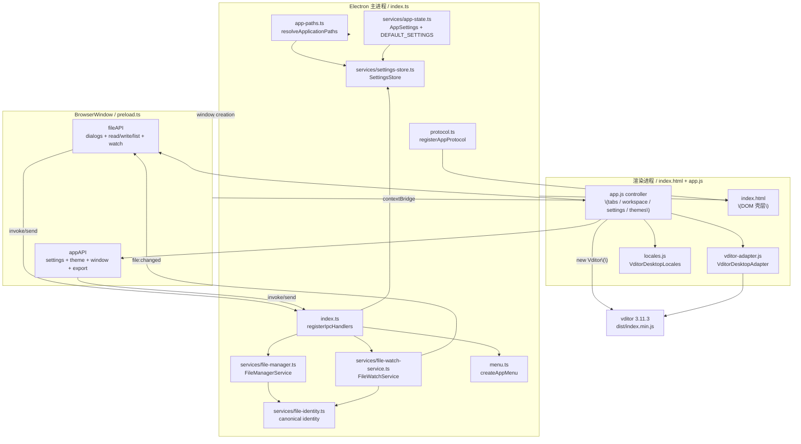

# Vditor-Electron Code Structure World Map

- **生成时间：** 2026-08-27
- **基于的工作区：** `dev-0.2.0`，P07 提交前基线 `3e7eb15`（已包含批次 6、计划外批次 6.5/6.6；0.2.0 开发 tracker 批次 7 的源码、测试和文档修复在此基线上收口）
- **文档版本：** v1.9
- **对应 package.json 版本号：** 0.1.5

---

## 1. 项目概览

**项目名称：** Vditor Desktop（com.github.studio-200a.vditor-electron）

**定位：** 本地优先（local-first）的 Markdown 桌面编辑器，基于 Electron 承载浏览器窗口，Vditor 3.11.3 提供 Markdown 编辑与渲染核心能力。

**核心功能：** 多标签页 Markdown 编辑、三种编辑模式（IR/SV/WYSIWYG）、分栏预览、文件树侧栏、文档大纲、查找替换、图片插入与压缩、HTML/PDF 导出、TOML 配置持久化、三语国际化（英/简/繁）。

**开发阶段：** 0.2.0 阶段开发中。保存、恢复、工作区内外 watcher、外部修改冲突、外部删除/重新出现/不可读状态、工作区读取/监听深度边界、目录级路径一致性以及 0.2.0 开发 tracker 批次 7 的本地闭环已有实现和测试；Electron 安全边界、已有目标的长期 TOCTOU、发布门槛和 Windows/macOS 实体机验证仍在后续批次。主题架构和六套内置主题见 [`docs/04-THEMES.md`](04-THEMES.md)。

---

## 2. 技术栈与依赖

### 运行时

| 技术     | 版本                    | 说明                            |
| -------- | ----------------------- | ------------------------------- |
| Electron | ^43.4.0                 | 窗口、IPC、协议、托盘等桌面宿主 |
| Node.js  | 随 Electron 绑定（^22） | 主进程运行时                    |

### 前端框架

**无框架，原生 DOM。** 渲染进程不引入 React、Vue 或任何 UI 框架；所有 UI 逻辑集中在单一 IIFE 控制器（`src/renderer/app.js`）中。

### 编辑器引擎

| 参数     | 值                                                                                                             |
| -------- | -------------------------------------------------------------------------------------------------------------- |
| 引擎     | Vditor 3.11.3（精确固定）                                                                                      |
| 模式     | WYSIWYG / IR（默认）/ SV（Split View）                                                                         |
| 资源加载 | 离线：通过 `app://` 协议加载 `static/dist/`                                                                    |
| 版本校验 | `scripts/check-vditor-version.js` 验证 package.json、lock 文件、node_modules 与 main/index.ts 的硬编码版本一致 |

### 构建工具

**无 Vite / Webpack。** 主进程使用 TypeScript 直接编译（`tsc -p tsconfig.main.json`），渲染进程为纯 JavaScript + CSS 静态文件复制（`scripts/copy-vditor-assets.js`）。

### 核心依赖（dependencies）

```json
{
  "@iarna/toml": "^2.2.5",
  "chokidar": "^4.0.3",
  "vditor": "3.11.3"
}
```

| 包名          | 职责                                                  |
| ------------- | ----------------------------------------------------- |
| `vditor`      | Markdown 编辑器核心（三模式编辑、渲染、工具栏、主题） |
| `@iarna/toml` | TOML 配置文件的读写                                   |
| `chokidar`    | 跨平台文件系统监听（工作区树刷新 + 外部变更通知）     |

---

## 3. 目录结构总览

```
Vditor-Electron/
├── src/                           # 项目源代码（唯一源目录）
│   ├── main/                      # Electron 主进程（TypeScript）
│   │   ├── index.ts               # 主入口，应用生命周期、所有 IPC handler 注册
│   │   ├── preload.ts             # preload 脚本，contextBridge 暴露 API
│   │   ├── protocol.ts            # app:// 与 local-file:// 协议注册
│   │   ├── external-url.ts         # 外部 URL 协议白名单校验
│   │   ├── menu.ts                # macOS 原生菜单构建（Menu.buildFromTemplate）
│   │   ├── app-paths.ts           # 平台路径解析（config / chromium / recovery 数据目录）
│   │   ├── open-files.ts          # CLI / OS 文件关联参数解析
│   │   ├── resolve-markdown-link.ts # 相对 Markdown 链接安全解析
│   │   └── services/              # 主进程服务层
│   │       ├── file-manager.ts    # 文件读写、目录操作、编码探测与文档写入错误映射
│   │       ├── file-identity.ts   # canonical identity：realpath、缺失祖先和平台大小写规则
│   │       ├── file-watch-service.ts # 工作区结构与打开文档内容 watcher 的所有权、稳定读取和清理
│   │       ├── safe-file-writer.ts # 同目录临时文件、同步、替换与失败清理
│   │       ├── recovery-store.ts  # 私有恢复快照的校验、原子写入、读取与清理
│   │       ├── settings-store.ts  # TOML 配置读写、深合并、原子保存
│   │       └── app-state.ts       # AppSettings 接口与默认值定义
├── src/renderer/                  # 渲染进程（纯 JavaScript + HTML + CSS）
│   ├── index.html                 # 应用壳 HTML（标题栏、侧栏、编辑区、对话框）
│   ├── app.js                     # 集中式应用控制器（标签、工作区、设置、编辑器生命周期等）
│   ├── vditor-adapter.js          # Vditor 私有 DOM 适配层（集中选择器与结构假设）
│   ├── locales.js                 # 三语字典（en_US / zh_Hans / zh_Hant）
│   ├── styles/
│   │   └── app.css                # 单一应用样式文件（含主题变量、Vditor 覆盖）
│   └── assets/                    # 内嵌 SVG 图标资源
│       ├── app-icon/              # 应用标识
│       ├── symbolic/              # 标题栏、主题、设置和其他界面符号图标
│       └── notification/          # 持久告警与短暂通知图标
├── static/
│   └── dist/                      # [自动生成] 离线 Vditor 构建产物（由 build:assets 复制）
├── dist/                          # [自动生成] 主进程编译输出（tsc）
├── tests/
│   ├── unit/                      # Vitest 单元测试
│   └── e2e/                       # Playwright Electron E2E 测试
├── scripts/                       # 构建辅助脚本
│   ├── copy-vditor-assets.js      # 复制 Vditor dist 与 renderer 到 dist/
│   ├── check-vditor-version.js    # Vditor 版本一致性校验
│   └── release-linux.js           # Linux x64 portable / AppImage 发布脚本
├── resources/
│   └── linux/                     # Linux 打包资源（.desktop、AppRun、metainfo）
├── docs/                          # 项目规划与文档
├── assets/                        # README 截图等静态资源
├── package.json
├── tsconfig.main.json
├── eslint.config.mjs
├── vitest.config.mts
├── playwright.config.ts
└── release/                       # [自动生成] electron-builder 输出目录
```

> **注：** `node_modules/`、`playwright-report/`、`test-results/`、`.cache/` 均为自动生成目录，不入版本库。

---

## 4. Electron 主进程架构

### 4.1 入口文件与启动流程

**入口：** `dist/main/index.js`（编译自 `src/main/index.ts`）

启动流程（单实例锁定、`app.whenReady()` 和窗口创建均由 `src/main/index.ts` 编排）：

```
1. app.requestSingleInstanceLock()
   ├── 失败 → app.quit()
   └── 成功 → queueOpenFiles(extractOpenFilePaths(process.argv))
2. app.whenReady() 回调：
   ├── registerAppProtocol()              // 注册 app:// 与 local-file://
   ├── new SettingsStore(configDir)       // 加载 TOML 配置
   ├── new RecoveryStore(recoveryDir)      // 初始化私有恢复快照存储
   ├── new FileManagerService()           // 初始化文件服务
   ├── new FileWatchService(...)          // 初始化工作区和打开文档的文件监听服务
   ├── registerIpcHandlers()              // 注册所有 IPC 通道
   ├── Menu.setApplicationMenu(...)       // macOS 设置原生菜单，其他平台置 null
   ├── nativeTheme.on('updated', ...)      // 监听系统主题变更
   └── createWindow()                     // 创建主窗口
3. app.on('activate', ...)               // macOS 点击 Dock 图标重建窗口
4. app.on('open-file', ...)               // macOS 文件关联打开事件
5. app.on('second-instance', ...)         // 单实例模式下第二个实例传来的文件
6. app.on('window-all-closed', ...)       // 非 macOS 平台退出应用
7. app.on('before-quit', ...)             // 释放工作区和打开文档 watcher
```

### 4.2 窗口创建逻辑

**函数：** `createWindow()`（`src/main/index.ts`）

```typescript
const options: BrowserWindowConstructorOptions = {
  width: normalBounds.width,       // 从 settings.windowBounds 恢复，默认 1200px
  height: normalBounds.height,     // 默认 800px
  minWidth: 760,
  minHeight: 520,
  title: 'Vditor Desktop',
  backgroundColor: process.platform === 'linux' ? initialWindowBackground(settings) : '#00000000',
  transparent: process.platform === 'win32',   // Windows 透明无边框
  frame: process.platform === 'darwin',         // macOS 保留原生标题栏
  titleBarStyle: process.platform === 'darwin' ? 'hiddenInset' : undefined,
  show: false,                                   // 延迟显示，等待 ready-to-show
  webPreferences: {
    preload: path.join(__dirname, 'preload.js'),
    contextIsolation: true,
    nodeIntegration: false,
    sandbox: false,
  },
};
```

**窗口尺寸持久化：** 每次 `move` 和 `resize` 事件（带 400ms 防抖）调用 `persistNormalWindowBounds()`，保存到 `settingsStore`。最大化状态通过 `windowMaximized` 字段恢复。Linux 平台的 unmaximize 后有额外的延迟位置修复（100/350/800/1400ms）。

### 4.3 应用生命周期

| 事件                   | 处理逻辑                                                               |
| ---------------------- | ---------------------------------------------------------------------- |
| `ready`                | 注册协议、加载配置、注册 IPC、设置菜单、监听主题、创建窗口             |
| `window-all-closed`    | 非 macOS 时退出应用                                                    |
| `activate`（macOS）    | 无窗口时重新 `createWindow()`                                          |
| `before-quit`          | 关闭 chokidar watcher                                                  |
| `second-instance`      | 解析 CLI 参数中的文件路径，入队 `pendingOpenFiles`，唤醒主窗口         |
| `open-file`（macOS）   | 阻止默认行为，将文件路径入队并唤醒主窗口                               |
| `window.close`         | 拦截关闭，向渲染进程发送 `app:requestClose`，等待 `app:closeConfirmed` |
| `web-contents-created` | 阻止非 `app:` 导航与新窗口；仅白名单 `http(s)` / `mailto:` 才转发到 `shell.openExternal()` |

### 4.4 系统菜单

**文件：** `src/main/menu.ts`

仅在 `process.platform === 'darwin'` 时调用 `Menu.buildFromTemplate()` 构建原生菜单，其他平台使用渲染进程的自定义菜单。

```
File 菜单:  New File / Open File / Open Folder / Save / Save As /
            Export HTML / Export PDF / Close Tab / Close Window
View 菜单:  Editing Mode (WYSIWYG / IR / SV) /
            Toggle Sidebar / Settings /
            Toggle Fullscreen / Zoom In / Zoom Out / Reset Zoom
```

菜单业务项通过 `mainWindow.webContents.send('menu:action', action, value?)` 通知渲染进程处理，不在主进程直接执行业务逻辑。Chrome DevTools 不属于原生菜单项；设置页开启后，渲染进程的 `Ctrl/Cmd+Shift+I` 请求仍由主进程依据 `devToolsEnabled` 授权，`F12` 始终被拦截。

### 4.5 系统托盘

**（待实现）** 当前无系统托盘、后台驻留或最小化到托盘功能。

### 4.6 全局快捷键

无全局快捷键注册（`globalShortcut` API 未使用）。应用快捷键在渲染进程通过 `keydown` 事件处理；Chrome DevTools 的 `Ctrl/Cmd+Shift+I` 还需通过主进程的 `devToolsEnabled` 授权，`F12` 不作为 DevTools 快捷键。

### 4.7 单实例锁定

```typescript
// src/main/index.ts
const ownsSingleInstanceLock = app.requestSingleInstanceLock();
if (!ownsSingleInstanceLock) {
  app.quit();
}
```

第二个实例的参数通过 `extractOpenFilePaths(argv, workingDirectory)` 解析，入队后通过 `app:openFiles` 通道发送给已激活的主窗口。

### 4.8 原生对话框

| 对话框             | 触发 IPC 通道           | 实现                                        |
| ------------------ | ----------------------- | ------------------------------------------- |
| 打开文件           | `file:openDialog`       | `dialog.showOpenDialog`，多选文件（Markdown + All Files 过滤器） |
| 打开文件夹         | `file:openFolderDialog` | `dialog.showOpenDialog`（openDirectory）    |
| 另存为             | `file:saveDialog`       | `dialog.showSaveDialog`                     |
| 导出对话框         | `file:exportDialog`     | `dialog.showSaveDialog`（HTML/PDF）         |
| 文件移至回收站     | `file:delete`           | `shell.trashItem()`                         |
| 在文件管理器中显示 | `app:showItemInFolder`  | `shell.showItemInFolder()`                  |
| 打开目录           | `app:openDirectory`     | `shell.openPath()`                          |
| 打开外部 URL       | `app:openExternal`      | `allowedExternalUrl()` 白名单后 `shell.openExternal()` |

---

## 5. 预加载脚本与 Bridge 层

### 5.1 脚本路径

`src/main/preload.ts`（编译到 `dist/main/preload.js`）

### 5.2 安全配置

```typescript
webPreferences: {
  contextIsolation: true,    // 渲染进程无法直接访问 Node/Electron API
  nodeIntegration: false,
  sandbox: false,
}
```

### 5.3 暴露的 API 完整清单

#### `window.fileAPI`

| 方法名                                            | 对应 IPC 通道           | 方向       | 入参                                  | 返回值                                  |
| ------------------------------------------------- | ----------------------- | ---------- | ------------------------------------- | --------------------------------------- |
| `openFileDialog()`                                | `file:openDialog`       | invoke     | 无                                    | `string[]`                              |
| `openFolderDialog()`                              | `file:openFolderDialog` | invoke     | 无                                    | `string \| null`                        |
| `saveFileDialog(defaultPath?, defaultDirectory?)` | `file:saveDialog`       | invoke     | `string?, string?`                    | `string \| null`                        |
| `exportDialog(type, defaultPath?)`                | `file:exportDialog`     | invoke     | `'html'\|'pdf', string?`              | `string \| null`                        |
| `readFile(filePath)`                              | `file:read`             | invoke     | `string`                              | `{ content: string, encoding: string }` |
| `writeFile(filePath, content)`                    | `file:write`            | invoke     | `string, string`                      | `{ expectedContent, wrote }`            |
| `writeDocument(filePath, content, expectedContent?, expectedAbsent?)` | `file:writeDocument` | invoke | `string, string, string?, boolean?` | `SafeWriteResult` 或 `{ error, content?, encoding? }` |
| `writeBinaryFile(filePath, bytes)`                | `file:writeBinary`      | invoke     | `string, Uint8Array`                  | `void`                                  |
| `exists(filePath)`                                | `file:exists`           | invoke     | `string`                              | `boolean`                               |
| `fileIdentity(filePath)`                          | `file:identity`         | invoke     | `string`                              | `string`                                |
| `listDir(dirPath, workspacePath?)`                | `file:listDir`          | invoke     | `string, string?`                     | `DirEntry[]`                            |
| `createItem(parent, name, type)`                  | `file:create`           | invoke     | `string, string, 'file'\|'directory'` | `string`                                |
| `renameItem(oldPath, newName)`                    | `file:rename`           | invoke     | `string, string`                      | `string`                                |
| `prepareRename(oldPath, newName)`                 | `file:prepareRename`    | invoke     | `string, string`                      | `string`（预校验后的目标路径）          |
| `deleteItem(filePath)`                            | `file:delete`           | invoke     | `string`                              | `void`                                  |
| `basename(filePath)`                              | `file:basename`         | invoke     | `string`                              | `string`                                |
| `dirname(filePath)`                               | `file:dirname`          | invoke     | `string`                              | `string`                                |
| `relative(from, to)`                              | `file:relative`         | invoke     | `string, string`                      | `string`                                |
| `resolveMarkdownLink(sourceFile, href)`           | `file:resolveMarkdownLink` | invoke  | `string, string`                      | `MarkdownLinkResolution`                |
| `setWorkspaceWatch(rootPath?)`                    | `file:setWorkspaceWatch` | invoke    | `string?`                             | `void`                                  |
| `watchDocument(filePath, reconcile?)`              | `file:watchDocument`    | invoke     | `string, boolean?`                     | `void`                                  |
| `unwatchDocument(filePath, identity?)`             | `file:unwatchDocument`  | invoke     | `string, string?`                      | `void`                                  |
| `onChanged(callback)`                             | `file:changed`          | on（订阅） | `{ event, path, identity?, scope, content?, encoding?, error? }` | 取消订阅函数                    |
| `getDroppedPath(file)`                            | _(webUtils)_            | 直接调用   | `File`                                | `string`                                |

`window.fileAPI.rebasePath(oldRoot, newRoot, candidatePath)` 对目录重命名后的路径执行主进程路径 rebase；候选路径不在旧根目录下时返回 `null`。

#### `window.appAPI`

| 方法名                           | 对应 IPC 通道                | 方向         | 入参                   | 返回值                                      |
| -------------------------------- | ---------------------------- | ------------ | ---------------------- | ------------------------------------------- |
| `platform`                       | _(process.platform)_         | 属性         | —                      | `string`                                    |
| `getSettings()`                  | `app:getSettings`            | invoke       | 无                     | `AppSettings`                               |
| `getDefaultSettings()`           | `app:getDefaultSettings`     | invoke       | 无                     | `AppSettings`                               |
| `saveSettings(settings)`         | `app:saveSettings`           | invoke       | `Partial<AppSettings>` | `AppSettings`                               |
| `resetSettings()`                | `app:resetSettings`          | invoke       | 无                     | `AppSettings`                               |
| `getSettingsPath()`              | `app:getSettingsPath`        | invoke       | 无                     | `string`                                    |
| `getSettingsDisplayPath()`       | `app:getSettingsDisplayPath` | invoke       | 无                     | `string`                                    |
| `getSystemLocale()`              | `app:getSystemLocale`        | invoke       | 无                     | `string`                                    |
| `getSystemTheme()`               | `app:getSystemTheme`         | invoke       | 无                     | `'dark'\|'classic'`                         |
| `isFullscreen()`                 | `app:isFullscreen`           | invoke       | 无                     | `boolean`                                   |
| `isMaximized()`                  | `app:isMaximized`            | invoke       | 无                     | `boolean`                                   |
| `getInfo()`                      | `app:getInfo`                | invoke       | 无                     | `{ app, electron, node, platform, vditor }` |
| `setZoomFactor(zoom)`            | `app:setZoomFactor`          | invoke       | `number`               | `number`                                    |
| `openExternal(url)`              | `app:openExternal`           | invoke       | `string`               | `Promise`                                   |
| `showItemInFolder(filePath)`     | `app:showItemInFolder`       | invoke       | `string`               | `void`                                      |
| `openDirectory(dirPath)`         | `app:openDirectory`          | invoke       | `string`               | `void`                                      |
| `exportPDF(html, defaultPath?)`  | `app:exportPDF`              | invoke       | `string, string?`      | `string \| null`                            |
| `toggleFullscreen()`             | `app:toggleFullscreen`       | send（单向） | 无                     | 无                                          |
| `rendererReady()`                | `app:rendererReady`          | send         | 无                     | 无                                          |
| `closeConfirmed()`               | `app:closeConfirmed`         | send         | 无                     | 无                                          |
| `minimize()`                     | `window:minimize`            | send         | 无                     | 无                                          |
| `maximize()`                     | `window:maximize`            | send         | 无                     | 无                                          |
| `closeWindow()`                  | `window:close`               | send         | 无                     | 无                                          |
| `toggleDevTools()`               | `app:toggleDevTools`         | send         | 无                     | 主进程确认来源窗口及 `devToolsEnabled` 后执行 |
| `onMenuAction(callback)`         | `menu:action`                | on           | `(action, value?)`     | 取消订阅函数                                |
| `onSystemThemeChanged(callback)` | `app:systemThemeChanged`     | on           | `(theme)`              | 取消订阅函数                                |
| `onRequestClose(callback)`       | `app:requestClose`           | on           | `()`                   | 取消订阅函数                                |
| `onFullscreenChanged(callback)`  | `window:fullscreenChanged`   | on           | `(fullscreen)`         | 取消订阅函数                                |
| `onMaximizedChanged(callback)`   | `window:maximizedChanged`    | on           | `(maximized)`          | 取消订阅函数                                |
| `onOpenFiles(callback)`          | `app:openFiles`              | on           | `(paths)`              | 取消订阅函数                                |
| `readClipboard()`                | `app:readClipboard`          | invoke       | 无                     | `{ text: string, html: string }`             |
| `writeClipboard(text)`           | `app:writeClipboard`         | invoke       | `string`               | `void`                                       |
| `getRecoveryCandidates()`        | `app:getRecoveryCandidates`  | invoke       | 无                     | `{ id, title, updatedAt }[]`                 |
| `restoreRecovery(id)`            | `app:restoreRecovery`        | invoke       | `string`               | 恢复快照或 `null`（含 `diskState`）          |
| `saveRecovery(snapshot)`         | `app:saveRecovery`           | invoke       | 恢复快照               | `void`                                       |
| `discardRecovery(id)`            | `app:discardRecovery`        | invoke       | `string`               | `void`                                       |

### 5.4 事件订阅清理机制

`on()` 函数返回 `() => ipcRenderer.removeListener(channel, listener)` 形式的取消订阅函数，但 `app.js` 当前未调用这些返回值——因应用为单窗口生命周期，页面卸载时自动释放。

---

## 6. 渲染进程架构

### 6.1 入口文件与挂载流程

**HTML 入口：** `src/renderer/index.html`（通过 `app://app/index.html` 加载）

加载顺序（HTML `<body>` 底部）：

```
1. Vditor 全局构建（通过 <script src="app://app/vditor/dist/index.min.js">）
2. locales.js（window.VditorDesktopLocales）
3. vditor-adapter.js（window.VditorDesktopAdapter）
4. app.js（IIFE，DOMContentLoaded 时执行 init()）
```

`init()` 函数（`src/renderer/app.js`）：

1. 校验 `Vditor`、`VditorDesktopAdapter`、`fileAPI`、`appAPI` 均可用
2. 设置 `body.dataset.platform`
3. 加载 `settings` 和 `defaultSettings`
4. 应用国际化：`applyLocale(locale)`
5. 绑定所有 DOM 事件：`setupEvents()`
6. 恢复侧栏宽度和可见性
7. 应用演示设置（CSS 变量、缩放）
8. 解析并应用主题
9. 恢复工作区（`restoreWorkspace`）
10. 恢复正常标签页（`restoreTabs`）
11. 读取并直接打开恢复快照；恢复标签显示文档级警示横幅
12. 发送 `rendererReady()`，触发主进程 `flushPendingOpenFiles()`

### 6.2 路由结构

不适用。本项目无前端路由框架，所有视图通过 DOM 显示/隐藏切换（无 Vue Router 或 React Router）。

### 6.3 状态管理

无独立状态管理层。全部状态为 IIFE 内部的 `state` 闭包对象：

```javascript
const state = {
  tabs: [],              // Tab[] 所有打开的标签页
  activeId: null,        // string 当前激活标签 ID
  toolbarPreview: null,  // 无标签时用于展示默认编辑模式 toolbar 的非文档 Vditor 实例
  workspace: '',         // string 当前工作目录路径
  workspaceRevision: 0,  // number 工作区切换/树读取 revision，丢弃迟到结果
  settings: null,        // AppSettings 从主进程加载的完整配置
  defaultSettings: null, // AppSettings 默认配置（用于重置）
  locale: 'en_US',       // string 当前语言代码
  untitledCounter: 0,    // number 新文件序号
  treeTimer: null,       // Timer 工作区树刷新防抖计时器
};

const saveOperationsByIdentity = new Map(); // 同一 canonical identity 的保存串行队列
```

持久化策略：每次标签/工作区状态变更调用 `persistSession()`，通过 `saveSettings({ session })` 写入 TOML。

恢复运行时状态属于各 `tab`：`fileIdentity`、`contentRevision`、`pendingEditorContent`、`saveOperation`、`recoverySnapshotId`、防抖 timer、`recoveryRevision` 与 `recoveryState`。外部变更状态包含 `expectedSavedContent`、`externalConflict`、`externalChangeIgnored` 和独立的 `externalFileState`（`deleted` / `reappeared` / `unreadable`）；文件不可访问时冻结的重建剪贴板正文也只存在运行时标签状态中。文档 watcher 的实际句柄、timer 和 binding generation 仅由主进程 `FileWatchService` 持有。它们都不进入 session；脏标签只将经过白名单投影的恢复快照经 `app:saveRecovery` 写入私有目录。

---

## 7. Vditor 编辑器集成

### 7.1 初始化配置

每个标签页的 Vditor 实例通过 `editorOptions(tab)` 构建（`src/renderer/app.js`）：

```javascript
{
  value: tab.content,
  mode: tab.mode,                    // 'wysiwyg' | 'ir' | 'sv'（从 settings.editMode 继承）
  theme: isDarkTheme ? 'dark' : 'classic',
  lang: 'en_US' | 'zh_CN' | 'zh_TW',
  icon: settings.iconSet,            // 'ant' | 'material'
  cdn: 'app://app/vditor',           // 离线资源协议
  height: '100%',
  width: '100%',
  minHeight: 300,
  placeholder: settings.placeholder,
  typewriterMode: settings.typewriterMode,
  tab: settings.tabInsertSpaces ? ' '.repeat(tabSize) : '\t',
  rtl: settings.rtl,
  toolbar: effectiveToolbarItems(settings.toolbarItems), // 保留 Vditor 内部 outline 占位项
  toolbarConfig: { hide: false, pin: false },  // 内嵌工具栏始终显示；可见性由应用菜单控制
  outline: { enable: false, position: 'left' }, // Desktop 侧栏是唯一大纲入口
  link: { isOpen: false },                     // 普通点击保留给 Vditor 编辑；应用仅接管 Ctrl/Cmd 跳转
  cache: { enable: false },
  undoDelay: 500,
  preview: {
    mode: settings.previewMode,      // 'both' | 'editor'
    delay: settings.previewDelay,
    maxWidth: settings.previewMaxWidth,
    actions: multiPlatformPreview ? ['desktop','tablet','mobile','mp-wechat','zhihu'] : [],
    hljs: { enable, lineNumber, style: codeTheme },
    math: { engine: settings.mathEngine },   // 'KaTeX' | 'MathJax'
    markdown: {
      autoSpace, callout, footnotes, imageCaption, mark, sub, sup, toc,
      paragraphBeginningSpace, fixTermTypo, gfmAutoLink, listStyle,
      sanitize,
      codeBlockPreview: true, mathBlockPreview: true
    },
    theme: { current: contentTheme, path: 'app://app/vditor/dist/css/content-theme' }
  },
  upload: { accept: 'image/*', handler: (files) => handleImageUpload(tab, files) }
}
```

### 7.2 编辑器生命周期

| 阶段     | 函数                       | 说明                                                      |
| -------- | -------------------------- | --------------------------------------------------------- |
| 延迟创建 | `createTab()`              | 标签创建时不立即实例化 Vditor                             |
| 实例化   | `ensureEditor(tab)`        | 首次激活标签时调用 `new Vditor(tab.host, options)`        |
| 就绪回调 | `after()`                  | 验证 DOM 契约、安装观察者、挂载工具栏、绑定事件           |
| 切换标签 | `switchTab(id)`            | 恢复旧工具栏到原标签 host，将新标签工具栏挂载到共享 mount |
| 模式切换 | `rebuildEditor(tab, mode)` | 捕获滚动位置、断开观察者、销毁旧实例、重建                |
| 销毁标签 | `closeTab(id)`             | 调用 `tab.vditor.destroy()` 并移除 host 节点              |
| 设置变更 | `saveSettings()`           | 先区分展示设置与初始化契约；展示设置热应用，只有非展示设置才重建相关编辑器 |

无文档标签时，`createToolbarPreview()` 创建一个不参与标签和文件状态的 Vditor 实例，仅将其 toolbar 挂载到共享 mount；该预览使用设置中的默认编辑模式。打开文档或设置变更时销毁并重建预览。预览 toolbar 调用 Vditor disabled 接口并由应用 CSS 灰化，不能交互；`View > Layout > Show Toolbar` 仍可控制其显隐。

### 7.3 工具栏定制

默认工具栏（`src/renderer/app.js`）：

```javascript
const DEFAULT_TOOLBAR = [
  'emoji', 'headings', 'bold', 'italic', 'strike', 'link', '|',
  'list', 'ordered-list', 'check', 'outdent', 'indent', '|',
  'quote', 'line', 'code', 'inline-code', '|',
  'upload', 'table', '|',
  'undo', 'redo', '|',
  'edit-mode', 'both', 'preview', 'outline', 'code-theme', 'content-theme',
];
```

`effectiveToolbarItems()` 会在运行时补回 Vditor 3.11.3 模式切换所需的内部 `outline` 工具项，但不改写持久化设置。`vditor-adapter.js` 为该私有 DOM 入口设置应用专用 data attribute，`app.css` 以 `display: none !important` 隐藏它；该规则不会被 Vditor 的模式切换显示更新覆盖。原生大纲面板保持关闭，应用侧栏的 Desktop 大纲是三种编辑模式共用的唯一大纲入口。adapter 也为 `outdent` / `indent` 设置稳定占位标记：SV 模式下由 CSS 保持可见并覆盖 Vditor 的禁用外观，应用的 source-selection 命令继续处理实际缩进；不要在模式切换后的延迟回调中再改写这两个按钮的 `display`。

**工具栏迁移机制：** 所有标签共享同一个 mount 点（`#vditorToolbarMount`），切换标签时将旧标签的 toolbar 节点移回原 host，将新标签的 toolbar append 到 mount：

```javascript
function mountEditorToolbar(tab) {
  const mount = $('#vditorToolbarMount');
  // 如果有其他标签的工具栏占据了 mount，先归还给它
  const owner = state.tabs.find((item) => item.toolbar === mounted);
  if (owner) owner.host.insertBefore(mounted, owner.host.firstChild);
  // 将当前标签的工具栏挂载
  if (tab.toolbar && tab.toolbar.parentElement !== mount) mount.appendChild(tab.toolbar);
}
```

无标签时共享 mount 改由 `state.toolbarPreview` 占用。应用菜单中的 `Editing Mode` 子菜单在此状态禁用且不展开；布局菜单中的 `Show Toolbar` 保持可用。预览 toolbar 的按钮和子面板控件全部 disabled，并使用与禁用文件操作按钮一致的灰色视觉。

### 7.4 内容同步机制

```
用户编辑 → Vditor input 回调 → onEditorInput(tab, value)
  ├── tab.content = value
  ├── tab.modified = value !== tab.savedContent
  ├── 渲染标签列表（更新 ● 脏标记）
  ├── 更新状态栏（词数/字符数/行数）
  └── 触发自动保存（如有 tab.filePath、settings.autoSave 为 true 且无未解决外部冲突）
       └── setTimeout(saveTab, settings.autoSaveDelay)
            └── saveTab() 的冲突检查与安全写入
```

**保存流程：**

- 手动保存：`Ctrl+S` → `saveTab()`；未保存文件弹出 `file:saveDialog`；存在未解决冲突时先要求用户处理，忽略冲突后再次保存必须明确确认覆盖
- 横幅保存：外部冲突可选择重载、另存当前内容或明确覆盖；另存沿用 `saveTab(tab, true)`，明确覆盖沿用既有确认对话框
- 自动保存：`onEditorInput` 设置防抖计时器，默认 2000ms；有 `filePath`、无外部冲突时触发
- 内容标准化：写入前统一将换行符转换为文件原始行结尾（CRLF 或 LF）
- 并发保护：保存捕获 `contentRevision`、目标 `fileIdentity` 和 expected content/absence 基线；同一 identity 的保存通过共享队列串行提交，完成后仅在 revision 未变化时清除 dirty/recovery。新目标使用 no-replace hard-link，已有目标的最终 compare-and-replace 边界见 [`docs/05-FILE-SAFETY.md` §7](05-FILE-SAFETY.md#7-已知原子性边界已有目标的-toctou)。

### 7.5 Markdown 解析配置

参见 §7.1 `preview.markdown` 字段，支持 callout、footnotes、mark、sub/sup、TOC、auto-space、auto-link、list-style 等扩展语法，均可通过设置面板独立控制。

### 7.6 主题适配

六套壳层主题（`app.css`）：

- `classic`（浅色）
- `dark`（深色）
- `claude-light`（浅色 Anthropic 配色）
- `claude-dark`（深色 Anthropic 配色）
- `monokai-pro-light`（浅色调 + Monokai 配色方案）
- `monokai-pro-dark`（深色调 + Monokai 配色方案）

主题切换时：

1. 设置 `document.documentElement.dataset.theme`
2. 调用 `tab.vditor.setTheme(editorTheme, contentTheme, codeTheme, cssPath)` 更新 Vditor 实例
3. 内容主题联动：若 `contentTheme` 为 `light/dark` 则根据壳层主题自动切换

应用主题只负责应用壳层颜色。字体设置、Vditor 内容主题和 Vditor 原生代码主题保持独立；SV 源码区的编辑表现不由应用主题重新实现。

### 7.7 事件监听清单

| Vditor 事件/回调 | 处理逻辑                                                                     |
| ---------------- | ---------------------------------------------------------------------------- |
| `after`          | 验证 DOM 契约、安装资源观察者、绑定 toolbar 事件、挂载工具栏、初始化行号增强 |
| `input(value)`   | `onEditorInput` → 更新脏标记、触发自动保存、刷新查找高亮                     |
| `blur(value)`    | 更新 `tab.content`                                                           |

Vditor 私有 DOM 交互通过 `vditor-adapter.js` 封装（见下 §7.8）。

### 7.8 Vditor 适配器（`src/renderer/vditor-adapter.js`）

**设计意图：** 将 Vditor 3.11.x 的私有 DOM 选择器和非公开行为集中于此文件，使 `app.js` 仅依赖语义化的适配器 API，降低 Vditor 升级时的审计面。

以下为 `window.VditorDesktopAdapter` 冻结对象导出的 API，按职能分组。

#### DOM 结构查询

| 函数                                  | 入参                          | 返回值                                                             | 用途                                                                                                                   |
| ------------------------------------- | ----------------------------- | ------------------------------------------------------------------ | ---------------------------------------------------------------------------------------------------------------------- |
| `selectors`                           | —                             | `frozen Object`                                                    | Vditor 私有 DOM 选择器常量集合                                                                                         |
| `editorParts(host)`                   | `host`                        | `{ toolbar, content, source, instantRendering, wysiwyg, preview }` | 返回编辑器各子视图 DOM 节点                                                                                            |
| `validateHost(host, mountedToolbar?)` | `host, toolbar?`              | `{ valid, missing[] }`                                             | 检查编辑子视图、preview content、toolbar 节点与 8 个必需按钮（edit-mode/both/preview/outdent/indent/outline/content-theme/code-theme），返回结构完整性报告 |
| `activeEditor(host, mode)`            | `host, 'sv'\|'ir'\|'wysiwyg'` | `Element`                                                          | 根据编辑模式返回当前活动编辑器节点                                                                                     |
| `editorScrollContainer(host, mode)`   | `host, 'sv'\|'ir'\|'wysiwyg'` | `Element \| null`                                                 | 返回当前模式的主滚动容器；SV 为源码区，IR/WYSIWYG 为其 `.vditor-reset` 子节点                                         |
| `setEditorBottomSpacer(host, height)` | `host, pixels`                | `boolean`                                                          | 为 SV、IR、WYSIWYG 与 preview 写入 Vditor 私有 `--editor-bottom`，形成动态尾部留白                                   |
| `scrollContainers(host)`              | `host`                        | `Element[]`                                                        | 获取所有可滚动容器节点（用于自动隐藏滚动条）                                                                           |
| `innerScroller(node)`                 | `node`                        | `Element \| null`                                                  | 获取节点最近的 `.vditor-reset` 内层滚动容器                                                                            |

#### 工具栏交互

| 函数                                | 入参            | 返回值                            | 用途                                                                          |
| ----------------------------------- | --------------- | --------------------------------- | ----------------------------------------------------------------------------- |
| `toolbarContext(target)`            | `eventTarget`   | `{ button, item, trigger, type }` | 从点击目标提取工具栏按钮上下文                                                |
| `toolbarButton(toolbar, type)`      | `toolbar, type` | `Element \| null`                 | 按 `data-type` 查找工具栏按钮（含防注入正则校验）                             |
| `hideNativeOutlineControl(toolbar)` | `toolbar`       | `boolean`                          | 为 Vditor 内部 outline 项设置应用标记，交由 CSS 隐藏重复入口                 |
| `keepSplitToolbarActionsAvailable(toolbar)` | `toolbar` | `boolean`                          | 为 outdent/indent 设置稳定占位标记，防止切入 SV 时发生延迟二次布局变更        |
| `toolbarHint(item)`                 | `item`          | `Element \| null`                 | 获取工具栏项的 hover 提示面板                                                 |
| `selectEditMode(toolbar, mode)`     | `toolbar, mode` | `boolean`                          | 通过 Vditor 自身的 edit-mode 菜单按钮切换模式，复用其状态、undo 与焦点处理    |
| `toolbarHints(root?)`               | `root?`         | `Element[]`                       | 获取所有打开的工具栏面板                                                      |
| `hoverTooltips(root?)`              | `root?`         | `Element[]`                       | 获取所有 hover 态标签列表                                                     |
| `openSubmenus(root?)`               | `root?`         | `Element[]`                       | 获取所有打开的自定义子菜单                                                    |
| `codeThemeButtons(toolbar)`         | `toolbar`       | `Element[]`                       | 获取代码主题面板中所有按钮                                                    |
| `classifyCodeThemeButtons(toolbar)` | `toolbar`       | `{ button, name, tone }[]`        | 按 Vditor 3.11.x 分界点（ant-design 前为 dark，之后为 light）分类代码主题按钮 |

#### 编辑器内容

| 函数                          | 入参          | 返回值                       | 用途                                                  |
| ----------------------------- | ------------- | ---------------------------- | ----------------------------------------------------- |
| `sourceNewlines(source)`      | `sv`          | `Element[]`                  | 获取 SV 模式所有换行 span（用于行号渲染）             |
| `listContext(node)`           | `textNode`    | `{ block, marker, padding }` | 解析当前列表的 marker/padding 节点（用于缩进/反缩进） |
| `headingTargets(host, index)` | `host, index` | `{ editor, heading }[]`      | 获取指定索引的标题在所有编辑器模式中的 DOM 节点       |
| `outlineSnapshot(host, mode)` | `host, mode` | `{ index, level, text, key }[]` | 按 Vditor 原生规则从可见 preview 或当前模式编辑区收集直接 H1–H6，作为 Desktop 大纲的唯一 snapshot |
| `outlineScrollContainer(host, mode)` | `host, mode` | `Element \| null` | 返回大纲 canonical 内容的实际滚动容器：可见 preview 为外层 preview，IR/WYSIWYG 为 reset，SV 为源码区 |
| `outlineHeadingTargets(host, mode, index)` | `host, mode, index` | `{ scroller, heading }[]` | 直接返回 snapshot 对应标题 DOM 节点及其滚动容器；SV 两侧集合数量一致时同步源码与 preview，否则只返回原生 canonical 目标 |
| `observeOutlineChanges(host, callback)` | `host, callback` | `MutationObserver \| null` | 监听模式可见性与异步 preview 标题渲染，驱动活动 Outline 视图的防抖刷新；重建和关闭标签时断开 |

#### 编辑器选择与右键菜单

| 函数 | 用途 |
| --- | --- |
| `isEditableTarget()` / `captureEditorSelection()` / `restoreEditorSelection()` | 限定真实可编辑表面，并保存、恢复右键菜单执行前的 Range |
| `selectCurrentContextOrAll()` | 实现当前 block、表格单元格或 SV 源码行到全文的选择升级 |
| `tableContext()` / `performTableAction()` | 识别 WYSIWYG / IR 表格上下文并执行四项行列操作，重新进入 Vditor 的 input / undo 更新路径 |
| `executeEditorCommand()` | 执行剪切、复制、删除和 Vditor paste 事件；撤销/重做不通过右键菜单提供 |

#### 查找替换（CSS Highlights API）

| 函数                                                                   | 入参            | 返回值                    | 用途                                     |
| ---------------------------------------------------------------------- | --------------- | ------------------------- | ---------------------------------------- |
| `textMatches(host, mode, query, caseSensitive?)`                       | 编辑器范围参数  | `{ start, end, range }[]` | 在编辑器文本节点中查找匹配项并构建 Range |
| `highlightTextMatches(host, mode, query, activeIndex, caseSensitive?)` | 同上 + 激活索引 | `matches[]`               | 将匹配项注册到 CSS Highlights API        |
| `scrollRangeIntoView(range, editor)`                                    | `Range, Element` | `boolean`               | 选择 Vditor 实际滚动容器，并将远处匹配项定位到可视区域 |
| `revealTextMatch(host, mode, query, occurrence, caseSensitive?)`       | 同上 + 第几个   | `boolean`                 | 高亮并滚动到指定匹配项                   |
| `selectTextMatch(host, mode, query, occurrence, caseSensitive?)`       | 同上            | `boolean`                 | 将浏览器选区设为指定匹配项               |
| `clearFindHighlights()`                                                | —               | `void`                    | 清除 CSS Highlights                      |

#### 文档导航动画

| 函数                                                    | 入参                   | 返回值    | 用途                                                                                  |
| ------------------------------------------------------- | ---------------------- | --------- | ------------------------------------------------------------------------------------- |
| `animateDocumentNavigationScroll(scroller, destination)` | `Element, scrollTop` | `boolean` | 统一查找与大纲跳转的距离时长公式、ease-out 动画、取消机制和 reduced-motion 降级策略 |

#### 文档锚点导航

| 函数                                | 入参                | 返回值                      | 用途                                                                  |
| ----------------------------------- | ------------------- | --------------------------- | --------------------------------------------------------------------- |
| `documentAnchor(target, host)`      | `eventTarget, host` | `{ element, href } \| null` | 检测文档内部锚点，包括 `a[href^="#"]`、IR 内部链接及 Vditor TOC 的 `data-target-id`       |
| `documentLink(target, host)`        | `eventTarget, host` | `{ element, href } \| null` | 统一提取上述锚点以及 WYSIWYG / 预览原生链接、IR 内部链接，供应用层决定允许的跳转类型 |
| `setDocumentLinkHint(link, hint, cursor)` | `{ element, href }, string, string` | `boolean` | 暂存原始标题/光标，抑制原生 tooltip 并设置文本或手形光标 |
| `clearDocumentLinkHint(link)`       | `{ element, href }` | `boolean`                   | 恢复 Markdown 作者指定的标题与原始光标 |
| `expandInstantLinkForEditing(link)` | `{ element, href }` | `boolean`                   | 补足 Vditor 3.11.x 未展开 IR 链接点击的早退路径：保留点击选区并展开 Markdown 标记；已展开节点交回 Vditor 以编辑链接文字或 URL |
| `focusDocumentLink(link)`           | `{ element, href }` | `boolean`                   | 将 IR / WYSIWYG 中的普通单击链接定位为可编辑选区；预览 TOC 返回 `false` |
| `headingIndexForAnchor(host, href)` | `host, href`        | `number`                    | 将 anchor 链接映射到标题 DOM 索引（先查 id/name，再按文本/slug 匹配） |

#### 相对图片资源

| 函数                                         | 入参                      | 返回值             | 用途                                                                                                |
| -------------------------------------------- | ------------------------- | ------------------ | --------------------------------------------------------------------------------------------------- |
| `resolveRelativeImageSources(host, baseUrl)` | `host, localResourceBase` | `void`             | 将相对路径图片（包括 Vditor 提前转成的 `app://app/` 路径）替换为 `local-file://` URL，记录原始路径到 `data-vditor-desktop-original-src` |
| `observeRelativeImageSources(host, baseUrl)` | 同上                      | `MutationObserver` | 安装 MutationObserver 持续监听新插入的图片并执行替换                                                |
| `withOriginalImageSources(host, callback)`   | `host, () => T`           | `T`                | 临时还原所有图片为原始相对路径后执行 callback（用于 `getValue()` 序列化），完成后重新替换回绝对 URL |

---

## 8. IPC 通信架构

### 8.1 完整 IPC 通道表

#### invoke 通道（render → main，返回 Promise）

| 通道名                       | 入参                              | 返回值                                      | 处理逻辑                                     |
| ---------------------------- | --------------------------------- | ------------------------------------------- | -------------------------------------------- |
| `file:openDialog`            | 无                                | `string[]`                                  | 多选文件对话框（Markdown + All Files 过滤器） |
| `file:openFolderDialog`      | 无                                | `string \| null`                            | 选择工作目录                                 |
| `file:saveDialog`            | `defaultPath?, defaultDirectory?` | `string \| null`                            | 保存对话框                                   |
| `file:exportDialog`          | `type, defaultPath?`              | `string \| null`                            | 导出对话框                                   |
| `file:read`                  | `filePath: string`                | `{ content, encoding }`                     | 读取文件（UTF-8/BOM/GB18030）                |
| `file:write`                 | `filePath, content`               | `{ expectedContent, wrote }`                | 安全写入文本（供非文档导出等使用）           |
| `file:writeDocument`         | `filePath, content, expectedContent?, expectedAbsent?` | `SafeWriteResult` 或 `{ error, content?, encoding? }` | 安全文档写入；在最终替换前复核磁盘基线，并将权限/外部变化等错误映射为领域结果 |
| `file:writeBinary`           | `filePath, Uint8Array`            | `void`                                      | 写入二进制（图片/PDF）                       |
| `file:exists`                | `filePath`                        | `boolean`                                   | 文件存在性检查                               |
| `file:identity`              | `filePath`                        | `string`                                    | 解析 canonical identity（已存在/缺失祖先/符号链接） |
| `file:listDir`               | `dirPath, workspacePath?`         | `DirEntry[]`                                | 目录列表（目录优先，自然排序），解析工作区内外目录链接 |
| `file:create`                | `parent, name, type`              | `string`                                    | 创建文件或目录                               |
| `file:rename`                | `oldPath, newName`                | `string`                                    | 重命名（不允许跨目录）；普通文件使用 no-replace hard-link，目录使用 Linux 可验证的占位保护 |
| `file:prepareRename`         | `oldPath, newName`                | `string`                                    | 预校验目标路径和目标冲突，供 renderer 生成重命名计划 |
| `file:delete`                | `filePath`                        | `void`                                      | `shell.trashItem` 移至回收站                 |
| `file:basename`              | `filePath`                        | `string`                                    | `path.basename`                              |
| `file:dirname`               | `filePath`                        | `string`                                    | `path.dirname`                               |
| `file:relative`              | `from, to`                        | `string`                                    | 斜杠归一化的相对路径                         |
| `file:resolveMarkdownLink`   | `sourceFile, href`                | `MarkdownLinkResolution`                    | 仅解析已保存文件的相对 Markdown 链接，验证普通文件并返回规范目标路径与片段 |
| `file:setWorkspaceWatch`     | `rootPath?, depth?`               | `void`                                      | 按 7–12 深度设置只报告目录结构变化的工作区 watcher，不跟随符号链接 |
| `file:watchDocument`         | `filePath, reconcile?`            | `void`                                      | 为每个打开文档建立去重的稳定内容 watcher；可在 ready 后请求 reconciliation |
| `file:unwatchDocument`       | `filePath, identity?`             | `void`                                      | 按路径或已保存 identity 关闭 watcher 并取消迟到读取 |
| `app:getSettings`            | 无                                | `AppSettings`                               | 返回完整配置副本（structuredClone）          |
| `app:getDefaultSettings`     | 无                                | `AppSettings`                               | 返回默认配置副本                             |
| `app:saveSettings`           | `Partial<AppSettings>`            | `AppSettings`                               | 深合并并持久化；相关设置变化时更新 macOS 菜单 |
| `app:resetSettings`          | 无                                | `AppSettings`                               | 重置为默认值并持久化                         |
| `app:getSettingsPath`        | 无                                | `string`                                    | 配置文件绝对路径                             |
| `app:getSettingsDisplayPath` | 无                                | `string`                                    | 带 `~` 替换的显示路径                        |
| `app:getSystemLocale`        | 无                                | `string`                                    | `app.getLocale()`                            |
| `app:getSystemTheme`         | 无                                | `'dark'\|'classic'`                         | `nativeTheme.shouldUseDarkColors`            |
| `app:isFullscreen`           | 无                                | `boolean`                                   | `mainWindow.isFullScreen()`                  |
| `app:isMaximized`            | 无                                | `boolean`                                   | 内部 `windowMaximizedState`                  |
| `app:getInfo`                | 无                                | `{ app, electron, node, platform, vditor }` | 版本信息                                     |
| `app:setZoomFactor`          | `zoom: number`                    | `number`                                    | 夹紧为 0.75–2.0 后应用                       |
| `app:openExternal`           | `url: unknown`                    | `Promise`                                   | `allowedExternalUrl()` 验证 http(s)/mailto 后 `shell.openExternal`  |
| `app:showItemInFolder`       | `filePath`                        | `void`                                      | `shell.showItemInFolder`                     |
| `app:openDirectory`          | `dirPath`                         | `void`                                      | `shell.openPath`                             |
| `app:exportPDF`              | `html, defaultPath?`              | `string \| null`                            | 隐藏 BrowserWindow 加载 HTML 后 `printToPDF` |
| `app:readClipboard`          | 无                                | `{ text: string, html: string }`             | 读取编辑区右键菜单所需的系统剪贴板文本和 HTML 数据 |
| `app:writeClipboard`         | `text: string`                    | `void`                                        | 在用户确认重建文件后写入冻结的此前正文备份       |
| `app:getRecoveryCandidates`  | 无                                | `{ id, title, updatedAt }[]`                  | 返回不含正文的有效恢复快照元数据              |
| `app:restoreRecovery`        | `id: string`                      | 恢复快照或 `null`                              | 校验快照并标记 `unchanged` / `changed` / `unavailable` 磁盘状态 |
| `app:saveRecovery`           | 恢复快照                          | `void`                                        | 校验大小/字段后原子写入私有 recovery 目录     |
| `app:discardRecovery`        | `id: string`                      | `void`                                        | 删除对应恢复快照                              |

#### send 通道（render → main，无返回值）

| 通道名                 | 入参 | 处理逻辑                                             |
| ---------------------- | ---- | ---------------------------------------------------- |
| `app:rendererReady`    | 无   | 标记 `rendererReady = true`，推送 `pendingOpenFiles` |
| `app:toggleFullscreen` | 无   | `mainWindow.setFullScreen(!isFullScreen)`            |
| `window:minimize`      | 无   | `mainWindow.minimize()`                              |
| `window:maximize`      | 无   | `toggleWindowMaximized()`（含 Linux bounds 修复）    |
| `window:close`         | 无   | `mainWindow.close()`（触发 close 拦截）              |
| `app:toggleDevTools`   | 无   | 主进程确认来源窗口及 `devToolsEnabled` 后调用 `webContents.toggleDevTools()` |
| `app:closeConfirmed`   | 无   | 设置 `closeConfirmed = true` 后重新 `close()`        |

#### 主进程 → 渲染器（main.send）

| 通道名                     | 载荷                             | 触发场景                                                 |
| -------------------------- | -------------------------------- | -------------------------------------------------------- |
| `menu:action`              | `action: string, value?: string` | macOS 原生菜单项点击                                     |
| `app:openFiles`            | `string[]`                       | 启动/second-instance/open-file 事件，渲染 ready 后推送   |
| `file:changed`             | `{ event, path, identity?, scope, content?, encoding?, error? }` | 工作区结构或稳定文档正文变化；identity 与错误结果随事件传递 |
| `app:systemThemeChanged`   | `'dark'\|'classic'`              | `nativeTheme.on('updated')`                              |
| `app:requestClose`         | 无                               | `mainWindow.on('close')` 拦截，交给渲染器确认未保存标签  |
| `window:fullscreenChanged` | `boolean`                        | `mainWindow.on('enter-full-screen'/'leave-full-screen')` |
| `window:maximizedChanged`  | `boolean`                        | `mainWindow.on('maximize'/'unmaximize')`                 |

### 8.2 双向通道标注

以下通道同时存在两个方向的数据流：

- `app:closeConfirmed`（渲染器 send）与 `app:requestClose`（main send）构成完整的双向关闭确认协议
- `file:setWorkspaceWatch` / `file:watchDocument` / `file:unwatchDocument`（渲染器 invoke）与 `file:changed`（main send 通知变更）配合使用

### 8.3 错误处理机制

- `ipcMain.handle` 抛出的异常通过 IPC 框架返回给渲染器为 Promise rejection
- `app.js` 通过 `try/catch` 捕获所有 `window.fileAPI` 调用，在状态栏显示 `message.xxx...Failed` 消息
- `app.saveSettings` 不捕获异常；若 `saveSettings` 调用失败，错误冒泡到调用方
- `app.openExternal` 对非法协议主动 `throw new Error`，渲染器捕获并在 UI 提示

---

## 9. 文件管理子系统

### 9.1 文件打开流程

```
用户触发打开（菜单 / 快捷键 / 拖入 / 文件关联 / session 恢复）
  ↓
window.fileAPI.openFileDialog()           # 主进程展示原生对话框
  ↓
renderer 调用 openPaths(paths)             # 顺序打开，激活最后一条
  ↓
openPath(filePath)
  ├── 去重：fileIdentity 匹配现有标签（displayPath 只用于展示）
  ├── window.fileAPI.readFile(filePath)    # 主进程异步读取、编码探测
  ├── window.fileAPI.fileIdentity(filePath) # 获取 canonical identity
  ├── window.fileAPI.dirname(filePath)     # 获取父目录作为 localResourceBase
  └── createTab({ filePath, fileIdentity, content, encoding, baseDir })
      ↓
    ensureEditor(tab)                      # 首次激活时创建 Vditor 实例
      ↓
    after() 回调 → 挂载工具栏、安装观察者、刷新 UI
```

Ctrl/Cmd+单击相对 Markdown 链接时，渲染器先调用 `file:resolveMarkdownLink(sourceFile, href)`；主进程拒绝协议、绝对路径、非 Markdown 和不存在目标，仅返回规范化的普通文件路径及可选片段。`openPath()` 复用已有标签或创建新标签，待 Vditor 就绪后将 `#片段` 定位到目标标题。

相对图片继续由 `vditor-adapter.js` 转换为 `local-file://` 资源 URL；不再使用 Vditor 的通用 `linkBase`，以保留 Markdown 链接原始相对目标供受限 IPC 解析。

### 9.2 文件保存流程

**手动保存（Ctrl+S）：**

```
saveTab(tab, saveAs = false)
  ├── 无 filePath 或 saveAs → fileAPI.saveFileDialog()
  ├── 冲突未处理或忽略后保存 → 阻止静默覆盖；必要时要求明确确认
  ├── currentContent(tab)                  # 通过 vditor-adapter 恢复相对图片 URL
  ├── 转换为文件原始行结尾（CRLF/LF）
  ├── 捕获 contentRevision、目标 fileIdentity 和磁盘 expectedContent/expectedAbsent 基线
  ├── 进入目标 identity 的共享保存队列，再调用 fileAPI.writeDocument(destination, content, baseline)
  │   └── main: SafeFileWriter 同目录临时文件 → write → sync → close → expectedBytes 复核 → rename/no-replace
  ├── 完成时仅在当前 contentRevision 未变化时清除 modified、更新 savedContent 和 recovery
  └── 成功后更新 tab.filePath/fileIdentity/title/baseDir；清除冲突、忽略状态和 recovery 状态；首次保存或另存为时主动刷新工作区树，再持久化会话
```

覆盖确认捕获当前 `externalConflict.version`。确认框显示期间若稳定磁盘正文再次变化，版本不匹配则取消本次覆盖并要求用户重新查看最新冲突；成功覆盖后重新建立 `savedContent` 和保存基线。

**自动保存：**

```
onEditorInput(tab, value)
  └── settings.autoSave && tab.filePath && tab.modified && !conflict
        └── clearTimeout(saveTimer)
        └── saveTimer = setTimeout(saveTab, settings.autoSaveDelay)
```

### 9.3 文件编码处理

`FileManagerService.readFile`（`src/main/services/file-manager.ts`）：

1. 检查 UTF-8 BOM（前 3 字节 `ef bb bf`）→ 跳过 BOM 解码，返回 `encoding: 'utf-8-bom'`
2. 尝试 `TextDecoder('utf-8', { fatal: true })` → 成功返回 `encoding: 'utf-8'`
3. UTF-8 失败则降级为 GB18030 → 返回 `encoding: 'gb18030'`（兼容中文 Windows 旧文件）

写入时统一使用 UTF-8。

`SafeFileWriter` 先比较目标文件字节；内容相同则返回 `wrote: false`，不改变 mtime。需要写入时，它在目标同目录创建唯一临时文件，写入并 `sync`、关闭、保留已有权限模式后调用当前平台的 `rename` 替换；`expectedBytes` 会在临近替换处再次复核，`expectedAbsent` 使用排他的 no-replace 落盘。任一阶段失败时不删除原目标，并尽力清理本次临时文件。`FileManagerService.writeDocument` 将权限、外部变化和写入错误映射为领域结果，renderer 显示本地化提示；主进程以 `WARNING:` 记录简短诊断。已有目标的最终替换仍保留跨平台 TOCTOU 边界，见 [`docs/05-FILE-SAFETY.md` §7](05-FILE-SAFETY.md#7-已知原子性边界已有目标的-toctou)。

### 9.4 文件变更监听

`FileWatchService`（`src/main/services/file-watch-service.ts`）将文件树和打开文档的监听分离：

- 一个工作区 watcher（`file:setWorkspaceWatch`）仅报告新增、删除等目录结构事件；已打开文档的内容事件不会触发文件树重建。
- 每个打开文档经 `file:watchDocument` 拥有一个按规范路径去重的独立 watcher，因而工作区外文件和工作区切换后的既有标签仍被监听；关闭标签、另存、重绑和应用退出经 `file:unwatchDocument` / `dispose()` 清理。
- 文档 watcher 启用 `awaitWriteFinish`（1000 ms / 150 ms poll），读取稳定正文后以 `scope: 'document'` 发送 `{ content, encoding, identity }`；每个 binding 同时维护 generation、read revision 和 ready/reconciliation 状态，防止 cleanup、乱序读取和重绑空窗中的迟到结果污染新状态。
- Linux 收到 raw `rename` 时延迟 `unwatch/add` 重绑目标路径，覆盖原子替换后的 inode 变化；规范路径会在可用时使用 `realpath`，Windows 键不区分大小写。
- `watchDocument(filePath, reconcile)` 在已有 binding 上可要求立即 reconciliation；新 binding 在 `ready` 后读取一次当前磁盘事实，再接收实时事件。工作区 watcher 另有 `workspaceRevision`，旧工作区关闭、创建和树读取结果不得写入新工作区。
- 自身保存的短时标记只抑制文件树临时替换事件；渲染器以稳定正文与标签 `expectedSavedContent` 比较，决定是否忽略自身写入或进入外部冲突。

**外部变更响应：**

- 标签未修改：收到稳定正文后自动重载，静默更新。
- 标签已修改：设置 `externalConflict`，保存检测时间、稳定磁盘正文、编码和递增版本，显示“重载/另存/忽略/明确覆盖”持久横幅。
- 横幅期间再次收到不同稳定正文：更新冲突快照并使旧的覆盖确认失效；正文回到 `expectedSavedContent` 时清除冲突。
- 选择“忽略外部更改”后隐藏横幅但保留冲突快照，暂停自动保存；后续普通保存仍需明确确认覆盖。
- 文件删除或不可读：发送独立的文档事件，渲染器进入持久保护状态并暂停自动保存；不会静默重建文件或关闭标签。
- 文件重新出现：发送稳定正文事件和一次工作区结构 `add`，使标签保留内存正文、由用户决定是否重载，同时让 sidebar 重新显示文件。

批次 6/7 的路径一致性：renderer 在文件树重命名/删除和 Save As 期间暂停受影响文档 watcher；目录重命名先由 main 预校验并在 renderer 计算计划，再通过 `rebasePath` 更新所有后代标签的 `filePath`、`fileIdentity`、`baseDir`、最近文件和目录展开状态，整体提交状态后重建 editor、持久化并重新绑定/对账 watcher。应用内删除保留打开标签和内存正文，进入 `deleted` 保护状态；工作区根目录收到 `unlinkDir` 或启动恢复发现路径不存在时，清空 workspace、默认打开目录和 session。

### 9.5 多标签页文件状态

每个 `Tab` 对象包含以下文件状态字段：

```javascript
{
  filePath: '.../notes.md',     // display path，未保存文件为 null
  fileIdentity: '.../notes.md', // canonical identity；暂时不存在时沿用已绑定 identity
  content: string,              // 当前编辑器内容（LF 标准）
  savedContent: string,         // 上次保存到磁盘的内容
  expectedSavedContent: string, // 最近一次安全写入预期的磁盘正文（含原始行结尾）
  modified: boolean,            // content !== savedContent
  contentRevision: number,      // 编辑版本；保存完成后仅匹配捕获版本才可清脏
  pendingEditorContent: boolean,// editor 未 ready 时等待 after() 交接的可信正文
  saveOperation: Promise<boolean> | null, // 当前标签保存串行链
  encoding: string,             // 读取时探测的编码
  lineEnding: 'LF' | 'CRLF',  // 原始行结尾，保存时还原
  baseDir: string,              // 文件父目录（用于 localResourceBase）
  externalConflict:
    null | {
      kind: 'modified',
      path,
      detectedAt: number,
      content: string,            // 最新稳定磁盘正文
      encoding: string,
      identity: string,
      version: number,            // 用于使过期覆盖确认失效
    },
  externalChangeIgnored: boolean,
  externalFileState:
    null | {
      kind: 'deleted' | 'reappeared' | 'unreadable',
      path: string,
      identity: string,
      clipboardContent?: string,
      content?: string,
      encoding?: string,
      version: number,
    },
  recoverySnapshotId: string | null,
  recoveryState: null | 'unchanged' | 'changed' | 'unavailable',
}
```

**脏标记**：`tab.modified` 为 `true` 时，标签列表显示 `●` 指示器。

**关闭确认：** 关闭含未保存修改的标签时弹出确认对话框（Save / Don't Save / Cancel）。

### 9.6 最近打开文件记录

```javascript
function rememberRecent(filePath) {
  const recent = [
    { path, title, openedAt: Date.now() },
    ...state.settings.recentFiles.filter(item => item.path !== filePath),
  ].slice(0, 20);  // 最多保存 20 条
  state.settings.recentFiles = recent;
  window.appAPI.saveSettings({ recentFiles: recent });
}
```

记录在 `AppSettings.recentFiles` 字段中，每次打开文件时更新。当前未在 UI 显示最近文件列表（数据已就绪，展示层待实现）。

### 9.7 异常退出恢复

`RecoveryStore` 将单个脏标签的版本化快照写入 Chromium 数据目录同级的私有 `recovery/` 应用数据目录；每份快照有稳定 UUID、2 MiB 上限、正文与保存基线，目录/文件权限在 POSIX 平台尽量收紧为 `0700` / `0600`。候选列表只返回元数据，正文仅在指定 ID 的恢复请求后返回。

渲染器对脏标签以 500 ms 防抖保存快照，并以每个标签的串行 operation 链避免旧写入覆盖新状态。启动时先按 `restoreTabs` 还原正常会话，再直接打开恢复标签。`#recoveryBanner` 使用通用 `assets/notification/warning.svg` 并按磁盘状态显示：

- `unchanged`：保存此版本、另存为或放弃恢复；
- `changed`：原文件已变化，只能另存为或放弃恢复；
- `unavailable`：原文件不存在或不可读，只能另存为或放弃恢复。

“放弃恢复”关闭恢复标签并删除快照，使界面回到用户设置决定的正常会话或无标签状态；成功保存同样清理快照。恢复目录不属于 `local-file://` 的资源根。

外部文件不可访问时使用独立的 `externalFileState`，不复用 `recoveryState`：`deleted` / `unreadable` 持续显示文档横幅并暂停自动保存；`reappeared` 表示磁盘正文已恢复可读但可能与内存正文冲突，必须由用户决定是否重载或写回。删除状态下确认重建成功后，通过 `app:writeClipboard` 复制首次进入不可访问状态时冻结的正文，并显示带 `assets/notification/notification.svg` 的 5 秒非驻留提示。

---

## 10. UI 组件体系

本项目无独立组件目录或组件化框架。所有 UI 逻辑集中在单体控制器 `app.js` 中，以函数形式组织。以下列出各逻辑组件的职责与实现位置。

### 10.1 逻辑组件清单

#### 标题栏与窗口控制（`app.js` 的 `updateMaximizedState()` / `setupEvents()`，`index.html:15-86`）

- **职责：** 自定义标题栏（Windows/Linux）、应用菜单挂载点、新建/打开/保存快捷按钮、标签栏、最小化/最大化/关闭按钮、macOS 隐藏式标题栏
- **实现：** `updateMaximizedState()`、窗口按钮 `onclick`

#### 应用菜单（`app.js` 的 `setupAppMenus()`，`index.html:17-25`）

- **职责：** Windows/Linux 平台在标题栏挂载自定义下拉菜单（File 菜单含编辑模式 / 布局 / 设置 / 退出）
- **实现：** `setupAppMenus()` 构建 popup DOM、`handleMenu(action, value)` 路由到功能函数
- **空状态：** 无文档时编辑模式菜单项 disabled 且不展开；布局中的显示工具栏仍可切换默认模式 toolbar 预览的显隐
- **macOS：** 使用 `src/main/menu.ts` 的原生 Menu，通过 `menu:action` IPC 与渲染器同步

#### 标签栏（`app.js` 的 `renderTabs()`，`index.html:64-66`）

- **职责：** 渲染标签按钮列表、支持拖拽重排序、中键关闭、脏标记显示、外部冲突标记
- **实现：** `renderTabs()`、标签拖拽使用 Pointer Events API

#### 编辑区（`app.js` 的 `ensureEditor()` 及相关编辑器生命周期函数，`index.html:141-213`）

- **职责：** 承载所有标签页的 Vditor 编辑器 host、无标签时的 toolbar 预览 host、空状态引导、外部变更与异常恢复横幅、查找替换组件
- **实现：** `ensureEditor()`、`switchTab()` 切换 active 类；编辑器重建和三种模式切换均保存主滚动容器的位置，跨模式按文档滚动进度恢复，SV 始终以源码区为准

#### 查找替换（`app.js` 的 `openFind()` / `replaceFindMatch()`，`index.html:153-206`）

- **职责：** 全文查找、逐条匹配、CSS Highlights API 高亮、替换单个/全部
- **实现：** `openFind()`、`refreshFind()`、`moveFindMatch()`、`replaceFindMatch()`、`replaceAllFindMatches()`
- **注意：** 当前实现通过 `tab.vditor.setValue(content)` 回写替换结果，可能丢失选择/undo 状态（已知问题）

#### 侧栏（`app.js` 的 `toggleSidebar()`，`index.html:115-139`）

- **职责：** 左侧可折叠面板，包含文件树视图和大纲视图
- **实现：** `toggleSidebar()` 带 CSS transition、`appendDirectory()` 懒加载子目录
- **提示：** `setupSidebarTooltips()` 通过事件委托读取 sidebar 内的 `data-tooltip`，与 Markdown 链接共用独立的 `#appTooltip`；文件名、工作区路径和图标操作不再依赖浏览器原生 `title` 提示。

#### 文件树（`app.js` 的 `appendDirectory()` / `showTreeMenu()`，`index.html:127-131`）

- **职责：** 懒加载工作区目录树、文件展开状态持久化、文件名省略（canvas 测量）、右键菜单（新建/重命名/回收站/在管理器中显示）
- **实现：** `appendDirectory()`、`showTreeMenu()`、`renameExplorerItem()`、`middleEllipsis()`；首次保存或另存为后直接调用 `refreshTree()`，避免自身保存事件被抑制时遗漏新文件。
- **过滤：** 仅显示 `fileExplorer.visibleExtensions` 中的扩展名，隐藏以 `.` 开头的文件
- **资源边界：** `workspaceReadDepth` 在 Files & Session 中以 7–12 滑块持久化（默认 7）。根目录深度为 0，`appendDirectory()` 不读取超过该边界的后代，恢复展开状态同样受限；边界目录显示不可选中的本地化提示，语言切换时文件树会重建。可由 `realpath` 解析的目录链接会携带目标、相对工作区深度与工作区内外状态：内部目标可展开、外部目标灰色不可展开、循环目标被阻止；链接名称使用斜体和图标标记。工作区 watcher 使用相同深度且不跟随链接，资源错误只发送一次降级事件并关闭失效 watcher，手动浏览和刷新仍可用。`FileManagerService.listDir()` 会跳过读取过程中消失、失效或无权限的单个条目，不让一个损坏链接阻断整棵树。

#### 文档大纲（`app.js` 的 `renderOutline()`，`index.html:133-136`）

- **职责：** 以 Vditor 原生语义收集当前可见编辑/预览内容的直接标题，构建可折叠层次树，点击跳转并平滑滚动到对应位置
- **实现：** `renderOutline()` 使用 adapter 的 `outlineSnapshot()`；`scrollToOutlineHeading()` 使用同一 snapshot 对应的标题节点和实际滚动容器。SV 两侧标题数量一致时同步滚动源码与预览。

#### 状态栏（`app.js`，`index.html:217-266`）

- **职责：** 显示当前文件路径、状态消息、编辑模式（IR/SV/WYSIWYG）、词字符行数、编码、行结尾、三态主题模式、设置快捷入口、版本号；编辑模式文本和主题图标可展开快捷菜单
- **实现：** `updateActiveUI()` 汇总状态，`toggleStatusModeMenu()` / `selectStatusMode()` 通过适配器复用 Vditor 的原生模式切换；`toggleStatusThemeMenu()` / `selectStatusThemeMode()` 管理太阳、月亮、显示器三种主题模式

#### 设置对话框（`app.js` 的设置保存/关闭逻辑及相关拖拽逻辑，`index.html:249-end`）

- **职责：** 模态对话框，包含 6 个面板（Appearance/Fonts/Editor/Preview/Files & Session/About），支持拖拽移动和 8 方向拖拽调整大小，保存后按设置类型热应用或重建编辑器
- **实现：** `openSettings()`、`saveSettings()`、`setupSettingsDrag()`、`restoreSettingsCardSize()`
- **图标：** 左侧 6 个分类按钮使用 `assets/symbolic/settings-*.svg` 的资源化符号图标；状态栏设置入口使用 `assets/symbolic/settings.svg`，设置目录入口使用 `assets/symbolic/settings-files.svg`。

##### Appearance 面板

- `locale`（语言：`system` / `en_US` / `zh_Hans` / `zh_Hant`）
- `systemTheme`（状态栏选择显示器模式时持久化为 `true`；不作为设置页控件展示）
- `lightTheme`（浅色壳层主题：`classic` / `claude-light` / `monokai-pro-light`，带预览图的独立 radio 组）
- `darkTheme`（深色壳层主题：`dark` / `claude-dark` / `monokai-pro-dark`，带预览图的独立 radio 组）
- `contentTheme`（内容主题：`light` / `ant-design` / `wechat` / `dark`）
- `codeTheme`（代码主题：亮/暗色调分别过滤，根据当前壳层主题仅显示对应色调的选项）
- `scrollbarMode`（滚动条可见性：`always` / `auto` / `hidden`）
- `uiZoom` / `editorZoom` / `previewZoom`（UI/编辑器/预览缩放，75–200%）

##### Fonts 面板

- **Interface 子组：** `uiFontFamily`（界面字体）
- **Split-view source editor 子组：** `editorFontFamily`（源编辑器字体）、`editorFontSize`（10–36）
- **Rendered editor and preview 子组：** `previewFontFamily`（渲染文本字体）、`previewFontSize`（10–36）、`previewCodeFontFamily`（渲染代码字体）、`previewCodeFontSize`（9–36）

##### Editor 面板

- `editMode`（默认模式：`wysiwyg` / `ir` / `sv`）
- `tabInsertSpaces`（Tab 插入空格，checkbox）
- `tabSize`（空格数：2 / 4 / 6 / 8）
- `showWhitespace`（SV 模式以点显示空格，checkbox）
- `autoIndent`（自动缩进，checkbox）
- `typewriterMode`（打字机模式，checkbox）
- `wordWrap`（自动换行，checkbox）
- `rtl`（从右到左布局，checkbox）
- **Editor layout 子组：** `editorTextWidth`（段落宽度滑块 40–100%，仅 WYSIWYG/IR 模式生效）

##### Preview 面板

- `previewDelay`（渲染延迟，0–5000 ms）
- `previewMaxWidth`（预览最大宽度，320–2400）
- `multiPlatformPreview`（多平台布局预览，checkbox）
- `mathEngine`（公式引擎：`KaTeX` / `MathJax`）
- **Markdown 功能网格（12 项 checkbox）：** `enableHighlight`（代码高亮）、`lineNumbers`（代码块行号）、`enableAutoSpace`（自动空格）、`enableCallout`、`enableFootnotes`、`enableImageCaption`、`enableMark`、`enableSub`、`enableSup`、`toc`（目录）、`gfmAutoLink`、`sanitize`（XSS 过滤）

##### Files & Session 面板

- `restoreTabs`（启动时恢复标签，checkbox）
- `restoreWorkspace`（启动时恢复工作区，checkbox）
- `autoSave`（自动保存，checkbox）
- `autoSaveDelay`（自动保存延迟，250–60000 ms）
- `workspaceReadDepth`（工作区目录最大读取深度，7–12，默认 7）；过深层级可能影响系统性能或受系统限制，建议改用更窄的工作区访问。
- `pasteImagesDir`（图片目录，相对路径）
- `imageMaxWidth`（图片最大宽度，0–10000）
- `imageQuality`（图片质量，0.1–1，步进 0.05）

##### About 面板

- 应用 logo + `Vditor Desktop` 标题 + 版本号（`Version x.x.x · Electron xx.x`）
- 项目来源链接（Vditor 仓库 / Studio 200A）
- 开源项目致谢（Electron / Vditor / Playwright / Vitest）
- "查看源码" 按钮（GitHub 链接）
- 底部 "Restore defaults" 按钮（重置所有设置，仅此面板显示）

#### 确认对话框（`app.js` 的 `showConfirmDialog()`，`index.html` 中的 `#confirmModal`）

- **职责：** 通用确认对话框，支持自定义标题/消息/操作按钮列表，返回 Promise
- **实现：** `showConfirmDialog({ title, message, detail, actions, draggable })` 直接返回由操作按钮结果兑现的 `Promise<string>`。
- **受限拖动交互：** 未保存变更与移到回收站确认框启用 `draggable`；拖动仅从标题栏开始，位置限制在模态窗口可用范围内，关闭后回到居中位置，不提供尺寸调整手柄或持久化位置。

#### 右键菜单（`app.js` 的 `showContextMenu()` / `showEditorContextMenu()`，`#contextMenu`）

- **职责：** 文件树节点、工作区根目录和编辑区真实可编辑表面的共享上下文菜单；编辑区提供剪切、复制、粘贴、纯文本粘贴、删除、当前上下文选择，以及 WYSIWYG / IR 表格行列操作。撤销/重做继续使用快捷键和 Vditor 工具栏。
- **菜单互斥：** 右键菜单显示前通过共享关闭回调收回自定义主菜单，避免主菜单与 sidebar/编辑区上下文菜单同时显示。

### 10.2 逻辑组件嵌套关系

```
#app（根容器）
├── #windowTitlebar（标题栏）
│   ├── #appMenuBar（自定义菜单，Windows/Linux）
│   ├── .titlebar-file-actions（新建/侧栏切换/打开/保存按钮）
│   ├── #tabBar（标签栏）
│   └── .window-controls（最小化/最大化/关闭）
├── header.titlebar（工具栏 mount）
│   ├── .sidebar-tabs / files/outline 切换按钮
│   └── #vditorToolbarMount（Vditor 工具栏共享 mount 点）
├── .workbench
│   ├── #sidebar（侧栏）
│   │   ├── #filesView（文件树视图）
│   │   └── #outlineView（大纲视图）
│   └── main.main-area
│       └── #editorArea（编辑区）
│           ├── .editor-host（每个 tab 一个，由 JS 动态创建）
│           ├── #recoveryBanner（异常恢复横幅；与外部冲突共用 persistent-banner 结构和 assets/notification/warning.svg）
│           ├── #externalChangeBanner（外部变更横幅；重载/另存/忽略/明确覆盖）
│           ├── #externalFileStateBanner（删除/重新出现/不可读状态；按状态提供独立动作）
│           ├── #temporaryDocumentNotice（重建成功后的 5 秒非驻留通知；assets/notification/notification.svg）
│           ├── #findWidget（查找替换）
│           └── #noTabs（空状态）
└── footer.statusbar（状态栏）

#settingsModal（独立模态层，不在 #app 内）
#confirmModal（独立确认对话框层；覆盖确认可启用窗口内受限拖动）
#contextMenu（独立右键菜单层）
#appTooltip（独立应用 tooltip 层；文档链接与 sidebar 共用）
```

---

## 11. 样式与主题系统

### 11.1 CSS 预处理器

**无预处理器，使用纯 CSS。** 样式集中在单一文件 `src/renderer/styles/app.css`。

### 11.2 CSS 变量体系（设计 Token）

```css
:root {
  /* 字体 */
  --ui-font: system-ui, sans-serif;
  --source-font: ui-monospace, monospace;
  --rendered-font: system-ui, sans-serif;
  --code-font: ui-monospace, monospace;

  /* 字号 */
  --ui-scale: 1;
  --source-size: 16px;
  --rendered-size: 16px;
  --preview-size: 16px;
  --code-size: 14px;

  /* 布局 */
  --editor-text-width: 100%;
  --window-radius: 8px;
  --sidebar-current: ...;

  /* 颜色 */
  --bg: #f7f7f8;
  --panel: #fff;
  --sidebar-surface: #f0f1f3;
  --editor-surface: #fff;
  --panel-2: #f0f1f3;
  --hover: #e7e9ec;
  --text: #25272b;
  --muted: #6e737b;
  --border: #d9dce1;
  --accent: #3578e5;
  --danger: #c73b3b;
}
```

### 11.3 主题切换机制

**CSS 变量覆盖方案：** 通过 `:root[data-theme='...']` 选择器切换整组 CSS 变量：

```css
:root[data-theme='dark']       { --bg: #17181a; --sidebar-surface: #202124; --editor-surface: #18191c; ... color-scheme: dark; }
:root[data-theme='claude-light'] { --sidebar-surface: #f5f4ed; --editor-surface: #faf9f5; --accent: #d97757; ... }
:root[data-theme='claude-dark'] { --sidebar-surface: #30302e; --editor-surface: #262624; --accent: #d97757; ... color-scheme: dark; }
:root[data-theme='monokai-pro-dark'] { --bg: #2d2a2e; --sidebar-surface: #2d2a2e; --editor-surface: #272428; ... color-scheme: dark; }
:root[data-theme='monokai-pro-light'] { --bg: #faf4f2; --sidebar-surface: #ede7e5; --editor-surface: #faf4f2; ... color-scheme: light; }
```

应用自有可交互控件的 `:focus-visible` 统一使用 `--accent` 的 2px outline；因此 Light、Dark 与 Monokai Pro Dark 均保持键盘焦点可见且与当前主题一致。

`--sidebar-surface` 是导航壳层：sidebar、Windows/Linux 自定义主菜单、titlebar、共享 Vditor toolbar、Files/Outline tabs、无标签的 `.editor-area` 及其新建/打开操作共享它。`--panel-2` 仍只服务状态栏、设置导航、SV 行号栏等次级表面。`--editor-surface` 仅用于已打开文档的 Vditor host；浅色主题的文档画布较导航壳层明亮，深色主题则较暗。`.document-tab:hover` 始终使用当前主题的 `--hover`，不使用跨主题的固定浅色。

切换路径：

```
用户分别选择 lightTheme / darkTheme
  → saveSettings({ lightTheme, darkTheme })
  → 状态栏太阳 / 月亮 / 显示器模式解析其中一项为当前 theme
  → applyTheme(theme)
    → document.documentElement.dataset.theme = theme
    → tab.vditor.setTheme(editorTheme, contentTheme, codeTheme, cssPath)
    → syncCodeThemeControls(dark, codeTheme)  // 过滤代码主题下拉选项
```

### 11.4 暗色模式实现

- `systemTheme: true` 时跟随系统主题（`nativeTheme.on('updated')`），状态栏常驻图标保持显示器图标
- `systemTheme: false` 时，状态栏太阳模式使用 `lightTheme`，月亮模式使用 `darkTheme`
- 亮色与深色偏好分别存储在 `settings.lightTheme` 和 `settings.darkTheme`；设置页只编辑这两项偏好，系统匹配模式只从状态栏菜单选择
- 亮色组为 `classic` / `claude-light` / `monokai-pro-light`，深色组为 `dark` / `claude-dark` / `monokai-pro-dark`；未发布配置迁移不兼容 `lastLightTheme` / `lastDarkTheme`
- 内容主题与壳层主题联动：当 `contentTheme` 为 `light/dark` 时，随壳层深浅自动切换
- 代码主题独立管理：`lightCodeTheme` / `darkCodeTheme`，工具栏下拉过滤当前色调
- `--sidebar-surface` 与 `--editor-surface` 分别表达侧栏和编辑区表面；Dark 主题两者 RGB 各通道相差 8，其他主题按视觉层级独立定义

### 11.5 响应式 / 平台差异

- **Linux：** `body[data-platform='linux']` 取消窗口圆角/阴影，背景直接应用（`app.js` 设置 `backgroundColor` 为当前主题色以避免透明间隙）
- **Windows：** `transparent: true` 实现无边框悬浮效果
- **macOS：** 保留 `frame: true` + `hiddenInset` titleBarStyle，使用原生红绿灯按钮
- **全屏模式：** `#app.fullscreen` 移除内边距和圆角

---

## 12. 构建、打包与发布

### 12.1 打包工具

**electron-builder v26.15.3**（devDependency）。配置内联于 `package.json#build`。

### 12.2 目标平台与输出格式

```json
{
  "build": {
    "appId": "com.github.studio-200a.vditor-electron",
    "productName": "Vditor Desktop",
    "directories": { "output": "release" },
    "files": ["dist/**/*", "static/**/*", "package.json"],
    "linux": {
      "syncDesktopName": true,
      "executableName": "vditor-desktop",
      "target": ["AppImage", "deb", "rpm"],
      "category": "Office"
    }
  },
  "fileAssociations": [{
    "ext": ["md", "markdown", "mdown", "mkd", "mkdn"],
    "name": "Markdown Document",
    "mimeType": "text/markdown",
    "role": "Editor"
  }]
}
```

**当前状态：**

- **Linux：** `electron-builder --linux` 支持 AppImage/deb/rpm，另有自定义 `release-linux.js` 生成 x86_64 portable tar.gz 和独立 AppImage
- **macOS：** 配置缺失（`build.mac` 字段不存在），构建命令 `npm run dist` 使用 electron-builder 默认行为
- **Windows：** 未配置签名；无 NSIS/MSI 安装程序配置（允许 `electron-winstaller` 脚本）

### 12.3 代码签名

**（待实现）** 无签名配置，无 `afterSign` / `afterAllArtifactBuild` 钩子。

### 12.4 自动更新机制

**（待实现）** 未集成 `electron-updater`，无发布版检查或增量更新功能。

### 12.5 CI/CD 流水线

**（待实现）** 未发现 `.github/workflows/` 或其他 CI 配置文件。

### 12.6 构建流程

```
npm run build
  = npm run build:main + npm run build:assets

build:main:
  tsc -p tsconfig.main.json      → dist/main/index.js
                                  → dist/main/preload.js
                                  → dist/main/services/*.js

build:assets:
  node scripts/copy-vditor-assets.js
  ├── node_modules/vditor/dist/  → static/dist/（Vditor 离线资源）
  └── src/renderer/              → dist/renderer/（HTML/CSS/JS/图标）
```

### 12.7 app 协议资源解析

`src/main/protocol.ts` 将 `app://` URL 映射到本地文件：

| URL 路径                   | 映射到                             |
| -------------------------- | ---------------------------------- |
| `app://app/vditor/...`     | `static/dist/...`                  |
| `app://app/styles/app.css` | `dist/renderer/styles/app.css`     |
| `app://app/index.html`     | `dist/renderer/index.html`         |
| `local-file://root/<path>` | 绝对本地文件路径（`path.resolve`） |

`app://` 协议对请求路径做了白名单根目录限制（`startsWith(path.resolve(allowedRoot) + sep)`）。

---

## 13. 开发工具链配置

### 13.1 TypeScript 配置（`tsconfig.main.json`）

```json
{
  "compilerOptions": {
    "target": "ES2022",
    "module": "commonjs",             // 主进程 CommonJS 输出
    "outDir": "dist/main",
    "rootDir": "src/main",
    "strict": true,                    // 严格模式
    "esModuleInterop": true,
    "declaration": true,               // 生成 .d.ts（供测试导入类型用）
    "declarationMap": true,
    "sourceMap": true,
    "moduleResolution": "node"
  },
  "include": ["src/main/**/*.ts"]
}
```

**注意：** 渲染进程为纯 JavaScript，不纳入 TypeScript 编译。

### 13.2 构建工具配置

**无 Vite / Webpack。** 主进程使用 `tsc`；渲染进程使用 Node 脚本复制静态文件。

### 13.3 ESLint 配置（`eslint.config.mjs`）

- **全局规则：** 基于 `@eslint/js/recommended` + `typescript-eslint/recommended`
- **`@typescript-eslint/no-explicit-any`:** 关闭（允许 `any`）
- **`@typescript-eslint/no-unused-vars`:** 允许以 `_` 开头的参数
- **渲染器文件（`src/renderer/**/*.js`）：** 注入 `Vditor` 全局只读变量和浏览器全局变量
- **忽略：** `dist/`、`static/`、`release/`、`coverage/`、`playwright-report/`

### 13.4 Prettier 配置（`.prettierrc.json`）

```json
{
  "bracketSpacing": true,
  "printWidth": 100,
  "proseWrap": "preserve",
  "semi": true,
  "singleQuote": true,
  "tabWidth": 2,
  "trailingComma": "all"
}
```

- `printWidth: 100`：控制**代码**每行最大字符数（默认值 80），超过时自动折行。
- `proseWrap: "preserve"`：仅影响 Markdown 散文段落，保持原有换行不重排（`printWidth` 对 prose 不再生效）；代码文件仍遵循 100 字符限制。

### 13.5 Vitest 测试配置（`vitest.config.mts`）

```typescript
{
  test: {
    environment: 'node',
    include: ['tests/unit/**/*.test.ts'],
    coverage: { reporter: ['text', 'html'] }
  }
}
```

### 13.6 Playwright E2E 配置（`playwright.config.ts`）

```typescript
{
  testDir: './tests/e2e',
  fullyParallel: false,          // 强制串行执行（共享 Electron 实例限制）
  workers: 1,
  timeout: 30_000,
  expect: { timeout: 10_000 },
  reporter: [['list'], ['html', { open: 'never' }]],
  use: { screenshot: 'only-on-failure', trace: 'retain-on-failure' }
}
```

### 13.7 全部 npm scripts 清单

#### 开发常用

| 命令 | 作用 |
|---|---|
| `npm run build:main` | `tsc -p tsconfig.main.json` 编译主进程 → `dist/main/` |
| `npm run build:assets` | `scripts/copy-vditor-assets.js` 复制 Vditor 离线资源与渲染器文件 |
| `npm run build` | = `build:main` + `build:assets` 的组合 |
| `npm run start` | `build` + `electron .` 启动应用 |
| `npm run dev` | 同 `start`（`build` + `electron .`） |

#### 测试与验证

| 命令 | 作用 |
|---|---|
| `npm run format` | Prettier 写入格式化（全项目） |
| `npm run format:check` | Prettier 格式检查（只检查不修改） |
| `npm run lint` | ESLint 检查 `src/`、`scripts/`、`tests/`、`*.config.*` |
| `npm run typecheck` | `tsc --noEmit` 主进程类型检查 |
| `npm run check:vditor` | `scripts/check-vditor-version.js` 校验 package.json / lock / node_modules / 主源码版本一致 |
| `npm test` | `vitest run` 运行全部单元测试 |
| `npm run test:watch` | `vitest` 监听模式运行单元测试 |
| `npm run test:e2e` | `build` + `playwright test` 运行 E2E 测试 |
| `npm run check` | 流水线验证：`format:check` + `lint` + `typecheck` + `check:vditor` + `test` + `build` |
| `npm run check:all` | `check` + `test:e2e`（含 E2E 的全量验证） |

#### 打包与发布

| 命令 | 作用 |
|---|---|
| `npm run pack` | `build` + `electron-builder --dir`（生成未打包的调试目录） |
| `npm run dist` | `build` + `electron-builder`（按默认目标打包） |
| `npm run dist:linux` | 调用 `release:linux`（默认 Linux 发布入口） |
| `npm run release:linux` | `build` + `scripts/release-linux.js all`（同时生成 portable tar.gz + AppImage） |
| `npm run release:linux:portable` | 仅生成 x86_64 portable `.tar.gz`（含 `.desktop` 文件与图标） |
| `npm run release:linux:appimage` | 仅生成 x86_64 AppImage（使用 appimagetool 1.9.1 + type2 runtime） |

### 13.8 Git Hooks

**（待实现）** 无 husky 或 lint-staged 配置。

### 13.9 代码规范来源

代码格式、静态检查、类型检查和完整验证以仓库根目录的配置文件与 `package.json` 脚本为准：

- 格式：`.prettierrc.json`、`npm run format:check`
- 静态检查：`eslint.config.mjs`、`npm run lint`
- TypeScript：当前生效的 `tsconfig*.json`、`npm run typecheck`
- 完整验证：`package.json` 中的 `check` / `check:all`
- 跨 coding agent 的稳定实现原则：`AGENTS.md`
- 当前模块位置和实现导航：本文档；完成定位后以源码为准
- 版本化迁移期间的专属规则：对应版本的开发计划，例如 `docs/14-0.2.5-RENDERER-REFACTOR-PLAN.md`

本节只记录规范的来源，不复制配置细节。配置、脚本或架构发生变化时，更新对应的唯一来源；本文档仅在模块位置或数据流导航发生变化时同步更新。

---

## 14. 模块依赖关系

### 14.1 启动链路

```
Electron 启动 dist/main/index.js
  ↓
resolveApplicationPaths()          # app-paths.ts：确定配置/数据目录
  ↓
app.requestSingleInstanceLock()
  ↓
app.whenReady():
  registerAppProtocol()            # protocol.ts：注册 app:// 和 local-file://
  new SettingsStore()              # settings-store.ts：加载 TOML 到内存
  new RecoveryStore()              # recovery-store.ts：加载/保存私有恢复快照
  new FileManagerService()         # file-manager.ts：注册文件服务
  new FileWatchService()           # file-watch-service.ts：工作区与文档 watcher 所有权
  registerIpcHandlers()            # index.ts：注册所有 ipcMain.handle / ipcMain.on
  new Menu (macOS)                 # menu.ts：设置原生菜单（其他平台 null）
  createWindow()                   # 创建 BrowserWindow → loadURL('app://app/index.html')
  ↓
BrowserWindow 加载 dist/renderer/index.html
  ↓
app://app/vditor/dist/index.min.js  →  Vditor 全局
app://app/locales.js               →  window.VditorDesktopLocales
app://app/vditor-adapter.js        →  window.VditorDesktopAdapter
app://app/app.js                   →  IIFE 执行 init()
  ↓
init():
  getSettings() / getDefaultSettings()      # IPC invoke
  applyLocale() → setupEvents() → applyTheme()
  restoreWorkspace() → setWorkspace(folder)  # fileAPI.watch + listDir
  restoreTabs() → openPaths(session.openFiles)
    └── fileAPI.readFile(path) + fileIdentity(path) → createTab({ content, fileIdentity }) → ensureEditor(tab) → new Vditor()
  restoreRecoverySnapshots()                 # 与 session 标签按 identity 合并
  persistSession()                            # 初始恢复写入完成后持久化最新投影
  rendererReady()                            # IPC send，触发主进程推送文件队列
```

### 14.2 核心数据流

```
用户操作（鼠标/键盘/菜单）
  ↓
app.js 事件处理器
  ↓
window.fileAPI.xxx(...）         # contextBridge 跨进程调用
  ↓
preload.ts ipcRenderer.invoke('file:xxx', ....)
  ↓
index.ts ipcMain.handle('file:xxx', handler)
  ↓
FileManagerService.xxx(...)      # fs.promises.readFile / readdir / rename / ...
  ↓
返回结果 → preload ipcRenderer → app.js Promise
  ↓
app.js 更新 state.tabs / tab.content / fileIdentity → DOM 更新（renderTabs / updateActiveUI）
```

```
主进程原生事件（系统主题变更 / 文件打开 / 菜单点击）
  ↓
mainWindow.webContents.send('xxx:yyy', payload)
  ↓
preload.ts ipcRenderer.on() → 取消订阅函数传给 app.js
  ↓
handleMenu / handleExternalChange / applyTheme 等
```

### 14.3 模块依赖关系图



**调用方向说明：**

- 主进程模块（`app-paths.ts` / `protocol.ts` / `services/*` / `menu.ts`）只在 `index.ts` 启动和注册阶段引用，运行时由 `ipcMain.handle` 回调驱动，不直接调用渲染器。
- `preload.ts` 是唯一被 `contextBridge` 允许的通道，渲染器通过 `window.fileAPI` / `window.appAPI` 访问所有主进程能力。
- 渲染器内部的 `app.js` 同时依赖 `VditorDesktopAdapter`（Vditor 私有 DOM 隔离）和 `VditorDesktopLocales`（国际化字典）两个全局脚本挂载点。
- `FileWatchService` 持有一个工作区结构 watcher 和每个打开文档的内容 watcher；事件通过 `mainWindow.webContents.send('file:changed')` 推送渲染器，并以 `scope` 区分树刷新和正文比较。

---

## 15. 测试覆盖情况

截至 2026-08-27，P07 提交前 Linux `npm run check:all` 结果为 11 个单元测试文件、149/149 单元测试通过，Electron Playwright 111/111 通过；格式、lint、类型、Vditor 版本检查和构建也通过。以下覆盖说明反映当前代码，并不把 Linux 结果外推为 Windows/macOS 实体机验证。

### 15.1 单元测试（Vitest）

下表按测试文件列出当前单元测试覆盖范围。

| 测试文件                            | 被测模块                                | 覆盖场景                                                                                                                                                                                                                                                                                                                                                                                                                                                                                                          |
| ----------------------------------- | --------------------------------------- | ----------------------------------------------------------------------------------------------------------------------------------------------------------------------------------------------------------------------------------------------------------------------------------------------------------------------------------------------------------------------------------------------------------------------------------------------------------------------------------------------------------------- |
| `tests/unit/app-paths.test.ts`      | `src/main/app-paths.ts`                 | Linux XDG 路径、XDG 相对路径回退、Windows Roaming/Local 分离、macOS 应用标识目录、环境变量隔离                                                                                                                                                                                                                                                                                                                                                                                                                    |
| `tests/unit/open-files.test.ts`     | `src/main/open-files.ts`                | 绝对/相对/file-URL 路径提取、去重、过滤标志位/目录/不存在的文件/非 Markdown 扩展名                                                                                                                                                                                                                                                                                                                                                                                                                                |
| `tests/unit/external-url.test.ts`   | `src/main/external-url.ts`              | 仅允许 `http:` / `https:` / `mailto:`；拒绝非字符串、相对路径、应用/文件/脚本/data 协议 |
| `tests/unit/resolve-markdown-link.test.ts` | `src/main/resolve-markdown-link.ts` | 相对 Markdown 路径、`../`、百分号编码、片段、Windows 路径、缺失/绝对/协议/非 Markdown/非法编码目标拒绝 |
| `tests/unit/file-manager.test.ts`   | `src/main/services/file-manager.ts` 与 `safe-file-writer.ts` | UTF-8 读取、UTF-8 BOM 检测与剥离、GB18030 回退、同目录安全替换、权限保持、无变化跳过、expected content/absence 基线、临时创建/替换失败保留原文件及清理、权限错误映射、文件/目录创建、路径逃逸拒绝（`../`）、目录优先自然排序、目录链接工作区内外分类与深度、普通文件/目录重命名冲突与失败回滚、二进制图片写入 |
| `tests/unit/file-identity.test.ts` | `src/main/services/file-identity.ts` | 已存在路径 realpath、大小写敏感规则、符号链接别名、缺失文件和缺失祖先路径拼接、跨平台 path 模型 |
| `tests/unit/file-watch-service.test.ts` | `src/main/services/file-watch-service.ts` | 工作区结构与文档内容 watcher 分工、7–12 读取深度规范化及重建、资源错误一次降级、同路径去重、ready 后 reconciliation、稳定等待、read revision 乱序保护、瞬态 `unlink` 重核、权限不可读事件、工作区内文件重新出现的双 scope 事件、符号链接规范路径、释放后的迟到读取、workspace revision，以及 Linux raw rename 重绑 |
| `tests/unit/settings-store.test.ts` | `src/main/services/settings-store.ts`   | 首次加载返回默认值、TOML 部分深合并与默认值、未知字段丢弃、`set` 持久化（含 TOML 段结构验证）、`update` 多字段快照（含 `workspaceTreeStates` 数组和 `workspaceReadDepth` 边界）、设置对话框尺寸持久化（`window.settingsDialog`）、`getAll` 返回克隆副本、`reset` 重置内存和磁盘                                                                                                                                                                                                                                                               |
| `tests/unit/recovery-store.test.ts` | `src/main/services/recovery-store.ts` | 私有目录/文件权限、候选元数据不含正文、原子写入与显式清理、损坏/未知 schema/超限快照移除，以及 `unchanged` / `changed` / `unavailable` 三种磁盘状态 |
| `tests/unit/vditor-adapter.test.ts` | `src/renderer/vditor-adapter.js`        | 冻结的 selectors 对象、`validateHost` 成功（toolbar 通过 `mountedToolbar` 参数提供）、代码主题亮/暗分界点（`ant-design` 前为 dark 组）、DOM 漂移检测（缺少 source 节点时 `valid: false`）、列表 `marker`/`padding` 解析、动态尾部留白写入全部 Vditor 表面、hash anchor 到标题索引（IR 内部链接 + 元素 id + slug）、原生大纲 snapshot、标题间普通块时的准确目标节点及 SV preview 外层滚动容器、跨多 span 文本节点的匹配与选区                                                                                                                                                                                                   |
| `tests/unit/renderer-shell.test.ts` | 渲染器壳（HTML/CSS/JS/preload）静态结构 | 标题栏 / 菜单 / 窗口控件 DOM；三种编辑模式菜单项；en/zh_Hans/zh_Hant 键完整性对等；Linux 发布脚本；自动隐藏滚动条样式；第二实例文件转发；确认对话框（未保存变更可拖动、无调整尺寸手柄）；设置对话框 8 方向调整手柄；空标签恢复；查找替换控件带 SVG；文件树无 draggable；折叠/展开/中间省略；链接目录斜体下划线与 SVG 资产；设置面板分类；关于面板；UI/编辑器/预览缩放；状态栏三态主题控件与无旧 checkbox；CSP img-src/connect-src；大纲无标题态；Monokai Pro Light / Dark 主题；亮/暗代码主题分离；字体子分组；工作区头部；编辑文本宽度范围；无过时占位符/工具栏设置项；适配器脚本加载顺序；设置路径页脚/重置当前页 |

### 15.2 E2E 测试（Playwright Electron，单文件 `tests/e2e/app.spec.ts`）

下列用例按功能域覆盖核心场景；具体数量以 Playwright 测试清单为准：

#### 启动与窗口生命周期

- 配置与 Chromium 数据目录隔离（`VDITOR_DESKTOP_CONFIG_DIR` / `VDITOR_DESKTOP_DATA_DIR`）
- 桌面文件关联冷启动打开 Markdown
- 第二实例参数转发（`second-instance` 事件）
- 原生窗口可调整大小（`isResizable()`）
- 最大化状态持久化（`windowMaximized` 真/假切换）
- 极大 bounds 修复（`isMaximizedLikeBounds` 检测 → 重置为合理尺寸）
- 窗口控制按钮 hover 动画
- Linux 原生阴影 + 设置卡片圆角保留

#### 标签与编辑模式

- 编号标签创建，关闭全部后显示空状态（`#noTabs` + 空动作按钮）
- 无标签时显示默认编辑模式的 Vditor toolbar 预览；预览按钮全部 disabled 灰化，编辑模式菜单 disabled，布局菜单仍可切换 toolbar 显隐
- 标签拖拽重排序（指针事件）
- `View > Editing Mode` 切换 WYSIWYG / IR / SV，持久化 `editMode`
- SV 源编辑器 + 预览 + 行号（对齐到 heading 垂直中线）
- 分割比例拖拽（含吸附 50% 标记）+ 持久化 `splitRatio`
- SV `both` / `preview` 切换后行号 / 分割条可见性
- `Ctrl+Alt+8` 模式切换
- 设置重建后保留当前编辑模式（WYSIWYG 不被覆盖回 IR）

#### Vditor DOM 契约

- `adapter.validateHost` 返回 `{ valid: true, missing: [] }`
- SV 换行 span 与列表 marker 存在性
- 编辑区动态尾部留白：IR / WYSIWYG / SV 源码与 preview 均为编辑器高度约 50%，窗口缩放后重新计算
- 大纲标题导航：IR / WYSIWYG / SV（双面板）点击后对应标题均进入实际滚动容器的可视区
- 相对图片加载（Markdown `` + HTML `` 不污染源码）
- HTTPS 文档图片在三模式下均加载
- 工具栏不出现 `fullscreen` 按钮，WYSIWYG 代码块使用 `previewCodeFontFamily`
- 编辑区右键菜单仅接管三种模式的真实可编辑表面；覆盖 Range 恢复、SV preview / 查找框排除、剪贴板命令与 WYSIWYG / IR 表格行列操作
- 三种模式下的两段式 Ctrl/Cmd+A：普通 block、非空/空表格单元格、SV 源码行，以及非编辑控件原生全选边界

#### 链接跳转与外部协议

- 文内锚点和 Vditor TOC 在 IR / WYSIWYG / SV 双面板中仅经 Ctrl/Cmd+单击平滑跳转
- 相对 Markdown 链接在三种模式下打开目标标签，并继续定位可选片段
- `app:openExternal` 在特权 IPC 边界拒绝 `javascript:` 等非白名单协议
- 窄窗口工具栏折行时，下拉菜单不改变编辑区几何；隐藏工具栏后标题栏仅在编辑区侧保留投影

#### 工作区与文件树

- 文件树头部仅显示工作区名 + 刷新按钮（无搜索 / 无新建文件按钮）
- 目录折叠/展开，`workspaceTreeStates` 按工作区单独持久化
- 默认 7、可选 7–12 的目录读取深度；达到边界时不读取更深后代，并显示受限提示；设置变更会立即重建工作区 watcher 和刷新文件树
- 切换工作区后各自保留展开状态，文件监听器拾取新文件
- 菜单"打开文件夹"后侧栏自动显示并持久化 `sidebarVisible`
- 侧栏宽度调整，长文件名中间省略（canvas 测量）
- 文件树行无 `draggable` 属性

#### 文件读写与外部变更

- 手动保存与自动保存写回磁盘；工作区中的自动保存不会丢失活动文件选中态
- 首次保存或另存为后立即刷新工作区文件树
- 安全写入成功、无变化跳过、临时写入失败、替换失败与权限错误映射
- 预置恢复快照启动后直接显示正文和警示横幅；正常状态保存后清理，磁盘冲突状态不会提供直接覆盖操作
- 恢复快照保存以快照的 `savedContent` 作为磁盘基线，原文件未变化时可以安全写回恢复正文
- 干净的工作区内外打开文件外部修改时自动重载（无冲突横幅）；原子替换、切换工作区和关闭后从文件树重开仍继续监听
- 本地有未保存修改的文件受外部修改时显示冲突横幅（`!` 冲突标记 + `#externalChangeBanner`），自身自动保存不误报冲突
- 冲突横幅提供重载、另存当前内容、忽略外部更改和明确覆盖；忽略后保存仍需二次确认，覆盖确认期间的再次磁盘变化会使旧确认失效
- 外部删除或权限不可读进入 `#externalFileStateBanner`，暂停自动保存并保留内存正文；重新出现不静默重载，确认重建后通过系统剪贴板备份首次不可访问时的正文，并显示 5 秒 `#temporaryDocumentNotice`
- CRLF 保留（写入磁盘后 `#statusLineEnding` = CRLF）
- 保存期间继续输入仍保持 dirty/recovery；同一 canonical identity 的并发保存串行化，Save As 目标冲突不会覆盖已有标签或磁盘文件
- 删除后重建、editor 未 ready 保存、目录重命名的 editor rebuild/settings/watcher 重绑失败注入均保持标签路径、内存正文、session 和 watcher 一致
- session 与 recovery 同 identity 合并；watcher 重绑后即时 reconciliation、读取乱序、符号链接祖先和工作区切换迟到结果均有回归覆盖

#### 查找替换

- `Ctrl+F` 打开，CSS Highlights API 匹配高亮
- Enter / Shift+Enter 跳转，Escape 关闭并将选区置于当前匹配
- 替换单个 / 替换全部，脏标记 `●`
- 保存后文件内容正确（CRLF / LF 保持）

#### 界面与主题

- 统一 workbench 栏（标题栏 + 标签栏一体，无主区域独立标签栏）
- 应用菜单仅在主标题栏出现，无 `File` / `View` 顶级菜单项
- `View > Layout > Show Toolbar` 隐藏 `#vditorToolbarMount`，编辑器区域上移
- F11 全屏 + Alt 临时显示菜单 + 再按 Alt / Escape 隐藏
- 分割编辑器 / 大纲 / 文件树滚动条自动隐藏（边缘 14px + 滚动事件 + 1s 超时）
- 三档 `scrollbarMode`（always/auto/hidden）持久化并反映在 `html[data-scrollbar-mode]` + 计算滚动条宽度
- 亮/暗内容主题与壳层主题联动（`contentTheme: 'light'` → 深色壳层自动切换为 `'dark'`）
- 深色壳层 + `ant-design` / `wechat` 内容主题下内联代码 / 表格 / 标题颜色可读
- Monokai Pro Dark H1–H6 调色板（粉/黄/绿/青/紫/橙）与 Monokai Pro Light H1–H6 调色板（红/橙/绿/蓝/紫/黑）在三模式下均正确
- `lightTheme` / `darkTheme` 偏好持久化，状态栏三态菜单使用用户分别选择的亮色与深色主题
- 空标签 toolbar skeleton 与 Vditor toolbar mount 一起交接；窗口启动和编辑器重建时不显示脱离位置的空 toolbar，窄窗口换行/隐藏状态下 Files/Outline 边界稳定
- 编辑 / 焦点 / 失焦状态下背景颜色稳定
- 文档级持久 banner 固定为图文区在上、动作区在下的两层布局；恢复和外部冲突共用 warning SVG，文案与按钮使用 15px
- 外部冲突危险动作使用主题可读的红色强调样式；覆盖确认在亮色、暗色和 Monokai 下保持红底白字
- 所有应用控件的键盘可见焦点使用当前主题 accent 色
- 文件标签名 → 窗口标题 → `document.title` 同步；标题栏 / 状态栏 / 标签栏背景色在亮/暗主题下一致

#### 设置对话框

- 实时预览（修改即时反映到 CSS / 编辑器）
- 对话框可拖拽移动，关闭前保存状态
- 8 方向拖拽调整大小（最小 620×420，最大 90vw/90vh），持久化 `settingsDialogSize`
- 平台感知开/关动画（`modal-open` / `modal-closing` CSS 类 + opacity/transform 过渡）
- 编辑文本宽度滑块（`editorTextWidth`，WYSIWYG/IR 模式下段落宽度范围 40–100%）
- 亮 / 暗代码主题过滤（切换壳层主题后 code-theme 下拉仅显示当前色调的主题）
- 多平台预览选项（默认关闭，开启后 5 个预览动作图标）
- 12 项 Markdown 检查项（`check-grid` 布局）
- 保存对话框关闭后滚动位置恢复（设置重建后滚动 ≥300px）

#### 国际化

- 简体中文 About 面板（7 个外部链接 + 居中 logo + 底部重置按钮）
- 繁体中文设置面板（`lang="zh-Hant"`、`設定` 标题）
- 未保存更改确认对话框（`zh_Hans` 下显示 "未保存的更改" 等本地化文案；可在窗口内拖动但不可调整尺寸）

### 15.3 测试覆盖缺口

| 模块                                | 当前状态                                   | 待补充                                                                                                                                                                        |
| ----------------------------------- | ------------------------------------------ | ----------------------------------------------------------------------------------------------------------------------------------------------------------------------------- |
| `src/main/index.ts`                 | E2E + 外部 URL 白名单单测                   | 缺乏 `resolveSystemLocale` / `isMaximizedLikeBounds` / `initialWindowBackground` 主题映射 / watcher `on('all')` 事件流的单元测试                |
| `src/main/preload.ts`               | 仅 E2E 覆盖                                | 无 Bridge API surface 类型契约测试                                                                                                                                            |
| `src/main/protocol.ts`              | 仅 E2E 覆盖                                | 无 `local-file://` 非绝对路径 / 不存在文件 / URL 遍历攻击的单元测试                                                                                                           |
| `src/main/menu.ts`                  | 仅 E2E 覆盖                                | 无三语言菜单标签生成的独立测试                                                                                                                                                |
| `src/main/services/file-manager.ts` | 单元测试较完善                             | 已覆盖 `exists()`、空目录 `listDir`、创建/重命名目标冲突、路径逃逸、safe writer 基线和失败回滚；Windows/macOS 的权限、占用和目录级 no-replace 原生语义仍见 [`docs/03-CROSS-PLATFORM.md` §9](03-CROSS-PLATFORM.md#9-020-batch-7-deferred-platform-validation) |
| `src/main/services/file-identity.ts` | 单元测试已覆盖 Linux 与注入路径模型       | Windows/macOS 实际卷大小写、Unicode 规范化、junction/Finder alias 和平台原生 identity 语义仍待实体机验证 |
| `src/main/services/file-watch-service.ts` | 单元测试已覆盖 revision、ready/reconciliation 和 cleanup | 真实 Windows/macOS watcher 事件来源、合并时序、权限/占用反馈仍待实体机验证 |
| `src/renderer/vditor-adapter.js`    | 单元测试与 E2E 均有                        | 覆盖 DOM 结构、链接交互、IR 展开切换和相对图片（含 Vditor 提前转换的 `app://app/` 路径）；仍缺少 `observeRelativeImageSources` / `withOriginalImageSources` / `toolbarButton` 选择器注入防御 / `isRelativeImageSource` 边界输入的单元测试 |
| `src/renderer/app.js`               | 仅 E2E + `renderer-shell` 源代码字符串断言 | 无模块化后的单元行为测试                                                                                                                                                      |
| `src/renderer/locales.js`           | `renderer-shell` 键完整性对等测试          | 无占位符参数替换 / 三语言字典完整性的独立单元测试                                                                                                                             |

---

## 16. 待完善 / 已知技术债

### 16.1 当前仍存在的显式技术债

以下项目是当前代码中的维护事项，不把易变的源码行号当作长期契约：

| 文件 | 现状 |
| ---- | ---- |
| `src/renderer/app.js` | 图片插入、导出和拖放失败提示仍有少量硬编码中文，后续需补齐三语国际化。 |
| `src/main/index.ts` | Linux `unmaximize` 后的多次延迟 bounds 复核是平台兼容 workaround，需在真实平台环境持续确认。 |

### 16.2 架构风险点

1. **`app.js` 集中度过高**：标签管理、工作区、设置、文件树、查找替换、主题、菜单、对话框、拖拽等功能全部耦合于同一文件，职责无法隔离测试，修改风险集中。

2. **IPC handler 仍集中在 `src/main/index.ts`**：当前仓库没有 `src/main/ipc/` 实现目录，所有 handler 由 `registerIpcHandlers()` 注册；这仍是 0.2.5 的拆分候选，但不应为此预先创建空模块。

3. **IPC 参数校验不足**：`file:write` / `file:read` / `app:saveSettings` 等通道未验证路径合法性、参数类型或授权范围。`local-file://` 协议无路径白名单，可访问任意本地文件。

4. **跨平台替换语义尚未实机验证**：文档安全写入已在 Linux 通过故障和 Electron 测试；Windows/macOS 对锁定目标、替换和大小写路径的真实语义按 [`docs/03-CROSS-PLATFORM.md`](03-CROSS-PLATFORM.md) 待实体机验证。

5. **`local-file://` 无访问范围限制**：任何包含本地文件路径的 URL 均可被加载，缺少工作区或已授权路径的校验。

6. **非展示设置仍会触发全标签重建**：`saveSettings()` 已将主题、内容/代码主题、缩放和滚动条等展示设置分类为热应用；仍会对影响 Vditor 初始化契约的设置重建标签，分类边界和编辑状态保护属于 0.2.5 范围。

7. **查找替换使用 `setValue()` 回写**：`replaceFindMatch()` 和 `replaceAllFindMatches()` 通过 `tab.vditor.setValue(content)` 替换全文，可能丢失选区状态、undo 历史和模式状态。

8. **部分 Vditor 私有 DOM 知识泄漏到 `app.js`**：`app.js` 直接访问 `VDITOR.selectors` 和部分未通过 adapter 暴露的 DOM 查询，削弱了适配器边界。

9. **Windows/Linux 无原生菜单**：仅 macOS 使用 `Menu.buildFromTemplate`，其他平台完全依赖渲染器自定义菜单，原生集成度不对称。

10. **无近期文件 UI**：`recentFiles` 数据已写入 TOML，但无 UI 入口展示。

11. **已有目标仍存在最终替换 TOCTOU 边界**：安全写入器会携带 expected bytes 并在临近替换处复核，但当前 Node/Electron 文件 API 没有跨平台的通用原子 CAS；长期边界和关闭条件见 [`docs/05-FILE-SAFETY.md` §7](05-FILE-SAFETY.md#7-已知原子性边界已有目标的-toctou)。

### 16.3 改进建议（按优先级）

**P1（功能/安全）：**

1. 在 `local-file://` 协议中增加工作区根目录白名单验证
2. 在 `file:write` / `file:delete` handler 中增加路径授权校验
3. 完成所有硬编码中文字符串的国际化

**P2（架构）：**
4. 将 `index.ts` 中的 IPC handler 分拆到职责明确的模块，保持 `src/main/ipc/` 只在确有边界时建立，不创建空壳目录
5. 将 `app.js` 按职责拆分为多个模块（`tabs.js`、`workspace.js`、`settings.js`、`find-replace.js`、`themes.js`、`menus.js`），保持无框架的原生 DOM 架构
6. 继续完善设置分类：仅影响展示的设置走现有 `applyPresentationSettings()`，影响 Vditor 初始化契约的设置重建时保护 undo、选区和滚动状态
7. 将剩余 Vditor 私有 DOM 查询（当前 toolbar mount 兼容逻辑）收回 `vditor-adapter.js`

**P3（功能完善）：**
8. 实现近期文件列表 UI
9. 为 `app:openExternal` 增加 URL 长度和格式验证
10. 补充缺失的 Windows/Linux 发布配置
