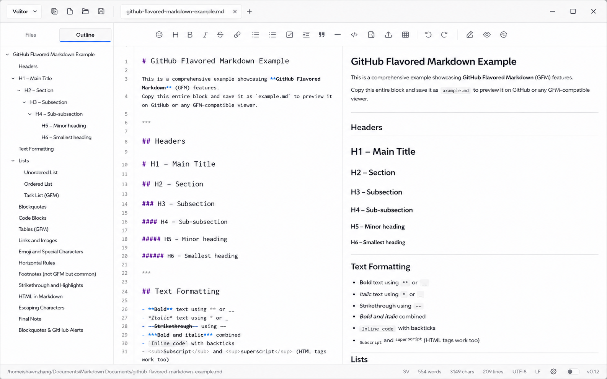

# Vditor Desktop 0.1.3 UI 改版开发计划

> 目标版本：`0.1.3`  
> 开发分支：`dev-0.1.3`

> 状态：核心 UI 改版已在 0.1.3 发布。本文保留为实现记录；未完成的文件可靠性工作继续由 0.2.0 计划跟踪。

## 1. 文档目的

本文档将新 UI 构思转为可执行的 0.1.3 开发计划。目标是减少编辑器顶部的固定占用，整理应用级导航、文档标签和编辑命令的层级，同时保持 Vditor Desktop 作为本地 Markdown 文件编辑器的简洁定位。

这不是重写 renderer 的计划。必须在现有 HTML、CSS 和原生 JavaScript 架构上渐进实施，每个阶段结束后应用都应能正常构建、启动并通过对应回归测试。

## 2. 当前基线

当前页面结构大致是三行：

```text
自定义窗口标题栏：菜单、应用标题、窗口控制
固定工具栏：新建、打开、保存、Vditor 工具栏
标签栏：文档标签和新建标签按钮
```

主要实现位置：

- 页面壳与固定区域：`src/renderer/index.html`
- 布局、主题和 Vditor 外观覆盖：`src/renderer/styles/app.css`
- 标签、侧边栏、菜单、快捷键和布局状态：`src/renderer/app.js`
- macOS 原生菜单：`src/main/menu.ts`
- 设置默认值和持久化字段：`src/main/services/app-state.ts`

目前已有的相关状态：

- `sidebarVisible`
- `toolbarVisible`
- `sidebarWidth`
- 标签栏临时显示状态（由 `#app.tabbar-hidden` 控制，尚未持久化）
- 侧边栏、固定工具栏、状态栏与全屏状态

0.1.3 改版必须先以当前代码和测试结果为准；若实现已发生变化，不应为了匹配本文档而反向重写合理的现有成果。

## 3. 改版目标

0.1.3 重新设计的UI界面概念图：



### 3.1 顶部结构

将当前三行顶部结构收束为以下两种稳定布局。

侧边栏展开且固定工具栏显示：

```text
统一顶部工作区栏：Vditor Desktop 菜单 | 侧边栏开关 新建 打开 保存 | 文档标签 | 新建标签 | （右上角）窗口控制
（当侧边栏显示时）文件和大纲两个属于侧边栏的按钮 | 固定 Vditor 工具栏：仅编辑命令
工作区：侧边栏内容的部分 | 编辑器
```

侧边栏收起且固定工具栏显示：

```text
统一顶部工作区栏：Vditor Desktop 菜单 | 侧边栏开关 | 文档标签 | 新建标签 | （右上角）窗口控制
固定 Vditor 工具栏：仅编辑命令
工作区：编辑器
```

固定工具栏隐藏时，只保留统一顶部工作区栏，编辑区直接接在它之后。

按下侧边栏开关后，侧边栏和“新建、打开、保存”三个按钮有一个同步的显隐动画；隐藏侧边栏时，顶部工作区栏上的“新建、打开、保存”三个按钮同步隐藏，侧边栏开关按钮保留；

### 3.2 信息层级

- 顶部工作区栏负责应用级动作、文档切换和窗口控制；File 与 View 命令收束为一个 Vditor Desktop 下拉菜单。
- 固定 Vditor 工具栏只负责 Markdown 编辑命令。
- 侧边栏继续负责 Files 和 Outline。
- 状态栏继续保留路径、文档统计、编码、行尾、设置和主题开关。
- 不把 Vditor 的编辑命令复制到应用菜单或新建第二套编辑命令逻辑。

### 3.3 侧边栏联动

侧边栏开关仍是唯一的布局控制入口之一：

- 侧边栏展开：显示新建、打开、保存三个主文件操作按钮。
- 侧边栏收起：侧边栏向左收起，三个主文件操作按钮同时隐藏，标签区自然占用释放出的空间。
- 编辑区同步扩展；第一个标签不要求与编辑区左沿强制对齐。
- 文件菜单和现有快捷键始终保留，新建、打开和保存不会因隐藏按钮而不可达。

文件操作按钮的可见性必须由 `sidebarVisible` 推导，不能新增独立持久化状态。例如：

```js
const showPrimaryFileActions = state.settings.sidebarVisible;
```

这避免出现“侧边栏隐藏、文件操作按钮仍显示”等无意义组合状态。

## 4. 视觉与交互规范

### 4.1 统一顶部工作区栏

- 使用当前主题 token，例如 `--panel-2`、`--border`、`--muted`、`--text`、`--accent`；不得为新 UI 新建脱离三套主题的硬编码色板。
- 保持紧凑的桌面密度，按钮以图标为主并保留本地化 tooltip/aria-label。
- 左侧应用控制组、标签区和右侧窗口控制组之间使用细分隔线或间距区分职责，不堆叠多层重边框。
- 标签区是弹性区域，自动占据左右控制组之间的剩余宽度。
- 标签过多时保持横向滚动；切换标签后活动标签必须自动可见。
- 新建标签按钮属于标签区末尾，不应占用文件操作组空间。

### 4.2 侧边栏收放动画

- 使用 CSS transition 实现侧边栏宽度/transform、文件操作组和标签区的平滑过渡。
- 动画不应阻塞点击、键盘快捷键、文件树滚动或 Vditor 输入。
- 收起期间不得销毁工作区树、Outline、编辑器或 Vditor 实例。
- 侧边栏宽度仍使用现有 `sidebarWidth`；重新展开后恢复用户保存的宽度。
- 降低动画偏好可通过 `prefers-reduced-motion` 禁用或明显缩短过渡。

### 4.3 拖拽与不可拖拽区域

自定义标题栏必须保留明确边界：

- 窗口标题栏的真正空白区域可拖动窗口。
- 菜单、侧边栏开关、文件操作、标签、新建标签和窗口控制必须是不可拖拽区域。
- 不能因标签区移入顶部栏而出现点击标签触发窗口拖动的行为。此处按住标签并横向移动鼠标指针，改变的是标签排序，而不是窗口位置。

### 4.4 macOS

- 保留原生红黄绿交通灯和 `hiddenInset` 标题栏策略。
- 顶部左侧应用控制组必须为交通灯预留固定安全宽度，而非为每个按钮单独添加平台偏移。
- macOS 上窗口控制不显示自定义最小化、最大化、关闭按钮。
- 无论侧边栏和文件操作组显示状态如何，应用控制和标签区都从安全区之后自然排列。

### 4.5 主题、缩放与窄窗口

必须在 Light、Dark、Monokai Pro Dark 中验证：

- 顶部栏层次、边框、hover、活动标签和工具提示保持可读。
- Monokai Pro Dark 中沿用既有强调色与标题配色，不引入纯白或纯黑的突兀元素。
- UI zoom 为 75%、100%、125%、150% 时，按钮、标签和窗口控制不重叠。
- 窄窗口优先保留：应用菜单、侧边栏开关、活动标签、窗口控制。
- 空间不足时文件操作按钮可按现有侧边栏规则隐藏；不得让窗口控制、活动标签或关闭按钮被挤出视口。

## 5. 0.1.3 范围

### 5.1 本版本必须完成

1. 将文档标签栏合并进统一顶部工作区栏。
2. 将新建、打开、保存按钮移入顶部工作区栏，并与侧边栏显示状态联动。
3. 将 Vditor 固定工具栏保留为独立的第二行，仅承载编辑命令。
4. 保留固定工具栏的显示/隐藏设置，隐藏后释放垂直编辑空间。
5. 调整侧边栏展开/收起动画、标签区弹性布局和活动标签可见性。
6. 整理 renderer 自绘菜单和 macOS 原生菜单，使其与新布局一致。
7. 完成 Light、Dark、Monokai Pro Dark、macOS、缩放和窄窗口回归测试。
8. 更新 README、README_CN、CHANGELOG 和相关静态/E2E 测试。

### 5.2 本版本明确不做

- 不实现浮动工具栏。
- 不实现选区格式化浮层。
- 不增加“完整/浮动/隐藏”三态工具栏设置；0.1.3 仅保留固定工具栏显示/隐藏。
- 不重写 renderer，不引入 React、Vue、Svelte 或状态框架。
- 不升级 Vditor，不修改 `node_modules/vditor` 或 bundled Vditor 资源。
- 不改变 Markdown 编辑、保存、工作区、标签、多模式编辑或搜索替换的既有语义。
- 不为 UI 改版顺带重做设置页、侧边栏文件树、状态栏或主题系统。

浮动工具栏仍是后续版本候选项。未来实现时，可将固定工具栏状态演进为：

```text
fixed    顶部显示固定 Vditor 工具栏
floating 选区时显示上下文工具栏
hidden   不显示编辑工具栏
```

但该模型不应提前写入 0.1.3 设置或 UI，以免制造未完成状态。

## 6. 菜单信息架构

新 UI 后保留更少但职责清晰的菜单。所有用户可见文本继续使用 `src/renderer/locales.js` 的三语言 key；macOS 菜单保持相同功能顺序和语言。

### 6.1 File

完整保留：

1. New File
2. Open File
3. Open Folder
4. Save
5. Save As
6. Export HTML
7. Export PDF
8. Close Window / Quit（遵循平台惯例）

按文件生命周期分组，在现有合适位置使用灰色分隔线。

### 6.2 Edit

删除 renderer 自绘 Edit 菜单及 macOS 原生 Edit 菜单中的标准编辑项；本版本不提供单独的 Edit 顶部菜单。

保留可达性：

- Vditor 工具栏及操作系统标准文本编辑行为继续可用。
- 搜索/替换不因删除 Edit 菜单而丢失，`Ctrl/Cmd + F` 是主要入口；是否在 File 或 View 提供“Find and Replace”二级入口，应在实现前以可发现性测试决定，不能静默移除菜单可达性。

### 6.3 View

建议顺序：

1. Editing Mode 子菜单：WYSIWYG、Instant Rendering、Split Preview。
2. Settings。

删除：

- Show Tab Bar：标签栏固定在统一顶部工作区栏。
- Toggle Fullscreen：不再作为自绘 View 菜单项；原生窗口/系统快捷键策略在实施前核对，不能在所有入口都不可达的情况下删除。
- Help 顶部菜单：About 和项目链接由 Settings > About 提供。

每个职责组之间使用分隔线，避免菜单成为无结构的命令列表。

## 7. 技术约束

### 7.1 DOM 与 CSS

- 优先重排现有 `#windowTitlebar`、`.titlebar`、`.app-tools`、`#tabBar`、`#vditorToolbarMount`，避免重复创建第二套标题栏或标签栏。
- 迁移标签栏时保留现有 `#tabBar`、`.document-tab`、`#addTab` 的事件和横向滚动能力，先移动结构/样式，再调整控制逻辑。
- 不使用绝对定位模拟正常流式布局；顶部控制组和标签区应使用 flex/grid 自然分配宽度。
- CSS 中与 Vditor 私有 class/DOM 相关的规则仍集中在现有 Vditor integration 区段；新布局代码不得在业务 JS 中新增 Vditor 私有 selector。

### 7.2 状态与持久化

- `sidebarVisible` 继续是侧边栏和顶部文件操作组的单一状态来源。
- `toolbarVisible` 继续代表固定 Vditor 工具栏的显示/隐藏。
- 删除标签栏显隐入口后，删除对应临时 class、菜单状态和测试；除非存在已发布的持久化字段，否则不增加兼容迁移代码。
- 用户调整侧边栏宽度、窗口大小、最大化状态、主题和缩放后的现有持久化行为必须不变。

### 7.3 Vditor 生命周期

- 单纯调整顶部栏、标签位置、侧边栏动画、文件操作按钮和样式时，不得重建任何 Vditor 实例。
- 固定工具栏仍可使用现有 `#vditorToolbarMount` 迁移活动标签 Vditor toolbar 的机制。
- 侧边栏收起、顶部栏重排、菜单开关和标签滚动不应触碰 Vditor 私有 DOM。
- 如确需改变 Vditor toolbar 挂载策略，先检查 `src/renderer/vditor-adapter.js`、Vditor 3.11.3 源码和真实 E2E DOM contract。

### 7.4 无障碍与本地化

- 所有新增按钮要有本地化 title、`aria-label`、focus-visible 状态和可键盘操作路径。
- 不得只给中文或英文新增菜单/tooltip 文案。
- `prefers-reduced-motion` 下避免侧边栏和顶部栏大范围平移动画。
- 标签、菜单、窗口控制与侧边栏开关的焦点顺序必须符合视觉顺序。

## 8. 实施阶段

### 阶段 A：基线与布局骨架

1. 确认 `dev-0.1.3` 分支、HEAD、工作区状态和概念图资源状态。
2. 运行 `npm run check:all`，记录基线。
3. 在 `index.html` 中将 `#tabBar` 移入顶部工作区栏的目标结构，但暂不改变可见功能。
4. 以 CSS 建立顶部左控制组、弹性标签区、右窗口控制组和 macOS 安全区。
5. 添加静态 shell 测试，确认只有一个标签栏、一个 Vditor toolbar mount 和一个窗口控制组。

验收：应用启动正常，所有标签操作、窗口控制和 Vditor 工具栏仍可用。

### 阶段 B：固定工具栏与垂直空间

1. 保持 Vditor 固定工具栏作为顶部第二行。
2. 删除旧标签栏行后留下的高度、边框、阴影和 overflow 假设。
3. 调整 `toolbarVisible` 行为：隐藏固定工具栏时编辑区向上扩展。
4. 验证三种编辑模式、统一 toolbar mount、工具提示、菜单和焦点不回归。

验收：固定工具栏显示/隐藏不重建 Vditor，不损失撤销栈、光标、选区或滚动位置。

### 阶段 C：菜单整理与平台适配

1. 根据第 6 节删除 Edit、Help、Tabbar Layout 等过时的自绘菜单项。
2. 同步调整 macOS 原生菜单，确保功能顺序与 renderer 一致。
3. 验证 macOS 交通灯安全区、Linux/Windows 窗口控制、全屏策略和窗口拖拽区域。
4. 删除已不存在布局项的 locale keys、事件处理和测试；保留仍被原生菜单或快捷键使用的 key。

验收：不同平台没有重复、失效或不可达菜单命令；菜单分隔符合文件、视图和设置的职责分组。

### 阶段 D：视觉完善与回归

1. 完成三套主题下的边框、hover、活动标签、阴影、状态栏衔接和焦点可见性调整。
2. 完成窄窗口、UI zoom、长文件名、多标签溢出和 macOS 布局验证。
3. 更新 README、README_CN 和 CHANGELOG，明确 UI 结构变化及仍未实现的浮动工具栏。
4. 执行完整检查和 Linux 实机冒烟测试。

## 9. 测试计划

### 9.1 单元与 shell 契约

更新 `tests/unit/renderer-shell.test.ts`，至少覆盖：

- 顶部工作区栏内仅存在一个 `#tabBar`。
- `#addTab` 位于标签区，且标签区在左控制组与窗口控制之间。
- 新建、打开、保存按钮位于顶部左控制组。
- 侧边栏开关与文件操作组使用同一 `sidebarVisible` 派生规则。
- 固定工具栏仍使用唯一的 `#vditorToolbarMount`。
- 删除 Edit、Help、Show Tab Bar 后，自绘菜单、native menu 和 locale 不存在孤立入口。
- CSS 包含 macOS 安全区、窄窗口和 reduced-motion 规则。
- 新增用户文案在三种 locale 中完整存在。

### 9.2 Electron E2E

在 `tests/e2e/app.spec.ts` 中增加或调整：

- 默认完整布局为两行顶部结构，标签在统一顶部栏中可切换和关闭。
- 侧边栏收起后文件操作组隐藏、编辑区变宽、活动标签仍可见。
- 侧边栏重新展开后文件操作组恢复，工作区和 Outline 状态不丢失。
- 固定工具栏显示/隐藏后不重建编辑器，之前编辑仍可撤销。
- 多标签下活动标签自动滚动到可见区域。
- 文件、菜单、快捷键、新建、打开、保存、搜索替换和关闭确认仍可用。
- Light、Dark、Monokai Pro Dark 下关键顶部元素可见且颜色稳定。
- macOS 条件测试验证交通灯安全区；Linux/Windows 验证自定义窗口控制。
- 75%、100%、125%、150% UI zoom 与窄窗口下无重叠、无不可点击控件。

### 9.3 必需验证命令

```bash
npm run format:check
npm run lint
npm run typecheck
npm run check:vditor
npm test
npm run build
npm run test:e2e
```

由于本任务修改 renderer shell 和主进程菜单，合并前必须运行：

```bash
npm run check:all
```

若 Electron E2E 无法启动且没有进入断言，按项目约定记录为环境限制；断言失败则必须修复或明确记录原因。

## 10. 发布与文档

- 完成开发后，在 `dev-0.1.3` 上审查 UI、测试、文档和 CHANGELOG。
- 通过 Pull Request 合入 `master`；不得直接在 `master` 开发。
- 合并后的最终 `master` commit 创建 `0.1.3` 或 `v0.1.3` tag，再从 tag 构建发布产物。
- 新版本或新功能不复用常驻 `dev` 分支；应建立与版本或功能对应的 `dev-*` / `feat-*` 分支。
- 如 UI 改版改变安装包、桌面入口或打包行为，再单独执行对应 Linux release 命令；纯 renderer UI 调整不应修改 release 脚本。

## 11. 风险与决策点

### 风险

- 顶部栏重排可能破坏标题栏拖拽、macOS traffic light、窗口控制或标签点击。
- CSS 调整可能与 Vditor toolbar 的挂载/tooltip/overflow 行为冲突。
- 侧边栏动画如果通过销毁 DOM 或重建编辑器实现，会造成文件树状态、滚动或撤销栈回归。
- 删除菜单项可能使搜索、全屏或关闭窗口等功能失去唯一可发现入口。
- 为了概念图视觉效果而硬编码尺寸，可能在缩放、长 locale 文案或窄窗口下溢出。

### 已决策事项

1. 删除 Edit 顶部菜单后，搜索/替换仅通过 `Ctrl/Cmd + F` 触达。
2. 删除自绘 View > Toggle Fullscreen 后，保留 `F11` 和 macOS 原生 fullscreen 菜单入口。
3. 侧边栏收起时，顶部文件操作组直接收起；极窄窗口不额外增加溢出菜单。
4. README 和 README_CN 已更新文字说明；新截图可在发布前 Linux 实机验证时按最终视觉效果决定是否补充。

不能以未完成的浮动工具栏设计替代当前固定工具栏的明确行为。
