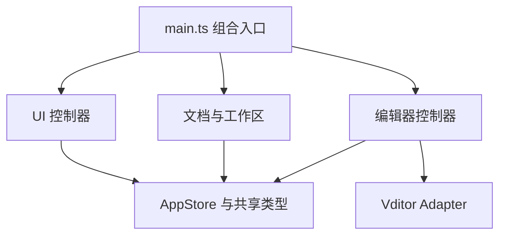

# Vditor-Electron 0.2.5 渲染层架构重构计划

> 项目仓库：[https://github.com/Studio-200A/Vditor-Electron](https://github.com/Studio-200A/Vditor-Electron)
> 目标版本：`0.2.5`
> 前置版本：`0.2.0` 已完成功能开发、回归测试并形成稳定基线
> 核心任务：渐进式拆解 `src/renderer/app.js`，建立类型明确、职责清晰、可独立测试的渲染层架构

## 1. 文档用途

本文档供 coding agent 在 Vditor-Electron 0.2.0 稳定后实施 0.2.5 渲染层重构。

0.2.5 不是一次面向用户的大功能版本，而是一次为后续维护、Vditor 升级和功能迭代建立工程基础的内部架构版本。重构对象以当前 2300 行左右的 `src/renderer/app.js` 为中心，但目标不是把一个大文件机械切割成许多小文件，也不是使用全新框架推倒重写。

正确的完成标准是：在用户可观察行为基本不变的前提下，明确状态归属、模块职责、依赖方向和生命周期，让单个模块能够独立理解、测试、修改和替换。

开始实施前，agent 必须先检查 0.2.0 的实际代码和测试结果。本文档以 0.1.0 评审时的结构以及 0.2.0 计划为依据；如果 0.2.0 已经拆出部分模块，应保留并评估现有成果，不能为了符合本文档建议的目录名而重新改写已经合理的实现。

## 2. 为什么安排为 0.2.5

0.2.0 优先解决用户可以直接感知的问题和桌面编辑器的基础风险，包括工具栏体验、保存可靠性、异常恢复、外部文件冲突、安全边界、设置重建和已确认缺陷。它还要求新增功能具备清晰边界，但明确排除了对整个 `app.js` 的一次性全量重写。

将完整的渲染层重构放到 0.2.5 有三个原因：

1. **先固定行为，再改变结构。** 0.2.0 补充的单元测试和 E2E 测试可以成为重构安全网。
2. **避免功能开发与大规模搬迁互相干扰。** 如果浮动工具栏、恢复机制和安全调整与全量重构同时进行，回归后很难判断问题来自功能还是结构变化。
3. **版本语义合适。** 0.2.5 可以承载一次基本保持功能兼容、但工程结构明显变化的中间版本，为 0.3.0 新功能或 Vditor 升级做准备。

因此，本计划建议使用“渐进式架构重构”，不要把任务描述为“重写 app.js”。后者容易诱导 agent 先删除现有实现，再凭理解重新制造一套行为近似但细节不同的应用。

## 3. 当前问题概述

当前 `src/renderer/app.js` 约 2303 行，包含约 70 个具名函数，并在同一个立即执行函数中负责：

- 全局应用状态和标签页状态；
- 本地化；
- 确认对话框和消息提示；
- 主题、字体和缩放；
- Vditor 创建、销毁、重建和工具栏挂载；
- 分栏模式行号、空白符、同步布局和拖动分隔线；
- 标签页创建、切换、关闭和保存；
- 文件打开、另存、自动保存和外部变化；
- 工作区、文件树、右键菜单和目录操作；
- 大纲生成与跳转；
- 图片上传和压缩；
- HTML/PDF 导出；
- session 和 recovery；
- 设置窗口、设置保存、拖动和缩放；
- 应用菜单、窗口按钮、快捷键和拖放；
- 启动初始化及各种全局事件监听。

这不是单纯的“文件太长”。更深层的问题是这些职责共享同一个可变 `state`、直接查询全局 DOM，并互相调用内部函数。任何局部改动都可能影响编辑器生命周期、标签状态、设置持久化或事件监听。

典型风险包括：

- 很难判断某个状态应由谁修改，哪些 UI 需要同步刷新；
- 设置、模式切换或另存操作容易触发范围过大的编辑器重建；
- 事件监听、Observer、计时器和保存的 DOM Range 容易泄漏；
- 测试只能搜索源码字符串或启动整个应用，难以验证单个行为；
- Vditor 私有 DOM、桌面文件逻辑和 UI 展示逻辑容易再次混合；
- coding agent 修改一个功能时需要加载并理解整个文件，增加误改概率。

## 4. 重构原则

0.2.5 必须遵守以下原则。

### 4.1 行为保持优先

- 重构前后，除本文档明确允许的细小一致性修复外，用户可观察行为应保持一致。
- 不顺手重做 UI、改变快捷键、重命名菜单、改变设置默认值或调整 Markdown 语义。
- 如果在重构中发现缺陷，先添加能够复现它的测试，再决定作为小型修复纳入还是记录到后续版本。

### 4.2 逐步迁移，不执行“大爆炸式重写”

- 任何阶段结束时，应用都必须能构建并正常启动。
- 每次迁移一个职责域，完成接入和测试后再删除旧实现。
- 不允许先创建所有空模块、删除 `app.js`，然后一次性补回功能。
- 不允许长期保留“新旧两套实现同时监听同一事件”的过渡状态。

### 4.3 按职责和状态所有权拆分

- 模块边界应由“谁拥有这类状态、谁负责这段生命周期”决定，而不是按函数数量平均切割。
- 一个模块可以有几百行，只要职责内聚；不要为了追求短文件制造几十个无法独立理解的小模块。
- 不把 `app.js` 的全局变量简单移动到一个新的 `globals.ts`。

### 4.4 明确依赖，避免新的隐式耦合

- 依赖从启动组合层流向领域控制器和基础服务。
- 优先使用构造参数或明确的上下文对象注入依赖。
- 不用全局事件总线替代所有直接调用。只有确实属于广播型通知的状态才使用事件订阅。
- 不允许形成模块循环依赖。

### 4.5 保持 Vditor 兼容边界

- Vditor 私有 DOM 查询继续集中在 adapter。
- 0.2.5 不升级 Vditor，不修改 vendored Vditor 文件。
- 可以为现有 JavaScript adapter 增加 TypeScript 类型声明或薄封装，但不应在重构初期同时改写其内部行为。

## 5. 范围与非目标

### 5.1 本版本必须完成

- 为 renderer 建立独立、严格的 TypeScript 构建与类型检查流程。
- 把 `app.js` 中的状态、领域逻辑和 UI 生命周期迁移到边界清晰的模块。
- 建立明确的应用组合入口。
- 为 preload API、Vditor、adapter、设置和标签页状态建立类型。
- 将依赖源码字符串的测试逐步改成模块行为测试和 DOM 行为测试。
- 建立统一的初始化与销毁协议，避免重复监听和资源泄漏。
- 最终移除旧的 `src/renderer/app.js`，或只保留一个不包含业务逻辑的极薄兼容启动文件。

### 5.2 本版本明确不做

- 不引入 React、Vue、Svelte 等 UI 框架。
- 不改变应用的本地优先 Markdown 编辑器定位。
- 不升级 Vditor。
- 不重做 main process 和 preload 架构；只在共享类型或 renderer 调用契约需要时做最小配合修改。
- 不新增云同步、知识库、插件系统或命令面板。
- 不借重构重新设计设置页面、文件树、标签栏或主题。
- 不以代码覆盖率数字为目标编写低价值测试。
- 不为了清除所有 DOM 操作而引入复杂虚拟 DOM 或状态框架。

---

# 第一部分：目标架构

## 6. 建议目录结构

以下是推荐的职责划分，不是必须逐字使用的目录模板。agent 应根据 0.2.0 最终代码调整命名和粒度，但必须保留同等清晰的边界。

```text
src/renderer/
├─ main.ts                         # 唯一应用组合入口
├─ types/
│  ├─ app.ts                       # AppState、DocumentTab 等核心类型
│  ├─ bridges.d.ts                 # window.appAPI / fileAPI 类型
│  └─ vditor.d.ts                  # Vditor 与 adapter 的必要类型
├─ core/
│  ├─ app-store.ts                 # 应用级状态及受控修改入口
│  ├─ disposables.ts               # listener/timer/observer 统一清理
│  └─ dom.ts                       # 小型、类型安全的 DOM 查询辅助
├─ ui/
│  ├─ dialogs.ts                   # 确认与未保存对话框
│  ├─ notifications.ts             # 状态消息
│  ├─ localization.ts              # 语言解析与文案应用
│  ├─ theme-controller.ts          # 主题、代码主题
│  ├─ presentation-controller.ts   # 字体、缩放、段落宽度
│  ├─ menu-controller.ts           # renderer 自定义菜单
│  └─ window-controller.ts         # 标题栏、全屏、最大化状态
├─ documents/
│  ├─ document-controller.ts       # 新建、打开、保存、关闭、外部变化
│  ├─ tab-controller.ts            # 标签渲染、切换、活动状态
│  ├─ document-state.ts            # modified/conflict/recovery 纯状态逻辑
│  └─ session-controller.ts        # session 与恢复快照协调
├─ editor/
│  ├─ editor-controller.ts         # Vditor 生命周期与活动编辑器
│  ├─ editor-options.ts            # 从设置构造 Vditor options
│  ├─ toolbar-controller.ts        # 顶部/浮动/隐藏工具栏
│  ├─ split-view-controller.ts     # 行号、空白符、分隔线、SV 增强
│  ├─ outline-controller.ts        # 大纲生成与跳转
│  └─ image-controller.ts          # 图片上传、压缩和资源基址
├─ workspace/
│  ├─ workspace-controller.ts      # 打开工作区、刷新、监听
│  ├─ explorer-controller.ts       # 文件树及目录操作
│  └─ path-display.ts              # 文件名和中间省略等纯函数
├─ settings/
│  ├─ settings-controller.ts       # 打开、保存、重置和热应用
│  └─ settings-window.ts           # 设置卡片拖动与尺寸
├─ export/
│  └─ export-controller.ts         # HTML/PDF 导出
├─ vditor-adapter.js               # 初期保留现有兼容层
├─ locales.js                      # 初期可保留现有语言资源
├─ index.html
└─ styles/app.css
```

目录结构的重点不是文件数量，而是形成几个稳定领域：应用壳、文档、编辑器、工作区、设置、导出。若某个建议文件只有十几行并且没有独立生命周期，可以与同领域模块合并。

## 7. 依赖方向

建议依赖关系如下：



约束：

- `main.ts` 创建 store、解析 DOM、实例化控制器、连接回调并启动应用。
- 领域控制器不得反向 import `main.ts`。
- UI 模块不得直接读写其他模块内部变量。
- `AppStore` 不操作 DOM、不调用 Electron API，也不创建 Vditor。
- adapter 不知道标签页、设置窗口或工作区。
- preload bridge 类型位于边界层，领域模块通过窄接口使用它们。
- 禁止 `documents → editor → documents` 形式的循环依赖；需要协作时由组合入口注入接口或回调。

## 8. 状态所有权

### 8.1 AppStore 的职责

AppStore 保存真正跨模块共享且有持续生命周期的状态，例如：

```ts
interface AppState {
  documents: DocumentTab[];
  activeDocumentId: string | null;
  workspacePath: string;
  settings: AppSettings;
  defaultSettings: AppSettings;
  locale: SupportedLocale;
}
```

它应提供受控操作，例如：

```ts
store.addDocument(document);
store.activateDocument(id);
store.updateDocument(id, patch);
store.removeDocument(id);
store.updateSettings(settings);
```

不要要求所有状态都经过复杂 reducer，也不要引入 Redux。这个 store 的作用是阻止任意模块直接修改无边界全局对象，并为状态变化建立可追踪入口。

### 8.2 不应进入 AppStore 的状态

以下短生命周期状态应由对应控制器自己拥有：

- 消息提示的 timeout；
- 菜单关闭监听；
- 设置窗口关闭动画 timer；
- 文件树文字测量 canvas；
- 单个标签页的 ResizeObserver、MutationObserver 和 animation frame；
- 浮动工具栏保存的 Range；
- 对话框当前 Promise resolver；
- 拖动过程中的坐标和 pointer capture。

### 8.3 DocumentTab 类型

必须给标签页建立明确类型，至少区分：

- 可持久化的文档状态：ID、路径、标题、内容、保存基线、行尾、编辑模式、modified、外部冲突；
- 编辑器运行时资源：Vditor 实例、host、toolbar、observer、timer、保存的选区；
- UI 派生状态：是否活动、标签显示文字等。

更推荐把“文档数据”和“Vditor 运行时句柄”拆成两个关联对象，避免 session/recovery 代码意外序列化 DOM 或 Vditor 实例。

## 9. 控制器生命周期

具有 DOM 监听、Observer、timer 或外部订阅的模块统一实现类似接口：

```ts
interface Controller {
  init(): void | Promise<void>;
  dispose(): void;
}
```

可以建立简单的 `DisposableBag`：

- 注册 `addEventListener` 对应的移除函数；
- 注册 Electron/preload 订阅的 unsubscribe；
- 清理 timeout、animation frame；
- disconnect MutationObserver 和 ResizeObserver；
- 标签关闭时释放标签级资源；
- 应用重建或测试结束时统一 dispose。

不要引入重量级依赖注入框架。构造函数和小型接口已经足够。

---

# 第二部分：Renderer TypeScript 与构建基础

## 10. 建立独立 renderer 构建

当前 renderer 源文件由资源复制脚本直接复制到 `dist/renderer`。0.2.5 需要引入明确的 renderer 编译步骤。

推荐方案是使用轻量 bundler 将 `src/renderer/main.ts` 及其模块输出为浏览器可执行的单一入口，例如：

```text
src/renderer/main.ts → dist/renderer/app.js
```

选择 bundler 时遵守：

- 配置简单、构建可复现；
- 支持 TypeScript、ES2022 和 sourcemap；
- 不注入 Node polyfill；
- 不允许 renderer import Node 内置模块；
- 不把 Vditor 的大型 vendored 资源重复打进 bundle；
- 产物仍由现有 `app://` 协议加载；
- production 构建不依赖开发服务器。

可以使用 esbuild 等轻量工具，但 agent 应先验证当前 Electron、自定义协议和 CSP 下的加载行为，再提交最终方案。若使用原生 ESM 多文件输出，也必须验证 `app://` 的 MIME、相对 import、CSP 和打包路径；不能只以浏览器理论支持作为完成依据。

## 11. 构建脚本调整

- [ ] 新增 `tsconfig.renderer.json`，启用 strict，目标与当前 Electron Chromium 能力一致。
- [ ] 新增 `build:renderer`。
- [ ] `npm run build` 同时构建 main、renderer 并复制静态资源。
- [ ] 修改现有资源复制脚本，使其不再把 `.ts` 源码和未编译入口复制到产物。
- [ ] HTML、CSS、图标、语言资源和 Vditor 资源继续正确复制。
- [ ] `index.html` 只加载一个正式应用入口；Vditor 和 adapter 如暂时保持全局脚本，应固定加载顺序。
- [ ] 增加 `typecheck:renderer`，并纳入 `npm run check`。
- [ ] 开发构建保留 sourcemap，发布包根据项目策略决定是否保留。
- [ ] 清理构建目录时只删除明确产物，不能影响用户文件或仓库外路径。

## 12. 浏览器全局类型

为以下全局对象建立最小而准确的声明：

- `window.appAPI`
- `window.fileAPI`
- `window.VditorDesktopAdapter`
- `window.VditorDesktopLocales`
- Vditor constructor 和本项目实际调用的方法

要求：

- 类型必须来自 preload 暴露的真实接口，不能大量使用 `any` 让检查失效。
- 对第三方 Vditor 类型中缺失的私有 DOM 行为，可在 adapter 边界使用窄范围类型断言。
- 不要在领域模块到处使用 `as any`。
- 对可能为空的 DOM、未 ready 的 Vditor 和已销毁的标签页进行真实建模。
- main process 的 `AppSettings` 类型应尽量成为 renderer 可复用的共享契约，避免复制后发生字段漂移；如移动源文件会影响 main 构建，可先建立无运行时代码的共享类型目录。

## 13. 类型安全的 DOM 入口

当前 `$` / `$$` 默认假定元素存在。重构后建立两个语义明确的辅助方法：

```ts
requiredElement<HTMLButtonElement>('#saveFile');
optionalElement<HTMLElement>('#someOptionalNode');
```

- 必需 DOM 缺失时在启动阶段给出包含 selector 的明确错误。
- 可选 DOM 必须由调用方处理 `null`。
- 不要把所有 selector 集中成一个数百项常量文件；按控制器保存其拥有的 DOM 引用。
- 控制器初始化时查询并缓存稳定节点，不在高频事件中反复全局查询。

---

# 第三部分：渐进式迁移顺序

## 14. 阶段 0：冻结 0.2.0 行为基线

在架构改动前：

- [ ] 从 0.2.0 稳定 tag 或专用重构分支开始，不直接在未完成的功能分支上迁移。
- [ ] 运行完整 `npm run check` 和 E2E。
- [ ] 对所有核心用户路径建立行为清单。
- [ ] 补齐明显缺失的回归测试，尤其是工具栏、保存、恢复、冲突、设置热更新和三种编辑模式。
- [ ] 保存 0.2.0 三种主题、三种编辑模式和三种工具栏模式的基准截图，供人工对比，不做脆弱的全页面像素测试。

核心行为清单至少包括：

1. 启动与 session 恢复；
2. 新建、打开、保存、另存和关闭；
3. 标签切换和独立编辑模式；
4. 完整/浮动/隐藏工具栏；
5. 工作区树、重命名、删除和外部变化；
6. 主题、字体、缩放和设置热应用；
7. 大纲、图片、HTML/PDF 导出；
8. 未保存关闭确认、异常恢复和窗口事件。

## 15. 阶段 1：建立 TypeScript 入口，但保持原行为

目标：先证明新构建管线可用，不同时拆业务。

- [ ] 建立 `main.ts` 和 renderer bundle。
- [ ] 将现有 `app.js` 暂时作为 legacy 模块或受控入口接入。
- [ ] 为全局 bridges、Vditor 和 adapter 添加类型声明。
- [ ] 调整 HTML 和构建脚本。
- [ ] 验证开发启动、正式构建和打包后的资源路径。
- [ ] 此阶段不改变用户行为。

如果无法在不制造双重初始化的情况下包装 legacy 入口，可以先把 IIFE 的启动点抽成显式 `bootstrapLegacyApp()`，但不要同时开始领域拆分。

## 16. 阶段 2：迁移无副作用的纯函数和基础 UI

优先迁移低风险、容易测试的内容：

- 文件名与扩展名处理；
- 行尾识别；
- HTML 转义；
- 主题判定与偏好选择；
- 中间省略计算；
- 工具栏模式等纯状态转换；
- localization；
- notifications；
- dialogs。

每迁移一组函数：

1. 为纯函数增加单元测试；
2. 从新模块导入并替换旧调用；
3. 删除 `app.js` 中的旧定义；
4. 运行相关测试和构建。

不要保留一份旧函数和一份新函数等待“最后统一删除”。

## 17. 阶段 3：建立 AppStore 与标签页模型

这是整个重构的关键阶段。

- [ ] 定义 `AppState`、`DocumentState`、`EditorRuntime`、`ExternalConflict` 等类型。
- [ ] 建立受控的状态修改 API。
- [ ] 把 `activeTab()`、标签查找和标签状态更新迁移到 store/document model。
- [ ] 把 UI 派生状态与真实文档状态分开。
- [ ] 把 ignored external changes、recovery 标识等状态放到正确所有者，而不是全部塞入 store。
- [ ] 增加状态转换测试：新建、激活、modified、保存成功、冲突、关闭、恢复。

阶段结束时，旧 `state` 对象不应再被新旧模块任意直接修改。若仍需过渡适配器，只允许存在于组合入口，并记录删除阶段。

## 18. 阶段 4：迁移标签与文档生命周期

按以下顺序迁移：

1. 标签渲染和活动标签切换；
2. 新建和打开文件；
3. 当前内容读取；
4. 保存、另存和自动保存；
5. 关闭文档与未保存确认；
6. 外部变化和冲突；
7. session 与 recovery。

边界要求：

- DocumentController 负责文档用例，不直接拼接整个标签 DOM。
- TabController 负责标签栏表现，不负责读写磁盘。
- 文件 API 通过窄接口注入，单元测试使用 fake bridge，不访问真实 Electron。
- 保存结果通过明确返回值或异常表达，不能只靠全局消息判断。
- 文档关闭必须先协调 EditorController 释放运行时资源，再从 store 删除文档。

## 19. 阶段 5：迁移 Vditor 生命周期和编辑器增强

将最复杂、与 Vditor 耦合最深的部分放在状态模型稳定后迁移。

### 19.1 EditorController

负责：

- 创建和初始化 Vditor；
- 保存每个文档的 EditorRuntime；
- 获取/设置当前 Markdown 内容；
- focus；
- 切换编辑模式；
- 仅在必要时重建实例；
- 销毁实例和关联资源；
- 将 Vditor input/blur/after 回调转成明确的应用动作。

不得负责：

- 直接保存磁盘文件；
- 工作区树操作；
- 设置窗口 UI；
- 应用菜单构建。

### 19.2 SplitViewController

集中负责：

- SV 行号；
- 空白字符 canvas；
- 编辑/预览比例和拖动分隔线；
- 滚动相关增强；
- SV 特殊缩进选择处理。

每个编辑器实例使用独立 controller 或明确的 tab-scoped state，并在标签关闭和模式离开时 dispose。

### 19.3 ToolbarController

负责完整、浮动和隐藏工具栏模式、挂载目标、选区保存与恢复、浮动定位和工具按钮过滤。它依赖 EditorController 的窄接口，不直接管理文档保存或设置窗口。

### 19.4 OutlineController 与 ImageController

在 EditorController 稳定后迁移大纲和图片能力，继续通过 adapter 获取 Vditor DOM 结构。

此阶段必须重点回归：撤销历史、标签切换、三种模式、工具栏、相对图片、滚动位置、Observer 清理和编辑器重建次数。

## 20. 阶段 6：迁移工作区、设置、菜单和导出

### Workspace / Explorer

- WorkspaceController 管理根路径、watcher 事件和刷新请求。
- ExplorerController 只管理文件树 UI、展开状态、右键菜单和目录命令。
- 路径改变通过 DocumentController 更新打开文档，不直接改其内部对象。

### Settings

- SettingsController 管理设置草稿、验证、保存、重置和设置分类。
- ThemeController 与 PresentationController 提供热应用接口。
- SettingsWindow 只处理设置卡片的打开、关闭、拖动和尺寸。
- 保存设置后由设置差异决定需要通知哪些控制器，不执行全应用无条件刷新。

### Menus / Window

- MenuController 根据当前 store 状态生成勾选项并调用公开应用命令。
- WindowController 处理标题栏按钮、全屏和最大化显示。
- 菜单 handler 不直接跨模块修改 store。

### Export

- ExportController 通过 DocumentController/EditorController 获取当前内容或渲染结果。
- 图片来源修复、主题策略和写文件由明确依赖完成。

## 21. 阶段 7：移除 legacy app.js

满足以下条件后才能删除旧入口：

- 所有业务职责已经迁移；
- 全仓搜索确认没有旧函数或旧全局 state 的调用；
- index.html 只加载新入口；
- 构建脚本不再复制 legacy 文件；
- renderer 单元测试、集成测试和 E2E 全部通过；
- 人工对比 0.2.0 基准路径未发现行为变化。

最终 `main.ts` 应只承担组合和启动，例如：

1. 验证必需全局 API；
2. 解析初始设置与平台信息；
3. 创建 store 和控制器；
4. 连接控制器之间的窄接口；
5. 依次 init；
6. 通知 main process renderer ready；
7. 在退出或测试中 dispose。

不要让 `main.ts` 再次成长为新的 `app.js`。

---

# 第四部分：测试策略

## 22. 调整现有测试

当前部分 `renderer-shell.test.ts` 通过读取 `app.js` 并搜索源码字符串确认功能存在。这类测试可以在早期保护静态结构，但不适合模块化之后继续作为主要保证。

迁移原则：

- DOM 必须存在、脚本加载顺序和静态资源路径仍可做 shell 测试。
- 菜单是否调用正确命令，应实例化 MenuController 测试行为。
- 主题或设置是否生效，应测试 class、CSS variable 和 controller 调用。
- 文档状态应测试 store 和 document-state 结果。
- 不再用“源码中包含某段字符串”代替行为验证。
- 测试不应依赖私有函数在文件中的具体排列顺序。

## 23. 测试分层

### 23.1 纯单元测试

适合测试：

- 状态转换；
- 文件名、行尾、路径展示；
- 主题选择；
- 设置 diff 分类；
- 浮动工具栏几何计算；
- 文档冲突决策；
- session/recovery 序列化。

### 23.2 DOM 控制器测试

在 jsdom 中挂载最小 HTML fixture，注入 fake store 和 fake bridge，测试：

- 标签栏渲染及交互；
- 菜单勾选与命令分发；
- 对话框 Promise 行为；
- 设置窗口状态；
- toolbar 可见性和选区失效；
- explorer 展开、选中和菜单行为。

每个测试结束必须调用 dispose，借此验证监听清理接口真实可用。

### 23.3 Renderer 集成测试

组合真实 store 和多个 controller，使用 fake Electron API 与 fake Vditor，验证跨模块用例：

- 打开文件 → 创建标签 → 创建编辑器；
- 编辑 → modified → 保存 → 清除标记；
- 外部修改 → 冲突 → 暂停自动保存 → 用户解决；
- 设置变更 → 热应用 → 不重建编辑器；
- 关闭标签 → 清除 timer/observer/runtime。

### 23.4 Electron E2E

保留 E2E 验证真实 Electron、preload、自定义协议、Vditor 和操作系统窗口行为。不要把所有边界条件都堆进 E2E；E2E 重点确认真实组合没有破裂。

## 24. Fake 与测试接口

- fake Vditor 只实现项目实际使用的最小接口。
- fake bridge 必须符合真实 preload 类型。
- 不为测试在生产模块中增加只用于绕过封装的公开方法。
- 时间相关逻辑优先注入 clock/timer 或使用 fake timers。
- watcher、observer 和 resize 行为使用可控制的 adapter，而不是测试中等待真实系统事件。

## 25. 回归与泄漏检查

增加验证：

- 多次打开/关闭设置窗口不会累积 click/keydown listener。
- 多次切换标签不会重复注册工具栏 handler。
- 关闭标签后 observer 全部 disconnect，animation frame 和 timer 被取消。
- 多次切换工作区不会保留旧 watcher 订阅。
- 重建编辑器时旧 runtime 被完整释放。
- 浮动工具栏 Range 不引用已关闭文档的 DOM。

如果条件允许，可以在测试构建中为 listener/disposable 数量提供只读诊断，但不要把调试计数暴露给正式用户界面。

---

# 第五部分：提交、审查与发布

## 26. 分支与提交策略

建议从稳定的 0.2.0 tag 创建专用分支，例如：

```bash
git switch -c refactor/renderer-0.2.5 v0.2.0
```

如果 tag 名称不同，应使用实际稳定 tag，不要机械执行示例。

提交应按可运行阶段拆分，例如：

```plaintext
build(renderer): add typed renderer entry point
refactor(renderer): extract localization and dialogs
refactor(state): introduce typed document store
refactor(documents): isolate document lifecycle
refactor(editor): isolate Vditor lifecycle
refactor(editor): move split-view enhancements
refactor(workspace): isolate explorer and watcher flows
refactor(settings): separate persistence from presentation
test(renderer): replace source assertions with behavior tests
refactor(renderer): remove legacy app entry
```

要求：

- 每个提交都能构建，相关测试通过。
- 搬迁代码和改变行为尽量分开提交。
- 不在单个提交中同时迁移多个高风险领域。
- 不批量格式化无关文件。
- 不使用 `--no-verify`、跳过测试或大范围 lint disable 完成重构。

## 27. 每阶段检查点

每个阶段结束后，agent 必须汇报：

1. 哪些职责已经迁移，哪些仍在 legacy 文件；
2. 当前依赖方向是否出现循环；
3. 新增和更新的测试；
4. 构建、类型检查、单元测试和 E2E 结果；
5. 用户可观察行为是否有变化；
6. 下一阶段最高风险点。

如果阶段结束时出现大量 E2E 回归，应暂停继续搬迁，先修复当前阶段。不要把多阶段问题累计到最后集中处理。

## 28. 允许的细小修复

重构中可以纳入以下类型的小修复：

- 明确由重复监听造成的一次操作执行多次；
- 销毁时未清理 timer/observer；
- 空 DOM 导致的确定性崩溃；
- 类型建模揭示的未处理 null/undefined；
- 新旧模块交界处的状态不同步。

纳入条件：

- 先有复现测试；
- 修复范围小；
- commit message 标明 `fix` 而非混在 `refactor` 中；
- 不改变产品设计。

其他缺陷进入 `docs/00-ISSUES.md`，留到 0.2.6 或 0.3.0。

## 29. 文档要求

- [ ] 新增 `docs/RENDERER-ARCHITECTURE.md`，说明模块、状态所有权、依赖方向和启动流程。
- [ ] README 只需更新开发构建命令，不必向普通用户解释内部目录。
- [ ] 更新 `docs/20-VDITOR-UPGRADE.md`，说明 EditorController 与 adapter 的边界。
- [ ] 在贡献说明中记录新增 renderer 模块的放置原则。
- [ ] 0.2.5 changelog 明确说明这是内部架构升级，用户功能基本保持一致。

## 30. 性能与包体检查

架构重构不应显著恶化启动和运行表现。

- [ ] 比较 0.2.0 与 0.2.5 的 renderer bundle 大小。
- [ ] 确认没有把 Vditor 重复打入应用 bundle。
- [ ] 比较冷启动至 renderer ready 的时间，记录测量方法和环境。
- [ ] 打开多个标签时，Vditor 实例数量与 0.2.0 一致。
- [ ] 编辑、切换标签和打开设置时没有明显新增卡顿。
- [ ] 发布包中不包含未使用的 TypeScript 源码、测试 fixture 或开发依赖产物。

不要求为了微小数字差异进行过早优化；重点排除构建错误、重复依赖和明显退化。

---

# 第六部分：完成标准

## 31. 架构完成标准

- [ ] `src/renderer/app.js` 已删除，或只保留无业务逻辑的极薄启动兼容层。
- [ ] 正式应用由 TypeScript 入口构建。
- [ ] 文档、编辑器、工作区、设置、菜单和导出具有明确模块所有者。
- [ ] 不存在可被任意模块直接修改的全局 `state` 对象。
- [ ] `main.ts` 只负责组合和启动，没有重新成为业务逻辑仓库。
- [ ] Vditor 私有 DOM 访问仍集中在 adapter。
- [ ] 模块依赖无循环。
- [ ] 具有副作用的 controller 都有明确 dispose 流程。
- [ ] preload、设置、标签页和 Vditor 实际用法具备有效类型，领域模块没有泛滥的 `any`。

## 32. 行为完成标准

- [ ] 0.2.0 的核心行为清单全部通过。
- [ ] 三种编辑模式和三种工具栏模式行为保持一致。
- [ ] 新建、打开、保存、另存、关闭和恢复没有回归。
- [ ] 外部修改冲突及自动保存保护没有回归。
- [ ] 主题、字体和缩放的热应用没有回归。
- [ ] 工作区树、目录操作、大纲、图片和导出没有回归。
- [ ] 撤销历史没有因普通设置或 UI 操作被意外清空。
- [ ] 跨平台标题栏和窗口关闭逻辑保持有效。

## 33. 质量完成标准

- [ ] Prettier、ESLint、main typecheck、renderer typecheck 全部通过。
- [ ] 单元测试、DOM 控制器测试和 renderer 集成测试全部通过。
- [ ] Electron E2E 在兼容环境全部通过。
- [ ] GitHub Actions 执行新的 renderer build/typecheck/test。
- [ ] 关键模块不再依赖搜索源码字符串证明行为存在。
- [ ] listener、timer、observer 和 editor runtime 清理测试通过。
- [ ] 开发构建、正式构建、Linux 打包和实机冒烟测试通过。
- [ ] 架构文档与实际代码一致。

## 34. 最终人工验收路径

发布前至少手工完成一次以下流程：

1. 启动应用并恢复工作区和多个标签。
2. 在 WYSIWYG、IR、SV 三种模式分别编辑和撤销。
3. 切换完整、浮动和隐藏工具栏。
4. 新建未命名文档，保存并另存。
5. 制造外部修改与删除冲突并分别处理。
6. 打开和关闭多个标签，观察工具栏、大纲和状态栏同步。
7. 修改主题、三类字体、三类缩放和编辑器布局。
8. 上传或粘贴图片，验证相对图片显示。
9. 导出 HTML 和 PDF。
10. 带未保存内容关闭标签及退出应用。
11. 模拟异常退出并验证 recovery。
12. 重启后确认 session、布局和设置持久化。

人工验收应优先检查“行为细节是否悄悄变化”，而不是只看应用能否打开。

## 35. 最终开发汇报格式

完成后请提交一份可核验的重构报告，至少包括：

1. 0.2.0 起始 commit 与 0.2.5 最终 commit。
2. 最终目录结构和模块职责说明。
3. 原 `app.js` 中各职责迁移到何处的映射表。
4. 状态所有权、控制器生命周期和依赖方向说明。
5. renderer 构建方案及选择理由。
6. 类型检查、单元测试、集成测试、E2E、构建和实机验证结果。
7. 与 0.2.0 相比的用户可观察变化；如果没有，也要明确说明。
8. 重构过程中发现并修复的缺陷及对应测试。
9. 尚未消除的耦合、技术债和后续版本建议。

不要仅提交文件列表或宣称“重构完成”。报告必须证明：结构确实发生了改善，行为仍然可靠，后续 agent 可以在不理解整个 renderer 的情况下安全修改单个领域。
