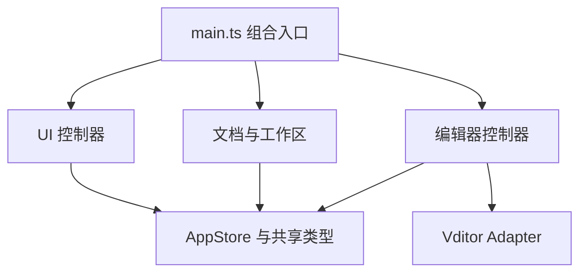

# Vditor-Electron 0.2.5 渲染层架构重构计划

> 项目仓库：[https://github.com/Studio-200A/Vditor-Electron](https://github.com/Studio-200A/Vditor-Electron)
> 目标版本：`0.2.5`
> 前置条件：`0.2.0` 完成功能开发、回归测试并形成稳定基线后启动
> 核心任务：渐进式拆解 `src/renderer/app.js`，建立类型明确、职责清晰、可独立测试的渲染层架构

## 1. 文档用途

本文档供 coding agent 在 Vditor-Electron 0.2.0 稳定后实施 0.2.5 渲染层重构。

0.2.5 不是一次面向用户的大功能版本，而是一次为后续维护、Vditor 升级和功能迭代建立工程基础的内部架构版本。重构对象以 0.2.0 稳定版本中的 `src/renderer/app.js` 及其实际职责为中心，但目标不是把一个大文件机械切割成许多小文件，也不是使用全新框架推倒重写。

文件身份、保存基线、外部冲突、恢复、watcher 和已有目标 TOCTOU 边界的长期权威契约见 [`docs/05-FILE-SAFETY.md`](05-FILE-SAFETY.md)。本计划只补充 0.2.5 重构必须保留的结构约束，不复制或重新定义该安全模型。

正确的完成标准是：在用户可观察行为基本不变的前提下，明确状态归属、模块职责、依赖方向和生命周期，让单个模块能够独立理解、测试、修改和替换。

开始实施前，agent 必须先检查 0.2.0 的实际代码和测试结果，并在执行记录中写明基线 commit、`app.js` 规模、已有模块、测试结果和主要副作用资源。本文档以 0.1.0 评审时的结构以及 0.2.0 计划为依据；如果 0.2.0 已经拆出部分模块，应保留并评估现有成果，不能为了符合本文档建议的目录名而重新改写已经合理的实现。

## 2. 为什么安排为 0.2.5

0.2.0 优先解决用户可以直接感知的问题和桌面编辑器的基础风险，包括工具栏体验、保存可靠性、异常恢复、外部文件冲突、安全边界、设置重建和已确认缺陷。它还要求新增功能具备清晰边界，但明确排除了对整个 `app.js` 的一次性全量重写。

将完整的渲染层重构放到 0.2.5 有三个原因：

1. **先固定行为，再改变结构。** 0.2.0 补充的单元测试和 E2E 测试可以成为重构安全网。
2. **避免功能开发与大规模搬迁互相干扰。** 如果浮动工具栏、恢复机制和安全调整与全量重构同时进行，回归后很难判断问题来自功能还是结构变化。
3. **版本语义合适。** 0.2.5 可以承载一次基本保持功能兼容、但工程结构明显变化的中间版本，为 0.3.0 新功能或 Vditor 升级做准备。

因此，本计划建议使用“渐进式架构重构”，不要把任务描述为“重写 app.js”。后者容易诱导 agent 先删除现有实现，再凭理解重新制造一套行为近似但细节不同的应用。

## 3. 当前问题概述

计划编写时，`src/renderer/app.js` 已在同一个立即执行函数中承担以下职责；实际规模和职责清单以阶段 0 记录的 0.2.0 稳定基线为准：

- 全局应用状态和标签页状态；
- 本地化；
- 确认对话框和消息提示；
- 主题、字体和缩放；
- Vditor 创建、销毁、重建和工具栏挂载；
- 分栏模式行号、空白符、同步布局和拖动分隔线；
- 标签页创建、切换、关闭和保存；
- 文件打开、另存、自动保存和外部变化；
- 工作区、文件树、右键菜单和目录操作；
- 大纲生成与跳转；
- 图片上传和压缩；
- HTML/PDF 导出；
- session 和 recovery；
- 设置窗口、设置保存、拖动和缩放；
- 应用菜单、窗口按钮、快捷键和拖放；
- 启动初始化及各种全局事件监听。

这不是单纯的“文件太长”。更深层的问题是这些职责共享同一个可变 `state`、直接查询全局 DOM，并互相调用内部函数。任何局部改动都可能影响编辑器生命周期、标签状态、设置持久化或事件监听。

典型风险包括：

- 很难判断某个状态应由谁修改，哪些 UI 需要同步刷新；
- 设置、模式切换或另存操作容易触发范围过大的编辑器重建；
- 事件监听、Observer、计时器和保存的 DOM Range 容易泄漏；
- 测试只能搜索源码字符串或启动整个应用，难以验证单个行为；
- Vditor 私有 DOM、桌面文件逻辑和 UI 展示逻辑容易再次混合；
- coding agent 修改一个功能时需要加载并理解整个文件，增加误改概率。

## 4. 重构原则

0.2.5 必须遵守以下原则。

### 4.1 行为保持优先

- 重构前后，除本文档明确允许的细小一致性修复外，用户可观察行为应保持一致。
- 不顺手重做 UI、改变快捷键、重命名菜单、改变设置默认值或调整 Markdown 语义。
- 如果在重构中发现缺陷，先添加能够复现它的测试，再决定作为小型修复纳入还是记录到后续版本。

#### 4.1.1 0.2.0 安全行为基线

0.2.5 必须保持 0.2.0 已建立的文档安全边界。以下行为属于重构约束，不是新的功能范围：

- 普通保存、自动保存和另存必须经过现有安全写入与路径重绑定流程。
- watcher 发现外部修改时，干净文档可以刷新；已有本地修改的文档必须进入显式冲突处理，不得静默覆盖外部内容。
- 已打开文档被删除或变得不可读时，必须保留内存正文并暂停自动保存，直到用户重新加载、另存或放弃。
- 已打开文档在异常退出前产生的恢复快照，重启时必须按 `unchanged`、`changed`、`unavailable` 状态采取对应的安全恢复动作；不可安全覆盖原文件时只能另存或放弃。
- 工作区根目录或其后代被外部删除时，已打开的受影响文档仍属于应用恢复范围；未打开的文件不进入后台恢复范围。
- session/recovery 只能通过版本化、显式投影的文档数据恢复，不能序列化 Vditor 实例、DOM 节点、watcher、timer 或其他运行时句柄。

0.2.0 开发 Tracker 批次 7 收尾还明确了以下三条必须在 0.2.5 重构中原样保留的基础契约：

- 文档的 canonical identity 是所有权、去重、保存队列、冲突、不可用状态以及 watcher 释放/重绑的语义依据；`filePath`/display path 只用于展示和文件 API 参数，不能用规范化显示字符串替代 identity 做安全决策。冲突和不可用状态必须携带产生它们时的 identity；文件暂时不存在时优先沿用已绑定文档的 identity。
- 文档 watcher 的生命周期是“创建 → `ready` → 读取一次当前磁盘事实 → 接收实时事件”。`ignoreInitial` 本身不能替代 ready 后的 reconciliation；ready 前发生的事件或重绑空窗必须并入这次补偿读取，并继续受 binding generation/read revision 的过期结果保护。
- 保存正文的解码结果与传给安全写入器的 `expectedBytes` 必须来自同一次原始读取；安全写入器在最终替换前仍需保留字节复核。该复核与最终 `rename` 之间的平台原子性边界必须如实记录，不能把它描述成消除了所有 TOCTOU 风险；完整契约见 [`docs/05-FILE-SAFETY.md` §7](05-FILE-SAFETY.md#7-已知原子性边界已有目标的-toctou)。

截至 2026-08-27，0.2.0 开发 tracker 批次 7 已完成 Linux 本地闭环。当前 `dev-0.2.0` 的提交基线为 `3e7eb15`，批次 7 的源码、测试和文档修复仍在工作树，提交哈希待按仓库流程创建；用户手动运行 `npm run check:all` 得到 149/149 单元测试和 109/109 Electron E2E 全部通过。该结果只构成 Linux 行为基线，不替代第 5.3 节和 [`docs/03-CROSS-PLATFORM.md` §9](03-CROSS-PLATFORM.md#9-020-batch-7-deferred-platform-validation) 的实体机证据；开始 0.2.5 前仍需按阶段 0 重新建立稳定 tag/分支基线。

重构阶段应优先把这些状态转换和数据投影抽成可测试边界；不得通过拆分控制器改变其语义或扩大后台文件保护范围。

### 4.2 逐步迁移，不执行“大爆炸式重写”

- 任何阶段结束时，应用都必须能构建并正常启动。
- 每次迁移一个职责域，完成接入和测试后再删除旧实现。
- 不允许先创建所有空模块、删除 `app.js`，然后一次性补回功能。
- 不允许长期保留“新旧两套实现同时监听同一事件”的过渡状态。

### 4.3 按职责和状态所有权拆分

- 模块边界应由“谁拥有这类状态、谁负责这段生命周期”决定，而不是按函数数量平均切割。
- 每个状态域必须明确 source of truth、唯一业务写入者、允许其他模块调用的命令以及只读消费方式；不能只规定“状态放在哪里”，却允许多个控制器直接修改同一字段。
- 跨领域协作通过命名明确的用例或命令完成。通用 `patch` 能力只能留在状态所有者内部，不能成为所有模块都可调用的公共写入口。
- 一个模块可以有几百行，只要职责内聚；不要为了追求短文件制造几十个无法独立理解的小模块。
- 不把 `app.js` 的全局变量简单移动到一个新的 `globals.ts`。

### 4.4 明确依赖，避免新的隐式耦合

- 依赖从启动组合层流向领域控制器和基础服务。
- 优先使用构造参数或明确的上下文对象注入依赖。
- 每个控制器只接收完成自身职责所需的最小接口，不直接持有完整 `window.appAPI`、`window.fileAPI` 或其他全局 bridge。
- 不用全局事件总线替代所有直接调用。只有确实属于广播型通知的状态才使用事件订阅。
- `main.ts` 只能负责初始化、依赖组装、生命周期编排和统一 dispose；业务判断必须留在领域控制器或领域模型中。
- 不允许形成模块循环依赖。

### 4.5 保持 Vditor 兼容边界

- Vditor 私有 DOM 查询继续集中在 adapter。
- 0.2.5 不升级 Vditor，不修改 vendored Vditor 文件。
- 可以为现有 JavaScript adapter 增加 TypeScript 类型声明或薄封装，但不应在重构初期同时改写其内部行为。

### 4.6 重点排查多层叠加与相互补偿

本次大纲对齐过程中发现，同一项行为可能同时由 Vditor 原生 DOM、桌面层 DOM、旧逻辑与新逻辑、同步处理与延迟刷新、原生结果与 fallback 解析共同实现。各层看似互相补偿，实际会造成重复计算、重复刷新、错位映射、难以解释的时序依赖和清理不完整。0.2.5 的每个迁移职责域都必须把这类现象作为重点排查项。

- 重点检查同一状态或 DOM 属性是否存在多个写入者、同一事件是否注册了多条作用相近的监听链路，以及同一结果是否被重复序列化、解析或拼接。
- 重点检查“先执行一次、再由 timer、`requestAnimationFrame` 或 observer 延迟修正”的补偿逻辑；除非有明确的外部时序原因，否则应收敛为一个拥有明确生命周期的处理路径。
- 重点检查旧实现、新实现和 fallback 是否在迁移期间并行生效，尤其禁止把不同语义集合通过数组下标强行对齐。
- 开始迁移前先画出“事件/输入 → 状态 → canonical DOM → 展示 → 清理”的链路，列出所有 reader、writer、listener、timer 和 observer，并为每类状态指定唯一 owner 和 source of truth。
- 迁移后由 adapter 或领域控制器提供单一的语义快照或动作接口，上层 UI 只消费该结果；验证通过后在同一迁移中删除旧的补偿路径，不长期保留双轨实现。
- 为重复调用、过期刷新、集合错位和 dispose 清理分别补充聚焦回归测试；保留的每个 listener、timer 和 observer 都必须能说明 owner、触发条件和 cleanup 路径。

## 5. 范围与非目标

### 5.1 本版本必须完成

- 为 renderer 建立独立、严格的 TypeScript 构建与类型检查流程。
- 把 `app.js` 中的状态、领域逻辑和 UI 生命周期迁移到边界清晰的模块。
- 建立明确的应用组合入口。
- 为 preload API、Vditor、adapter、设置和标签页状态建立类型。
- 将依赖源码字符串的测试逐步改成模块行为测试和 DOM 行为测试。
- 建立统一的初始化与销毁协议，避免重复监听和资源泄漏。
- 最终移除旧的 `src/renderer/app.js`，或只保留一个不包含业务逻辑的极薄兼容启动文件。

### 5.2 本版本明确不做

- 不引入 React、Vue、Svelte 等 UI 框架。
- 不改变应用的本地优先 Markdown 编辑器定位。
- 不升级 Vditor。
- 不重做 main process 和 preload 架构；只在共享类型或 renderer 调用契约需要时做最小配合修改。
- 不新增云同步、知识库、插件系统或命令面板。
- 不借重构重新设计设置页面、文件树、标签栏或主题。
- 不以代码覆盖率数字为目标编写低价值测试。
- 不为了清除所有 DOM 操作而引入复杂虚拟 DOM 或状态框架。
- 不以本次 renderer 重构为由引入全局平台适配层、平台工厂或按操作系统拆分的 renderer 子类。

### 5.3 跨平台边界

0.2.5 的完整开发和验收继续以 Linux 为主，Windows/macOS 的实体机回归留待后续专用阶段。重构不得把 Linux 假设固化到 renderer；平台边界、路径处理和测试证据统一遵循 [`docs/03-CROSS-PLATFORM.md`](03-CROSS-PLATFORM.md)。

---

# 第一部分：目标架构

## 6. 建议目录结构

以下是推荐的职责划分，不是必须逐字使用的目录模板。agent 应根据 0.2.0 最终代码调整命名和粒度，但必须保留同等清晰的边界。

```text
src/renderer/
├─ main.ts                         # 唯一应用组合入口
├─ types/
│  ├─ app.ts                       # AppState、DocumentTab 等核心类型
│  ├─ bridges.d.ts                 # window.appAPI / fileAPI 类型
│  └─ vditor.d.ts                  # Vditor 与 adapter 的必要类型
├─ core/
│  ├─ app-store.ts                 # 应用级状态及受控修改入口
│  ├─ disposables.ts               # listener/timer/observer 统一清理
│  └─ dom.ts                       # 小型、类型安全的 DOM 查询辅助
├─ ui/
│  ├─ dialogs.ts                   # 确认与未保存对话框
│  ├─ notifications.ts             # 状态消息
│  ├─ localization.ts              # 语言解析与文案应用
│  ├─ theme-controller.ts          # 应用主题、内容主题和代码主题协调
│  ├─ presentation-controller.ts   # 字体、缩放、段落宽度
│  ├─ menu-controller.ts           # renderer 自定义菜单
│  └─ window-controller.ts         # 标题栏、全屏、最大化状态
├─ documents/
│  ├─ document-controller.ts       # 新建、打开、保存、关闭、外部变化
│  ├─ tab-controller.ts            # 标签渲染、切换、活动状态
│  ├─ document-state.ts            # modified/conflict/recovery 纯状态逻辑
│  └─ session-controller.ts        # session 与恢复快照协调
├─ editor/
│  ├─ editor-controller.ts         # Vditor 生命周期与活动编辑器
│  ├─ editor-options.ts            # 从设置构造 Vditor options
│  ├─ toolbar-controller.ts        # 顶部/浮动/隐藏工具栏
│  ├─ split-view-controller.ts     # 行号、空白符、分隔线、SV 增强
│  ├─ outline-controller.ts        # 大纲生成与跳转
│  └─ image-controller.ts          # 图片上传、压缩和资源基址
├─ workspace/
│  ├─ workspace-controller.ts      # 打开工作区、刷新、监听
│  ├─ explorer-controller.ts       # 文件树及目录操作
│  └─ path-display.ts              # 文件名和中间省略等纯函数
├─ settings/
│  ├─ settings-controller.ts       # 打开、保存、重置和热应用
│  └─ settings-window.ts           # 设置卡片拖动与尺寸
├─ export/
│  └─ export-controller.ts         # HTML/PDF 导出
├─ vditor-adapter.js               # 初期保留现有兼容层
├─ locales.js                      # 初期可保留现有语言资源
├─ styles/
│  ├─ app.css                      # 全局布局、通用组件和共享语义变量使用者
│  └─ themes/
│     ├─ classic.css               # Classic 应用主题变量与专属覆盖
│     ├─ dark.css                  # Dark 应用主题变量与专属覆盖
│     ├─ claude-light.css          # Claude Light 应用主题变量与专属覆盖
│     ├─ claude-dark.css           # Claude Dark 应用主题变量与专属覆盖
│     ├─ monokai-pro-light.css     # Monokai Pro Light 应用主题变量与历史专属覆盖
│     └─ monokai-pro-dark.css      # Monokai Pro Dark 应用主题变量与历史专属覆盖
└─ index.html
```

目录结构的重点不是文件数量，而是形成几个稳定领域：应用壳、文档、编辑器、工作区、设置、导出。若某个建议文件只有十几行并且没有独立生命周期，可以与同领域模块合并。

与 renderer 并列建立 `src/shared/contracts/`，仅放置主进程、preload 与 renderer 共同使用的可序列化 IPC 请求、响应、错误结果和设置契约。这里不得引入 Electron、Node、DOM、Vditor 实例或其他运行时依赖；renderer 内部状态、控制器类型和 bridge 能力接口仍保留在 `src/renderer/types/`。bridge 能力接口复用共享 DTO，并按文件、设置、窗口、工作区、导出等职责拆分；组合入口只把控制器需要的接口子集注入给它。

### 6.1 主题样式组织

`app.css` 与主题样式文件按职责拆分，不按“颜色出现在哪个组件”拆分：

- `app.css` 保留布局、通用组件规则、交互状态和语义变量的使用者；
- `styles/themes/*.css` 只提供对应主题的变量组和确有必要的主题专属覆盖；
- `ThemeController` 管理主题值、偏好解析、`data-theme` 和 Vditor theme 参数，不直接承载大段 CSS 字符串；
- 主题文件不得复制 Vditor code theme 或替代字体设置；
- Monokai 的内容可读性和 H1–H6 颜色属于已有历史特例，迁移时须单独标记，Claude 等主题不得因此扩大应用层内容覆盖；
- 主题文件的加载/组合方式必须保持离线资源路径、构建产物和 CSS 顺序稳定。若采用 CSS `@import`、构建时合并或 renderer bundler，必须用构建检查和 Electron E2E 验证最终产物，而不是只验证源码目录。

这里的拆分是职责迁移，不要求六个主题永久固定为六个文件。如果某个主题没有独立覆盖且只使用共享变量，应保留清晰的主题入口，但不要为了文件数量制造空模块。

## 7. 依赖方向

建议依赖关系如下：



约束：

- `main.ts` 创建 store、解析 DOM、实例化控制器、连接回调并启动应用；不得包含领域状态判断、DOM/Vditor 操作或文件业务逻辑。
- 领域控制器不得反向 import `main.ts`。
- UI 模块不得直接读写其他模块内部变量。
- `AppStore` 不操作 DOM、不调用 Electron API，也不创建 Vditor。
- adapter 不知道标签页、设置窗口或工作区。
- preload bridge 类型位于边界层；每个领域模块通过能力专用的窄接口使用它，不直接访问完整全局 bridge。
- 平台能力类型只表达 renderer 实际需要的行为，不复制 `process.platform` 或暴露任意 OS 特定 API。
- 禁止 `documents → editor → documents` 形式的循环依赖；需要协作时由组合入口注入接口或回调。

## 8. 状态所有权

### 8.1 AppStore 的职责

AppStore 保存真正跨模块共享且有持续生命周期的状态，例如：

```ts
interface AppState {
  documents: DocumentTab[];
  activeDocumentId: string | null;
  workspacePath: string;
  settings: AppSettings;
  defaultSettings: AppSettings;
  locale: SupportedLocale;
}
```

它应提供受控操作，例如：

```ts
store.addDocument(document);
store.activateDocument(id);
store.updateDocument(id, patch);
store.removeDocument(id);
store.updateSettings(settings);
```

不要要求所有状态都经过复杂 reducer，也不要引入 Redux。这个 store 的作用是阻止任意模块直接修改无边界全局对象，并为状态变化建立可追踪入口。示例中的通用更新方法应限制在对应状态所有者内部；其他控制器只能调用由所有者公开的领域命令，不能通过任意 patch 绕过状态转换规则。Store 不执行文件、DOM、Vditor 或持久化副作用。

Store 可以提供窄粒度订阅，例如 `subscribe(selector, listener)`，供确实需要广播的派生 UI 使用。订阅只在 selector 结果发生约定意义上的变化时触发，必须返回幂等的 unsubscribe，并由订阅者纳入 dispose；初次是否立即触发也应形成统一、可测试的约定。不得把所有 `updateSettings()` 自动广播给 ThemeController、EditorController 等模块：主题、字体、缩放和编辑器重建的影响范围不同，实际应用应由明确的 Controller 协调，避免隐式级联和不必要的 Vditor 重建。

### 8.2 不应进入 AppStore 的状态

以下短生命周期状态应由对应控制器自己拥有：

- 消息提示的 timeout；
- 菜单关闭监听；
- 设置窗口关闭动画 timer；
- 文件树文字测量 canvas；
- 单个标签页的 ResizeObserver、MutationObserver 和 animation frame；
- 浮动工具栏保存的 Range；
- 对话框当前 Promise resolver；
- 拖动过程中的坐标和 pointer capture。

### 8.3 DocumentTab 类型

必须给标签页建立明确类型，至少区分：

- 可持久化的文档状态：ID、路径、标题、内容、保存基线、行尾、编辑模式、modified、外部冲突；
- 编辑器运行时资源：Vditor 实例、host、toolbar、observer、timer、保存的选区；
- UI 派生状态：是否活动、标签显示文字等。

其中，实际文档必须同时区分用户可见的 `filePath`/display path 与由主进程解析的 canonical `fileIdentity`。前者可以因重命名或用户选择的别名变化，后者用于判断同一资源的所有权和生命周期；外部冲突、外部不可用/重新出现状态也必须保存对应 identity，不能在 renderer 中重新用显示路径猜测关联关系。目录重命名提交后再交接新路径时，不得让已绑定文档短暂退化为没有 identity 的状态。

必须把“文档数据”和“Vditor 运行时句柄”拆成两个关联对象，避免 session/recovery 代码意外序列化 DOM 或 Vditor 实例。

session/recovery 不得直接序列化 AppStore、`DocumentState` 或任意运行时对象。应定义版本化、可序列化的快照 DTO，并通过显式白名单投影与恢复函数转换，例如：

```ts
toSessionSnapshot(document: DocumentState): SessionDocumentSnapshot;
toRecoverySnapshot(document: DocumentState): RecoveryDocumentSnapshot;
restoreDocumentState(snapshot: unknown): DocumentState;
```

投影函数只复制契约列出的字段；恢复函数在边界验证版本和运行时结构。Vditor、DOM、observer、timer、listener、Range、Promise resolver 和清理函数不得进入快照。

## 9. 控制器生命周期

具有 DOM 监听、Observer、timer 或外部订阅的模块统一实现类似接口：

```ts
interface Controller {
  init(): void | Promise<void>;
  dispose(): void;
}
```

生命周期契约：

- `dispose()` 必须幂等；重复调用不得抛错、重复触发业务动作或访问已释放资源。
- `init()` 注册资源后如果后续步骤失败，必须释放本次初始化已经创建的资源，再把错误交给组合入口处理。
- 组合入口按依赖顺序初始化 controller，关闭或初始化失败时按相反顺序 dispose 已成功初始化的 controller。
- controller dispose 后，尚未完成的 Promise、timer、animation frame、observer 回调和 bridge 推送不得再修改 store、DOM 或其他 controller。
- 异步回调提交结果前必须确认其 owner、文档绑定和 editor runtime 仍然有效；支持取消的操作应在 dispose 时取消。

可以建立简单的 `DisposableBag`：

- 注册 `addEventListener` 对应的移除函数；
- 注册 Electron/preload 订阅的 unsubscribe；
- 清理 timeout、animation frame；
- disconnect MutationObserver 和 ResizeObserver；
- 标签关闭时释放标签级资源；
- 应用重建或测试结束时统一 dispose。

`DisposableBag.dispose()` 同样必须幂等，并按注册的相反顺序执行清理，使后创建、依赖前置资源的对象先释放。

不要引入重量级依赖注入框架。构造函数和小型接口已经足够。

---

# 第二部分：Renderer TypeScript 与构建基础

## 10. 建立独立 renderer 构建

当前 renderer 源文件由资源复制脚本直接复制到 `dist/renderer`。0.2.5 需要引入明确的 renderer 编译步骤。

推荐方案是使用轻量 bundler 将 `src/renderer/main.ts` 及其模块输出为浏览器可执行的单一入口，例如：

```text
src/renderer/main.ts → dist/renderer/app.js
```

选择 bundler 时遵守：

- 配置简单、构建可复现；
- 支持 TypeScript、ES2022 和 sourcemap；
- 不注入 Node polyfill；
- 不允许 renderer import Node 内置模块；
- 不把 Vditor 的大型 vendored 资源重复打进 bundle；
- 产物仍由现有 `app://` 协议加载；
- production 构建不依赖开发服务器。

可以使用 esbuild 等轻量工具，但 agent 应先验证当前 Electron、自定义协议和 CSP 下的加载行为，再提交最终方案。若使用原生 ESM 多文件输出，也必须验证 `app://` 的 MIME、相对 import、CSP 和打包路径；不能只以浏览器理论支持作为完成依据。

## 11. 构建脚本调整

- [ ] 新增 `tsconfig.renderer.json`，启用 strict，目标与当前 Electron Chromium 能力一致。
- [ ] 新增 `build:renderer`。
- [ ] `npm run build` 同时构建 main、renderer 并复制静态资源。
- [ ] 修改现有资源复制脚本，使其不再把 `.ts` 源码和未编译入口复制到产物。
- [ ] HTML、CSS、图标、语言资源和 Vditor 资源继续正确复制。
- [ ] `index.html` 只加载一个正式应用入口；Vditor 和 adapter 如暂时保持全局脚本，应固定加载顺序。
- [ ] 增加 `typecheck:renderer`，并纳入 `npm run check`。
- [ ] 开发构建保留 sourcemap，发布包根据项目策略决定是否保留。
- [ ] 清理构建目录时只删除明确产物，不能影响用户文件或仓库外路径。

## 12. 浏览器全局类型

为以下全局对象建立最小而准确的声明：

- `window.appAPI`
- `window.fileAPI`
- `window.VditorDesktopAdapter`
- `window.VditorDesktopLocales`
- Vditor constructor 和本项目实际调用的方法

要求：

- 类型必须来自 preload 暴露的真实接口，不能大量使用 `any` 让检查失效。
- 对第三方 Vditor 类型中缺失的私有 DOM 行为，可在 adapter 边界使用窄范围类型断言。
- 不要在领域模块到处使用 `as any`。
- 对可能为空的 DOM、未 ready 的 Vditor 和已销毁的标签页进行真实建模。
- 将跨进程 DTO、设置快照和错误/结果模型放入 `src/shared/contracts/`，使主进程、preload 与 renderer 共同编译同一份契约，避免字段漂移。
- 共享契约必须无运行时代码和平台 API；DOM、Electron、Node 与 Vditor 运行时类型不得进入该目录。
- IPC channel、请求参数、返回结果和 main-to-renderer 推送应有单一类型来源；修改一端时由类型检查同时覆盖 main、preload 和 renderer。
- preload 中的推送订阅统一返回 unsubscribe；真实 bridge 与测试 fake 必须实现同一能力接口和清理语义。
- 迁移期间可以在尚未接触的旧边界保留现状，但一个 channel 所属职责迁移完成时，其最终契约不得仍依赖宽泛 `any`、`unknown[]` 或未经校验的类型断言。

## 13. 类型安全的 DOM 入口

当前 `$` / `$$` 默认假定元素存在。重构后建立两个语义明确的辅助方法：

```ts
requiredElement<HTMLButtonElement>('#saveFile');
optionalElement<HTMLElement>('#someOptionalNode');
```

- 必需 DOM 缺失时在启动阶段给出包含 selector 的明确错误。
- 可选 DOM 必须由调用方处理 `null`。
- 不要把所有 selector 集中成一个数百项常量文件；按控制器保存其拥有的 DOM 引用。
- 控制器初始化时查询并缓存稳定节点，不在高频事件中反复全局查询。

---

# 第三部分：渐进式迁移顺序

## 14. 阶段 0：冻结 0.2.0 行为基线

在架构改动前：

- [ ] 从 0.2.0 稳定 tag 或专用重构分支开始，不直接在未完成的功能分支上迁移。
- [ ] 在 Tracker 或阶段记录中写明基线 commit，并重新统计 `app.js` 行数、具名函数、现有 renderer 模块、全局状态字段和主要 listener/timer/observer/runtime；后续报告均以该基线为准。
- [ ] 将完成验证的 0.2.0 tag/commit 作为旧 renderer 的唯一只读参考来源。在阶段 0 从该基线创建独立 Git worktree，例如 `git worktree add --detach ../Vditor-Electron-0.2.0-reference <baseline>`，供整个重构期间持续检索和比对。重构分支中的 legacy 实现只服务于当前迁移；一个职责完成接入并通过验证后，必须在同一迁移中删除对应旧实现。不得在当前工作树的 `src/renderer` 保留 `app.js` 的文本副本、reference 文件或长期双轨实现。需要临时核对时，也可使用 `git show <baseline>:src/renderer/app.js`。
- [ ] 运行完整 `npm run check` 和 E2E。
- [ ] 对所有核心用户路径建立行为清单。
- [ ] 补齐明显缺失的回归测试，尤其是工具栏、保存、恢复、冲突和三种编辑模式。
- [ ] 保存 0.2.0 五种应用主题、三种编辑模式和三种工具栏模式的基准截图，供人工对比，不做脆弱的全页面像素测试；主题内容与应用壳层边界单独标注。
- [ ] 为核心职责建立“事件/输入 → 状态 → DOM → 清理”链路，标记多重 writer、延迟补偿、fallback 和重复监听，将未解释的叠加路径列为重构重点。

核心行为清单至少包括：

1. 启动与 session 恢复；
2. 新建、打开、保存、另存和关闭；
3. 标签切换和独立编辑模式；
4. 完整/浮动/隐藏工具栏；
5. 工作区树、重命名、删除和外部变化；
6. 主题、字体、缩放和设置热应用；
7. 大纲、图片、HTML/PDF 导出；
8. 未保存关闭确认、异常恢复和窗口事件。

其中保存、外部修改冲突、外部删除/不可读、工作区根删除和 recovery 的状态转换，必须单独列出输入、状态、用户动作、持久化结果和清理结果，作为后续模块迁移的安全基线。

在这份清单中，以下三项也必须作为可重复的安全回归保留：

- [ ] watcher 只有在 `ready` 后才执行当前磁盘 reconciliation，ready 前的事件不会造成永久漏报；
- [ ] 通过符号链接或其他路径别名访问同一文件时，冲突、不可用状态、Save As 和 watcher 所有权判断仍以 canonical identity 为准；
- [ ] 保存基线的正文和原始字节来自同一次读取，基线读取后发生的外部变化不能被第二次读取“洗成”可接受基线。

## 15. 阶段 1：建立 TypeScript 入口，但保持原行为

目标：先证明新构建管线可用，不同时拆业务。

- [ ] 建立 `main.ts` 和 renderer bundle。
- [ ] 将现有 `app.js` 暂时作为 legacy 模块或受控入口接入。
- [ ] 为全局 bridges、Vditor 和 adapter 添加类型声明，并为后续控制器定义能力专用的 bridge 子接口。
- [ ] 调整 HTML 和构建脚本。
- [ ] 验证开发启动、正式构建和打包后的资源路径。
- [ ] 建立组合入口按依赖顺序 init、按相反顺序 dispose 的最小实现，并覆盖部分初始化失败的清理测试。
- [ ] 此阶段不改变用户行为。

如果无法在不制造双重初始化的情况下包装 legacy 入口，可以先把 IIFE 的启动点抽成显式 `bootstrapLegacyApp()`，但不要同时开始领域拆分。

## 16. 阶段 2：迁移无副作用的纯函数和基础 UI

优先迁移低风险、容易测试的内容：

- 文件名与扩展名处理；
- 行尾识别；
- HTML 转义；
- 主题判定与偏好选择；
- 中间省略计算；
- 工具栏模式等纯状态转换；
- localization；
- notifications；
- dialogs。

主题相关迁移还应包括：

- 将应用主题枚举、亮暗偏好选择和主题判定迁入 `ThemeController`；
- 建立六套内置主题的 CSS 文件入口，先保持最终计算样式和用户行为不变；
- 将 `app.css` 中分散的主题变量、主题专属覆盖和主题预览样式按职责迁移到对应文件；
- 保留 `--sidebar-surface`、`--editor-surface`、`--accent` 等语义变量，禁止组件重新硬编码主题颜色。

每迁移一组函数：

1. 为纯函数增加单元测试；
2. 从新模块导入并替换旧调用；
3. 删除 `app.js` 中的旧定义；
4. 运行相关测试和构建。

不要保留一份旧函数和一份新函数等待“最后统一删除”。

主题样式迁移采用逐主题步骤：

1. 先为当前六套主题记录 computed-style 和关键交互基线；
2. 一次迁移一个主题的变量和专属覆盖，并保持 CSS 加载顺序明确；
3. 运行主题单测、构建和相关 Electron E2E，确认设置、状态栏开关、系统主题和三种编辑模式没有回归；
4. 确认新文件生效后删除 `app.css` 中对应的旧规则，不长期保留新旧双轨样式。

## 17. 阶段 3：建立 AppStore 与标签页模型

这是整个重构的关键阶段。

- [ ] 定义 `AppState`、`DocumentState`、`EditorRuntime`、`ExternalConflict` 等类型。
- [ ] 为每个 AppStore 状态域记录 source of truth、唯一业务写入者、公开命令和只读消费者，并据此建立受控修改 API。
- [ ] 把 `activeTab()`、标签查找和标签状态更新迁移到 store/document model。
- [ ] 把 UI 派生状态与真实文档状态分开。
- [ ] 把 ignored external changes、recovery 标识等状态放到正确所有者，而不是全部塞入 store。
- [ ] 定义版本化的 session/recovery 快照 DTO，以及显式白名单投影和恢复校验函数；测试证明运行时句柄不会进入快照。
- [ ] 增加状态转换测试：新建、激活、modified、保存成功、冲突、关闭、恢复。

阶段结束时，旧 `state` 对象不应再被新旧模块任意直接修改。若仍需过渡适配器，只允许存在于组合入口，并记录删除阶段。

## 18. 阶段 4：迁移标签与文档生命周期

按以下顺序迁移：

1. 标签渲染和活动标签切换；
2. 新建和打开文件；
3. 当前内容读取；
4. 保存、另存和自动保存；
5. 关闭文档与未保存确认；
6. 外部变化和冲突；
7. session 与 recovery。

边界要求：

- DocumentController 负责文档用例，不直接拼接整个标签 DOM。
- TabController 负责标签栏表现，不负责读写磁盘。
- 文件 API 通过窄接口注入，单元测试使用 fake bridge，不访问真实 Electron。
- 保存结果通过明确返回值或异常表达，不能只靠全局消息判断。
- 文档关闭必须先协调 EditorController 释放运行时资源，再从 store 删除文档。
- 异步打开、保存、恢复和外部变化结果提交前必须确认文档仍存在且路径绑定未改变；关闭、另存或工作区切换后到达的旧结果不得修改新状态。
- 文档所有权和同一资源判断必须使用 `fileIdentity`；冲突/不可用状态的 identity 随状态一起传递，不能以 display path 比较代替。
- 文档 watcher 的注册必须显式建模 `ready` 后 reconciliation；重建、重绑和工作区切换仍须保留 generation/revision 过期保护与 cleanup。
- 保存控制器必须把单次磁盘快照映射为解码正文和 `expectedBytes`，再交给安全写入器；最终替换语义和剩余平台 TOCTOU 边界通过明确结果返回给上层。

## 19. 阶段 5：迁移 Vditor 生命周期和编辑器增强

将最复杂、与 Vditor 耦合最深的部分放在状态模型稳定后迁移。

### 19.1 EditorController

负责：

- 创建和初始化 Vditor；
- 保存每个文档的 EditorRuntime；
- 获取/设置当前 Markdown 内容；
- focus；
- 切换编辑模式；
- 仅在必要时重建实例；
- 销毁实例和关联资源；
- 将 Vditor input/blur/after 回调转成明确的应用动作。
- 为每个 runtime 绑定稳定的 document ID，并在回调执行时确认该 runtime 仍是文档的当前实例。

不得负责：

- 直接保存磁盘文件；
- 工作区树操作；
- 设置窗口 UI；
- 应用菜单构建。

### 19.2 SplitViewController

集中负责：

- SV 行号；
- 空白字符 canvas；
- 编辑/预览比例和拖动分隔线；
- 滚动相关增强；
- SV 特殊缩进选择处理。

每个编辑器实例使用独立 controller 或明确的 tab-scoped state，并在标签关闭和模式离开时 dispose。

### 19.3 ToolbarController

负责完整、浮动和隐藏工具栏模式、挂载目标、选区保存与恢复、浮动定位和工具按钮过滤。它依赖 EditorController 的窄接口，不直接管理文档保存或设置窗口。

### 19.4 OutlineController 与 ImageController

在 EditorController 稳定后迁移大纲和图片能力，继续通过 adapter 获取 Vditor DOM 结构。

此阶段必须重点回归：撤销历史、标签切换、三种模式、工具栏、相对图片、滚动位置、Observer 清理和编辑器重建次数。

## 20. 阶段 6：迁移工作区、设置、菜单和导出

### Workspace / Explorer

- WorkspaceController 管理根路径、watcher 事件和刷新请求。
- ExplorerController 只管理文件树 UI、展开状态、右键菜单和目录命令。
- 路径改变通过 DocumentController 更新打开文档，不直接改其内部对象。

### Settings

- SettingsController 管理设置草稿、验证、保存、重置和设置分类。
- ThemeController 与 PresentationController 提供热应用接口。
- SettingsWindow 只处理设置卡片的打开、关闭、拖动和尺寸。
- 用纯函数 `classifySettingsChange(previous, next)` 或等价接口把设置差异分类为明确的运行时影响，例如主题、展示样式、布局、工具栏和确需重建的编辑器选项。
- SettingsController 根据分类结果调用对应控制器；分类函数不操作 DOM、Vditor、bridge 或持久化，也不执行全应用无条件刷新。
- 主题 CSS 文件由构建/资源层稳定组合；SettingsController 和 ThemeController 只操作主题状态和语义应用接口，不通过字符串拼接动态注入未经验证的样式。

### Menus / Window

- MenuController 根据当前 store 状态生成勾选项并调用公开应用命令。
- WindowController 处理标题栏按钮、全屏和最大化显示。
- 菜单 handler 不直接跨模块修改 store。

### Export

- ExportController 通过 DocumentController/EditorController 获取当前内容或渲染结果。
- 图片来源修复、主题策略和写文件由明确依赖完成。

## 21. 阶段 7：移除 legacy app.js

满足以下条件后才能删除旧入口：

- 所有业务职责已经迁移；
- 全仓搜索确认没有旧函数或旧全局 state 的调用；
- index.html 只加载新入口；
- 构建脚本不再复制 legacy 文件；
- renderer 单元测试、集成测试和 E2E 全部通过；
- 人工对比 0.2.0 基准路径未发现行为变化。

最终 `main.ts` 应只承担组合和启动，例如：

1. 验证必需全局 API；
2. 解析初始设置与平台信息；
3. 创建 store 和控制器；
4. 连接控制器之间的窄接口；
5. 依次 init；
6. 通知 main process renderer ready；
7. 在退出或测试中 dispose。

不要让 `main.ts` 再次成长为新的 `app.js`。

---

# 第四部分：测试策略

## 22. 调整现有测试

当前部分 `renderer-shell.test.ts` 通过读取 `app.js` 并搜索源码字符串确认功能存在。这类测试可以在早期保护静态结构，但不适合模块化之后继续作为主要保证。

迁移原则：

- DOM 必须存在、脚本加载顺序和静态资源路径仍可做 shell 测试。
- 菜单是否调用正确命令，应实例化 MenuController 测试行为。
- 主题或设置是否生效，应测试 class、CSS variable 和 controller 调用。
- 六套应用主题的 CSS 文件入口、语义变量和必要的主题专属覆盖，应通过 CSS/DOM 契约测试和至少一条真实 Electron E2E 验证；不以源码字符串存在作为唯一证据。
- 文档状态应测试 store 和 document-state 结果。
- 不再用“源码中包含某段字符串”代替行为验证。
- 测试不应依赖私有函数在文件中的具体排列顺序。

## 23. 测试分层

### 23.1 纯单元测试

适合测试：

- 状态转换；
- 状态域公开接口只暴露所有者允许的命令，其他模块无法取得通用写入口；
- 文件名、行尾、路径展示；
- 主题选择；
- 设置 diff 分类及其对应的最小运行时影响；
- 浮动工具栏几何计算；
- 文档冲突决策；
- watcher ready、reconciliation、binding generation/read revision 及过期读取丢弃；
- canonical identity 下的路径别名去重、冲突和不可用状态关联；
- 单次原始磁盘快照的正文解码、`expectedBytes` 传递及基线后的外部变化拒绝；
- session/recovery 显式投影、版本校验和运行时字段排除。

### 23.2 DOM 控制器测试

在 jsdom 中挂载最小 HTML fixture，注入 fake store 和 fake bridge，测试：

- 标签栏渲染及交互；
- 菜单勾选与命令分发；
- 对话框 Promise 行为；
- 设置窗口状态；
- toolbar 可见性和选区失效；
- explorer 展开、选中和菜单行为。

每个测试结束必须调用 dispose，借此验证监听清理接口真实可用。

### 23.3 Renderer 集成测试

组合真实 store 和多个 controller，使用 fake Electron API 与 fake Vditor，验证跨模块用例：

- 打开文件 → 创建标签 → 创建编辑器；
- 编辑 → modified → 保存 → 清除标记；
- 外部修改 → 冲突 → 暂停自动保存 → 用户解决；
- watcher ready 后补偿读取，以及重绑空窗中的外部变化不会被漏掉；
- 符号链接别名下的打开、Save As、冲突和不可用文档仍共享同一资源所有权；
- 基线读取后发生变化的保存请求返回冲突且不覆盖外部正文；
- 设置变更 → 热应用 → 不重建编辑器；
- 关闭标签 → 清除 timer/observer/runtime。
- controller 初始化中途失败 → 已注册资源按相反顺序清理；
- 重建或关闭 editor → 旧 runtime 的迟到回调不能修改当前文档。

### 23.4 Electron E2E

保留 E2E 验证真实 Electron、preload、自定义协议、Vditor 和操作系统窗口行为。不要把所有边界条件都堆进 E2E；E2E 重点确认真实组合没有破裂。

## 24. Fake 与测试接口

- fake Vditor 只实现项目实际使用的最小接口。
- fake bridge 必须符合真实 preload 的能力接口，并与真实 bridge 具有一致的调用结果、推送订阅和 unsubscribe 语义。
- 对依赖窗口能力、主修饰键或路径表示的控制器，fake bridge 至少覆盖 Linux 默认能力及一组 Windows/macOS 差异输入，避免重构后重新写入 Linux 专用假设。
- 不为测试在生产模块中增加只用于绕过封装的公开方法。
- 时间相关逻辑优先注入 clock/timer 或使用 fake timers。
- watcher、observer 和 resize 行为使用可控制的 adapter，而不是测试中等待真实系统事件。
- fake watcher 必须能单独触发异步 `ready`，并允许测试在 ready 前发出事件，以验证“ready → reconciliation → live”顺序。

## 25. 回归与泄漏检查

增加验证：

- 多次打开/关闭设置窗口不会累积 click/keydown listener。
- 多次切换标签不会重复注册工具栏 handler。
- 关闭标签后 observer 全部 disconnect，animation frame 和 timer 被取消。
- 多次切换工作区不会保留旧 watcher 订阅。
- 重建编辑器时旧 runtime 被完整释放。
- 重建或关闭编辑器后，旧 Promise、timer、animation frame 和 Vditor 回调的迟到结果被忽略。
- watcher 在 ready 前发生的事件、重绑后的当前磁盘状态和连续读取的乱序结果都有回归覆盖。
- canonical identity 别名不会绕过外部冲突/不可用状态，也不会错误释放仍被其他标签使用的 watcher。
- 保存基线与原始字节来自同一读取；基线之后的外部变化不会被接受为安全替换基线。
- controller 重复 dispose 不会报错或重复执行业务动作，部分 init 失败不会遗留已注册资源。
- 浮动工具栏 Range 不引用已关闭文档的 DOM。

如果条件允许，可以在测试构建中为 listener/disposable 数量提供只读诊断，但不要把调试计数暴露给正式用户界面。

---

# 第五部分：提交、审查与发布

## 26. 分支与提交策略

建议从稳定的 0.2.0 tag 创建专用分支，例如：

```bash
git switch -c refactor/renderer-0.2.5 v0.2.0
```

如果 tag 名称不同，应使用实际稳定 tag，不要机械执行示例。

提交应按可运行阶段拆分，例如：

```plaintext
build(renderer): add typed renderer entry point
refactor(renderer): extract localization and dialogs
refactor(state): introduce typed document store
refactor(documents): isolate document lifecycle
refactor(editor): isolate Vditor lifecycle
refactor(editor): move split-view enhancements
refactor(workspace): isolate explorer and watcher flows
refactor(settings): separate persistence from presentation
test(renderer): replace source assertions with behavior tests
refactor(renderer): remove legacy app entry
```

要求：

- 每个提交都能构建，相关测试通过，并可单独回滚而不破坏后续提交的前置条件。
- 一个提交只迁移一个可独立验证的职责单元；提取实现与补充其必要测试可以同一提交，前提是提交本身保持可运行。
- 搬迁代码和改变行为尽量分开提交。
- 不在单个提交中同时迁移多个高风险领域。
- 不批量格式化无关文件。
- 不使用 `--no-verify`、跳过测试或大范围 lint disable 完成重构。

## 27. 每阶段检查点

每个阶段结束后，agent 必须汇报：

1. 哪些职责已经迁移，哪些仍在 legacy 文件；
2. 当前依赖方向是否出现循环；
3. 新增和更新的测试；
4. 构建、类型检查、单元测试和 E2E 结果；
5. 用户可观察行为是否有变化；
6. 下一阶段最高风险点。

如果阶段结束时出现大量 E2E 回归，应暂停继续搬迁，先修复当前阶段。不要把多阶段问题累计到最后集中处理。

## 28. 允许的细小修复

重构中可以纳入以下类型的小修复：

- 明确由重复监听造成的一次操作执行多次；
- 销毁时未清理 timer/observer；
- 空 DOM 导致的确定性崩溃；
- 类型建模揭示的未处理 null/undefined；
- 新旧模块交界处的状态不同步。
- 多层实现相互补偿造成的重复执行、错位映射或不必要刷新。

纳入条件：

- 先有复现测试；
- 修复范围小；
- commit message 标明 `fix` 而非混在 `refactor` 中；
- 不改变产品设计。

其他缺陷进入 `docs/00-ISSUES.md`，留到 0.2.6 或 0.3.0。

## 29. 文档要求

- [ ] 新增 `docs/RENDERER-ARCHITECTURE.md`，说明模块、状态所有权、依赖方向和启动流程。
- [ ] README 只需更新开发构建命令，不必向普通用户解释内部目录。
- [ ] 更新 `docs/20-VDITOR-UPGRADE.md`，说明 EditorController 与 adapter 的边界。
- [ ] 在贡献说明中记录新增 renderer 模块的放置原则。
- [ ] 0.2.5 changelog 明确说明这是内部架构升级，用户功能基本保持一致。

## 30. 性能与包体检查

架构重构不应显著恶化启动和运行表现。

- [ ] 比较 0.2.0 与 0.2.5 的 renderer bundle 大小。
- [ ] 确认没有把 Vditor 重复打入应用 bundle。
- [ ] 比较冷启动至 renderer ready 的时间，记录测量方法和环境。
- [ ] 打开多个标签时，Vditor 实例数量与 0.2.0 一致。
- [ ] 编辑、切换标签和打开设置时没有明显新增卡顿。
- [ ] 记录 canonical identity 解析、ready 后单次 reconciliation 和保存安全复核的调用成本；这些成本应限定在受影响文档，不得引入全局串行化或无必要的重复磁盘读取，安全写入器保留的最终复核属于有意的保护读取。
- [ ] 发布包中不包含未使用的 TypeScript 源码、测试 fixture 或开发依赖产物。

不要求为了微小数字差异进行过早优化；重点排除构建错误、重复依赖和明显退化。

---

# 第六部分：完成标准

## 31. 架构完成标准

- [ ] `src/renderer/app.js` 已删除，或只保留无业务逻辑的极薄启动兼容层。
- [ ] 正式应用由 TypeScript 入口构建。
- [ ] 文档、编辑器、工作区、设置、菜单和导出具有明确模块所有者。
- [ ] 每个共享状态域具有唯一业务写入者和命名明确的公开命令，不存在供任意模块绕过状态规则的公共 patch 入口。
- [ ] 不存在可被任意模块直接修改的全局 `state` 对象。
- [ ] `main.ts` 只负责组合和启动，没有重新成为业务逻辑仓库。
- [ ] Vditor 私有 DOM 访问仍集中在 adapter。
- [ ] 应用通用样式与六套内置主题样式按职责分离；主题文件只提供主题变量和有记录的专属覆盖，Vditor code theme 与字体仍保持独立。
- [ ] 模块依赖无循环。
- [ ] 具有副作用的 controller 都有幂等 dispose 流程；组合入口能在正常关闭和部分初始化失败时按相反依赖顺序完成清理。
- [ ] 文档与 editor runtime 使用稳定身份关联，已关闭、已重绑或已替换 owner 的异步结果不会修改当前状态。
- [ ] 文档 identity、冲突/不可用状态 identity、watcher ready/reconciliation 和单次保存基线契约均有行为测试，重构后仍保持有效。
- [ ] session/recovery 通过版本化快照 DTO 和显式投影恢复，不序列化 AppStore 或运行时句柄。
- [ ] 已迁移的职责域不存在未解释的双重监听、旧新实现并行、延迟补偿写入或跨集合下标拼接；保留的 listener、timer 和 observer 均有明确 owner 与 cleanup。
- [ ] preload、设置、标签页和 Vditor 实际用法具备有效类型；控制器只接收所需 bridge 能力，已迁移 channel 不保留宽泛契约，领域模块没有泛滥的 `any`。

## 32. 行为完成标准

- [ ] 0.2.0 的核心行为清单全部通过。
- [ ] 三种编辑模式和三种工具栏模式行为保持一致。
- [ ] 新建、打开、保存、另存、关闭和恢复没有回归。
- [ ] 外部修改冲突及自动保存保护没有回归。
- [ ] 路径别名不能绕过外部修改冲突、外部不可用状态或 Save As 的同一资源保护；watcher 重绑不会漏掉 ready 前后的磁盘变化。
- [ ] 保存正文和安全写入基线的一致性没有回归；最终平台替换边界按实际能力记录。
- [ ] 外部删除/不可读、工作区根删除后的已打开文档保护，以及 `unchanged`、`changed`、`unavailable` recovery 行为没有回归。
- [ ] 主题、字体和缩放的热应用没有回归。
- [ ] 设置差异由纯函数分类并只触发对应控制器，展示类设置不会造成无关的 Vditor 重建。
- [ ] 工作区树、目录操作、大纲、图片和导出没有回归。
- [ ] 撤销历史没有因普通设置或 UI 操作被意外清空。
- [ ] 跨平台标题栏和窗口关闭逻辑保持有效。

## 33. 质量完成标准

- [ ] Prettier、ESLint、main typecheck、renderer typecheck 全部通过。
- [ ] 单元测试、DOM 控制器测试和 renderer 集成测试全部通过。
- [ ] Electron E2E 在兼容环境全部通过。
- [ ] GitHub Actions 执行新的 renderer build/typecheck/test。
- [ ] 关键模块不再依赖搜索源码字符串证明行为存在。
- [ ] listener、timer、observer 和 editor runtime 清理测试通过。
- [ ] 重复 dispose、部分初始化失败回滚、迟到异步结果失效和 bridge unsubscribe 测试通过。
- [ ] session/recovery 快照投影与恢复边界测试通过。
- [ ] 开发构建、正式构建、Linux 打包和实机冒烟测试通过。
- [ ] 未经实体机验证的 Windows/macOS 行为、安装包与签名状态明确记录为后续工作，不将 Linux 验收写成跨平台验收。
- [ ] 架构文档与实际代码一致。

## 34. 最终人工验收路径

发布前至少手工完成一次以下流程：

1. 启动应用并恢复工作区和多个标签。
2. 在 WYSIWYG、IR、SV 三种模式分别编辑和撤销。
3. 切换完整、浮动和隐藏工具栏。
4. 新建未命名文档，保存并另存。
5. 制造外部修改与删除冲突并分别处理。
6. 打开和关闭多个标签，观察工具栏、大纲和状态栏同步。
7. 修改主题、三类字体、三类缩放和编辑器布局。
8. 上传或粘贴图片，验证相对图片显示。
9. 导出 HTML 和 PDF。
10. 带未保存内容关闭标签及退出应用。
11. 模拟异常退出并验证 recovery。
12. 重启后确认 session、布局和设置持久化。

人工验收应优先检查“行为细节是否悄悄变化”，而不是只看应用能否打开。

## 35. 最终开发汇报格式

完成后请提交一份可核验的重构报告，至少包括：

1. 0.2.0 起始 commit 与 0.2.5 最终 commit。
2. 最终目录结构和模块职责说明。
3. 原 `app.js` 中各职责迁移到何处的映射表。
4. 状态所有权、控制器生命周期和依赖方向说明。
5. renderer 构建方案及选择理由。
6. 类型检查、单元测试、集成测试、E2E、构建和实机验证结果。
7. 与 0.2.0 相比的用户可观察变化；如果没有，也要明确说明。
8. 重构过程中发现并修复的缺陷及对应测试。
9. 尚未消除的耦合、技术债和后续版本建议。

不要仅提交文件列表或宣称“重构完成”。报告必须证明：结构确实发生了改善，行为仍然可靠，后续 agent 可以在不理解整个 renderer 的情况下安全修改单个领域。

完成最终验证并提交上述报告后，移除阶段 0 创建的只读参考 worktree，避免其在后续开发中变成过时的第二工作树。先确认该 worktree 没有未提交修改，再使用其实际路径执行 `git worktree remove <reference-worktree-path>`；不要使用 `--force`。如果目录已由其他方式移除，再执行 `git worktree prune` 清理 Git 元数据。
