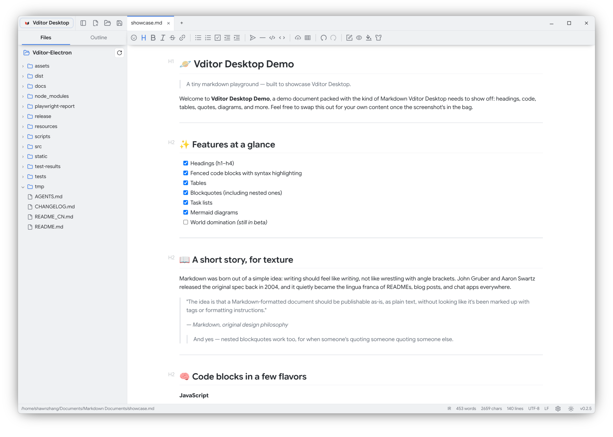
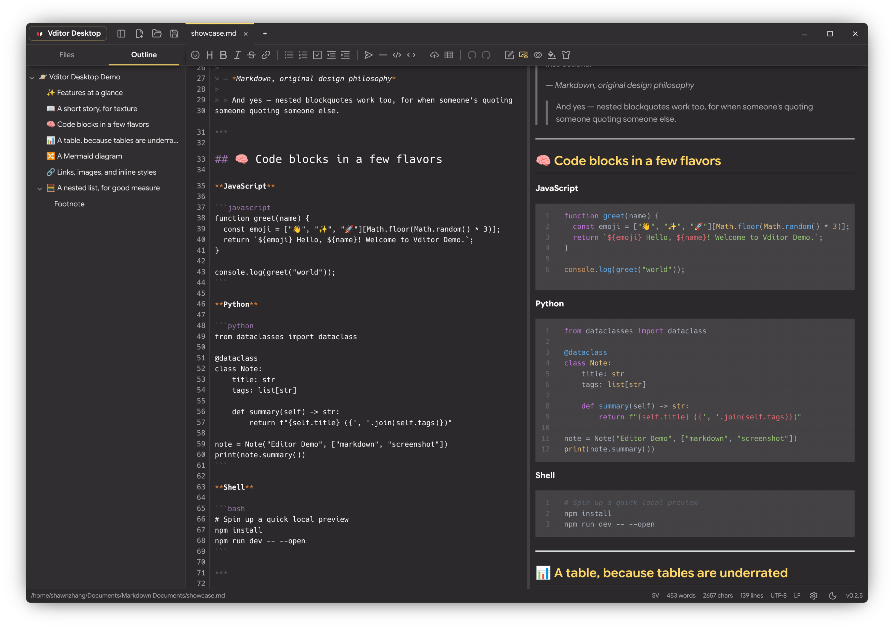
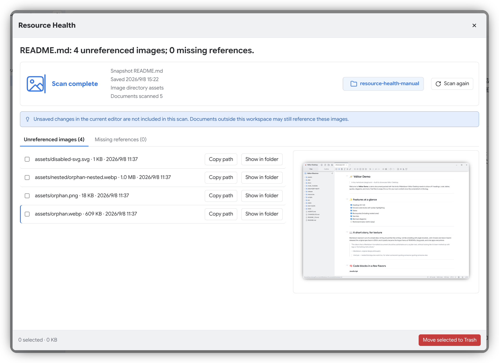

# Vditor Desktop

[简体中文](README_CN.md) · 繁體中文 · [English](../../README.md)

<p align="center">
  
</p>

<p align="center">
  一個為專注本機 Markdown 撰寫和閱讀而打造的桌面編輯器——不用開瀏覽器裡的分頁，不搞雲端帳號，只把 Vditor 完整的編輯能力安放在一片安靜的本機工作區裡。
</p>

<p align="center">
  <a href="https://github.com/Studio-200A/Vditor-Electron/releases"></a>
  <a href="https://github.com/Vanessa219/vditor"></a>
  <a href="https://github.com/Studio-200A/Vditor-Electron/blob/main/LICENSE"></a>
  <a href="https://github.com/Studio-200A/Vditor-Electron/releases"></a>
  <a href="https://github.com/prettier/prettier"></a>

</p>

<p align="center">
  <a href="https://github.com/Studio-200A/Vditor-Electron/releases/latest"></a>
</p>

Vditor Desktop 把 [Vditor](https://github.com/Vanessa219/vditor)——**最好用的 Markdown 編輯核心之一**——裝進了它本該擁有的桌面外殼。沒有專有格式，也沒有任何鎖定：儲存後的文件是普通的 Markdown 檔案，例如 `.md`，可以用其他編輯器開啟；尚未儲存的修改會在應用程式中標明。在此基礎上，軟體補全了一款真正的桌面工具該有、而網頁版編輯器給不了的部分：多分頁、工作區、檔案總管、Vditor 自帶大綱、佈景主題、工作階段還原和桌面檔案關聯。





## 目錄

- [為什麼選擇 Vditor Desktop](#為什麼選擇-vditor-desktop)
- [三種編輯模式](#三種編輯模式)
- [不打擾寫作的工作區](#不打擾寫作的工作區)
- [盡心保護你和你的內容](#盡心保護你和你的內容)
- [佈景主題與語言](#佈景主題與語言)
- [常用快捷鍵](#常用快捷鍵)
- [設定與資料目錄](#設定與資料目錄)
- [安裝與執行](#安裝與執行)
- [開源專案](#開源專案)
- [免責聲明](#免責聲明)
- [授權條款](#授權條款)

## 為什麼選擇 Vditor Desktop

- **只屬於你的本機檔案：** 不需要帳號，不需要雲端同步，也沒有專有格式。儲存後的文件是普通的 Markdown 檔案，可以用其他編輯器開啟、遷移。
- **想怎麼寫就怎麼寫：** 想看最終排版效果就用所見即所得，想兼顧語法和視覺就用即時渲染，想左右對照就用分欄預覽——寫作過程中隨時切換，不用中斷思路。
- **真正的桌面端，不是網頁套殼：** 可以從命令列或檔案管理員直接開啟檔案，把任意目錄當作專案來用，下次開啟時分頁和視窗配置都還在原地。
- **檔案樹與編輯器天然一體，而不是買一送一：** 不用離開文件就能新增、重新命名和整理檔案，也能直接在檔案總管的右鍵選單裡開啟新工作區或把檔案送進資源回收筒。
- **看似不起眼、用起來卻很順手的小巧思：** 寫作時隨手右鍵就有剪貼簿和選取操作，渲染後的表格自帶列欄控制，也不會再遇到選單開著開著忘了自己收起來的情況。
- **安靜，不喧賓奪主：** 一條緊湊的頂部列裝下選單、檔案操作、分頁和視窗控制，編輯工具列只在真正需要時才出現。
- **Vditor 該有的能力一個不少：** 公式、圖表、流程圖、註腳、程式碼醒目提示、目錄、媒體預覽——尊重上游，完整呈現。
- **聚焦本機：** 設定和應用程式資料都存在系統對應的本機目錄裡，沒有上傳這一說，因為根本沒有可以上傳的地方。

## 三種編輯模式

| 模式           | 適合情境                                                           |
| -------------- | ------------------------------------------------------------------ |
| **所見即所得** | 直接按照最終排版效果寫作和編輯。                                   |
| **即時渲染**   | 游標附近保留 Markdown 標記，其餘內容即時渲染，兼顧語法和視覺效果。 |
| **分欄預覽**   | 左側編輯 Markdown 原始碼，右側查看渲染後的文件。                   |

可以透過統一工具列或「檢視 → 編輯模式」切換模式。分欄預覽提供原始碼行號、可設定的 Tab 空格數、可選的空白字元灰點、可拖動的分隔線以及自動隱藏的預覽捲軸。「設定 → 編輯器」還提供游標樣式選項，可在原生、底線、直線和直塊之間選擇，兼顧系統原生文字游標與自繪游標。

三種模式都支援**自動換行**。關閉後，長行可以水平捲動；在所見即所得和即時渲染模式中，文字段落寬度仍可單獨調整。

## 不打擾寫作的工作區

大多數時候你不是在「管理一個編輯器」，只是在寫東西。Vditor Desktop 盡量讓周圍這些工具在你沒用到之前保持安靜。

- 指向一個目錄，它就是你的工作區：Markdown 檔案直接在檔案總管裡瀏覽，不需要額外的匯入步驟。
- 用你熟悉的方式在檔案間穿梭——展開、收合、按副檔名篩選、重新命名、移入資源回收筒，或者一鍵定位到系統檔案管理員，全程不用離開編輯器。
- 長文件也不會迷路：即時大綱支援跳轉到任何 H1–H6 標題（所見即所得、即時渲染，或已開啟預覽的分欄預覽），與桌面 UI 自然融合。
- 同時開啟多份文件，每一份都有獨立的復原歷程和未儲存狀態提示，分頁可以拖動，排成你順手的順序。
- 想要更大的寫作空間？收起檔案總管就行，它會自己讓開，快捷鍵和選單照常可用。
- 支援儲存、另存新檔、匯出可攜式 HTML 或圖片自包含的 PDF，下次開啟軟體時上一次的工作區和視窗狀態會自動還原。
- 尋找取代不需要一個拍在臉上的彈出視窗，`Ctrl/Cmd + F` 召喚緊湊面板搞定。
- 圖片直接拖進文件就行，它們會落進一個可設定的資源目錄，無論是本機圖片還是線上圖片，三種模式下都能正常預覽。需要 SVG 時也能隨時開啟，應用程式會先多問一句。

## 盡心保護你和你的內容

Vditor Desktop 把你的寫作當作需要保護的內容，而不是可以隨時覆寫的資料。在簡潔的 Markdown 工作流程背後，我們加入了多重保護設計，盡量避免異常結束、其他軟體修改檔案或檔案系統變化時，你的內容被悄悄帶走：

### 主打功能：資源健康

**資源健康會像照看你的寫作一樣照看圖片資源：** 從「工具 → 資源健康」開啟後，它會從目前焦點文件出發梳理圖片引用，把未引用圖片和遺失圖片放到一個清晰的管理介面裡。管理圖片資源前，它還會掃描工作區內所有具有存取權限的 Markdown 和 HTML 文件，讓共用資源目錄保持整潔，也盡量避免誤刪仍被其他文件需要的圖片。



### 其他安全防線

- **讓每一次跳轉都更有分寸：** Markdown 裡的網頁和電子郵件連結只會把明確支援的 `http:`、`https:` 和 `mailto:` 交給系統處理；指令碼、危險協定和不受信任的應用程式頁面會被攔截，不讓一條連結把編輯器帶到不該去的地方。
- **本機圖片預覽有邊界：** 應用程式會限制 Markdown 中的圖片引用可預覽哪些本機路徑，文件仍保持普通的相對路徑。
- **需要時再啟用 SVG：** SVG 預覽預設關閉，開啟陌生文件時更安心，也更可預期。當文件確實需要 SVG 時，可在「設定 → 編輯器 → 安全性」開啟，並確認提示。遇到不熟悉的 SVG，尤其是來自網路的圖片，建議先核對來源；本機檔案也可以先用文字編輯器看看內容。
- **謹慎渲染文件：** Markdown 中可能有風險的 HTML 預設會被過濾。關閉過濾前，應用程式會明確提示風險；只應為可信文件這樣做，陌生 HTML 不會因此變得安全。
- **更謹慎地儲存：** 應用程式會先準備好新內容，再取代原檔案；內容未變化時不會重寫，儲存失敗也會保留原檔案和編輯器中的未儲存內容。
- **異常結束後仍可找回：** 未儲存內容會寫入私有復原快照。重新開啟軟體時，會先檢查原檔案是否仍保持不變，再決定是否允許儲存復原版本；如果情況不安全，可以將復原內容另存到其他位置。
- **主動感知外部變化：** 軟體會監控所有已開啟檔案，包括工作區外獨立開啟的檔案。沒有本機修改時可以自動重新載入；存在本機修改時會暫停自動儲存，並持續提醒你處理。
- **引導解決內容衝突：** 因外部編輯產生內容衝突時，自帶經過悉心設計的引導解決方案──重新載入磁碟上的穩定版本、將目前內容另存新檔、保留為未命名文件、忽略外部變化，或經過明確確認後覆寫磁碟版本。如果磁碟再次發生變化，之前的覆寫確認會自動失效。
- **防讀寫權限遺失機制：** 檔案被刪除或暫時無法讀寫時，編輯器會保留記憶體中的內容並暫停自動儲存，不會偷偷重建或覆寫檔案。檔案恢復存取後，也不會未經決定就把磁碟版本塞回編輯器──你決定一切。
- **重建檔案也留下退路：** 只有在你明確確認後，軟體才會重建遺失檔案，並把檔案變得無法存取那一刻擷取的內容複製到系統剪貼簿，同時顯示 5 秒確認提示。提示出現後繼續輸入的內容不會混入這份備份，因此這份備份正是你可能需要的那份受保護版本。

## 佈景主題與語言

內建應用程式佈景主題：

- **淺色**
- **深色**
- **Claude Light**
- **Claude Dark**
- **雅緻**，改編自 [ColaMD 的 elegant 主題](https://github.com/marswaveai/ColaMD/blob/main/themes/elegant.css)
- **Monokai Pro Light**，包含獨立的 H1–H6 標題配色
- **Monokai Pro Dark**，包含獨立的 H1–H6 標題配色
- **Nord 深色**，對應自 [Nord 官方 color palette](https://github.com/nordtheme/nord/blob/develop/src/nord.css)，包含獨立的 H1–H6 標題配色

> [!NOTE]
>
> 可在設定中分別選擇淺色與深色應用程式佈景主題，狀態列主題模式選單可選擇固定淺色、固定深色或跟隨系統；常駐圖示會顯示目前模式。應用程式佈景主題只改變應用程式本身的顏色；內容主題和程式碼區塊預覽主題仍由 Vditor 控制，並分別保留使用者在淺色／深色環境中的最後選擇。需要時可以啟用多平台排版預覽。
>
> 介面目前支援 English（`en_US`）、简体中文（`zh_Hans`）、繁體中文（`zh_Hant`）以及跟隨系統語言。

## 常用快捷鍵

| 操作                           | 快捷鍵                 |
| ------------------------------ | ---------------------- |
| 新增檔案                       | `Ctrl/Cmd + N`         |
| 開啟檔案                       | `Ctrl/Cmd + Alt + O`   |
| 開啟資料夾                     | `Ctrl/Cmd + Alt + K`   |
| 儲存                           | `Ctrl/Cmd + S`         |
| 另存新檔                       | `Ctrl/Cmd + Shift + S` |
| 尋找與取代                     | `Ctrl/Cmd + F`         |
| 選取目前上下文／全文           | `Ctrl/Cmd + A`         |
| 關閉分頁                       | `Ctrl/Cmd + W`         |
| 切換檔案總管                   | `Ctrl/Cmd + Alt + B`   |
| 開啟設定                       | `Ctrl/Cmd + ,`         |
| 切換 Chrome DevTools（啟用後）  | `F12`                  |
| 切換全螢幕                     | `F11`                  |

## 設定與資料目錄

應用程式設定和 Chromium 使用者資料相互分離：

| 平台    | 設定檔                                                                                  | Chromium 資料                                                                    | 復原資料                                                                         |
| ------- | --------------------------------------------------------------------------------------- | -------------------------------------------------------------------------------- | -------------------------------------------------------------------------------- |
| Linux   | `${XDG_CONFIG_HOME:-~/.config}/vditor-desktop/config.toml`                                | `${XDG_DATA_HOME:-~/.local/share}/vditor-desktop/chromium/`                      | `${XDG_DATA_HOME:-~/.local/share}/vditor-desktop/recovery/`                      |
| Windows | `%APPDATA%\\vditor-desktop\\config.toml`                                                  | `%LOCALAPPDATA%\\vditor-desktop\\chromium\\`                                     | `%LOCALAPPDATA%\\vditor-desktop\\recovery\\`                                     |
| macOS   | `~/Library/Application Support/com.github.studio-200a.vditor-electron/Config/config.toml` | `~/Library/Application Support/com.github.studio-200a.vditor-electron/Chromium/` | `~/Library/Application Support/com.github.studio-200a.vditor-electron/recovery/` |

> [!NOTE]
>
> TOML 設定檔可直接閱讀，按應用程式、外觀、字型、編輯器、預覽、檔案、工作區、視窗和工作階段設定分類。淺色與深色佈景主題會分別記住你的選擇；可以從狀態列切換，也可以跟隨系統。內容主題和程式碼區塊主題保留各自的設定。
>
> 異常復原快照單獨存放在上表所列的私有應用程式資料目錄中；儲存或放棄復原後會刪除，且不會被作為本機文件資源提供。

## 安裝與執行

從 [Releases 頁面](https://github.com/Studio-200A/Vditor-Electron/releases)下載 Linux x86_64 的 AppImage 或 Portable 壓縮檔。AppImage 加上執行權限後即可執行；Portable 壓縮檔解壓縮後可啟動 `vditor-desktop`。Windows 和 macOS 建置及實機驗證仍待完成。

<details>
<summary>從原始碼執行</summary>

原始碼開發需要 Node.js 22.x（22.22.2 及以上）、24.x（24.15.0 及以上）或 26+，以及 npm。目前相依套件不支援 Node.js 23 和 25：

```bash
git clone https://github.com/Studio-200A/Vditor-Electron.git
cd Vditor-Electron
npm ci
npm start
```

編輯器核心資源已內建於本機，使用時不依賴 Vditor CDN。平台支援與驗證範圍見[跨平台說明](../04-CROSS-PLATFORM.md)。

</details>

<details>
<summary>Linux 建置</summary>

專案可以產生 Linux unpacked 目錄、Portable 壓縮檔和 AppImage：

```bash
npm run pack                 # release/linux-unpacked
npm run release:linux       # 全部 Linux 產物
```

發行命令會產生：

```text
release/vditor-desktop-<版本號>-linux-x86_64.tar.gz
release/vditor-desktop-<版本號>-linux-x86_64.AppImage
```

Portable 壓縮檔中的 desktop 檔案使用 `/path/to/vditor-desktop` 作為安裝路徑預留位置。安裝到桌面環境前，請將其替換為實際解壓縮路徑。AppImage 加上執行權限後即可執行。

目前 Linux 是主要開發和驗證平台。Windows 和 macOS 的後續工作見[跨平台說明](../04-CROSS-PLATFORM.md)。

</details>

<details>
<summary>建置與測試</summary>

```bash
npm run format:check
npm run check:project
npm run lint
npm run typecheck
npm run typecheck:renderer
npm run check:vditor
npm test
npm run build
npm run test:e2e
```

Vditor 相依版本固定為 3.11.3。參考 [Vditor 升級說明](../07-VDITOR-UPGRADE.md)。

</details>

## 開源專案

Vditor Desktop 的實作離不開以下開源專案。各專案作者保留其著作權和授權條款權利，完整相依關係圖見 [`package-lock.json`](../../package-lock.json)。

<details>
<summary>執行環境與直接相依套件</summary>

| 專案                                                           | 作用                      | 授權條款        |
| -------------------------------------------------------------- | ------------------------- | --------------- |
| [Electron](https://github.com/electron/electron)               | 跨平台桌面執行環境        | MIT             |
| [Chromium](https://github.com/chromium/chromium)               | Electron 的網頁渲染引擎   | BSD-3-Clause 等 |
| [Node.js](https://github.com/nodejs/node)                      | 主程序執行環境            | MIT 等          |
| [Vditor](https://github.com/Vanessa219/vditor)                 | Markdown 編輯器和渲染核心 | MIT             |
| [chokidar](https://github.com/paulmillr/chokidar)              | 檔案變化監控              | MIT             |
| [@iarna/toml](https://github.com/iarna/iarna-toml)             | TOML 設定讀寫             | ISC             |
| [diff-match-patch](https://github.com/JackuB/diff-match-patch) | Vditor 使用的文字差異演算法 | Apache-2.0      |

</details>

<details>
<summary>隨 Vditor 提供的 Markdown 渲染元件</summary>

- [abcjs](https://github.com/paulrosen/abcjs) · [Apache ECharts](https://github.com/apache/echarts) · [flowchart.js](https://github.com/adrai/flowchart.js)
- [Viz.js](https://github.com/mdaines/viz-js) · [Graphviz](https://gitlab.com/graphviz/graphviz) · [highlight.js](https://github.com/highlightjs/highlight.js)
- [KaTeX](https://github.com/KaTeX/KaTeX) · [Lute](https://github.com/88250/lute) · [markmap](https://github.com/markmap/markmap)
- [MathJax](https://github.com/mathjax/MathJax) · [Mermaid](https://github.com/mermaid-js/mermaid) · [plantuml-encoder](https://github.com/markushedvall/plantuml-encoder)
- [SmilesDrawer](https://github.com/reymond-group/smilesDrawer) · [WaveDrom](https://github.com/wavedrom/wavedrom) · [Ant Design Icons](https://github.com/ant-design/ant-design-icons) · [Material Design Icons](https://github.com/google/material-design-icons)

</details>

<details>
<summary>開發、測試與打包工具</summary>

- [TypeScript](https://github.com/microsoft/TypeScript) · [ESLint](https://github.com/eslint/eslint) · [typescript-eslint](https://github.com/typescript-eslint/typescript-eslint)
- [Prettier](https://github.com/prettier/prettier) · [Vitest](https://github.com/vitest-dev/vitest) · [jsdom](https://github.com/jsdom/jsdom)
- [Playwright](https://github.com/microsoft/playwright) · [electron-builder](https://github.com/electron-userland/electron-builder) · [DefinitelyTyped](https://github.com/DefinitelyTyped/DefinitelyTyped)
- [Lucide](https://lucide.dev) · [lucide-static](https://www.npmjs.com/package/lucide-static)（ISC）：提供應用程式介面、尋找取代和檔案樹使用的 SVG 圖示；`lucide-static` 僅在建置時複製選定資源，不引入 React。

</details>

## 免責聲明

> [!WARNING]
>
> Vditor Desktop 用於本機 Markdown 編輯，軟體仍在持續完善。請為重要檔案保留備份，並在正式使用匯出的內容前先檢查一遍。作者及貢獻者不對因使用本專案造成的任何檔案遺失、損毀、資料錯誤或其他損失和責任承擔責任。

## 授權條款

Vditor Desktop 採用 [MIT License](../../LICENSE) 發布。
